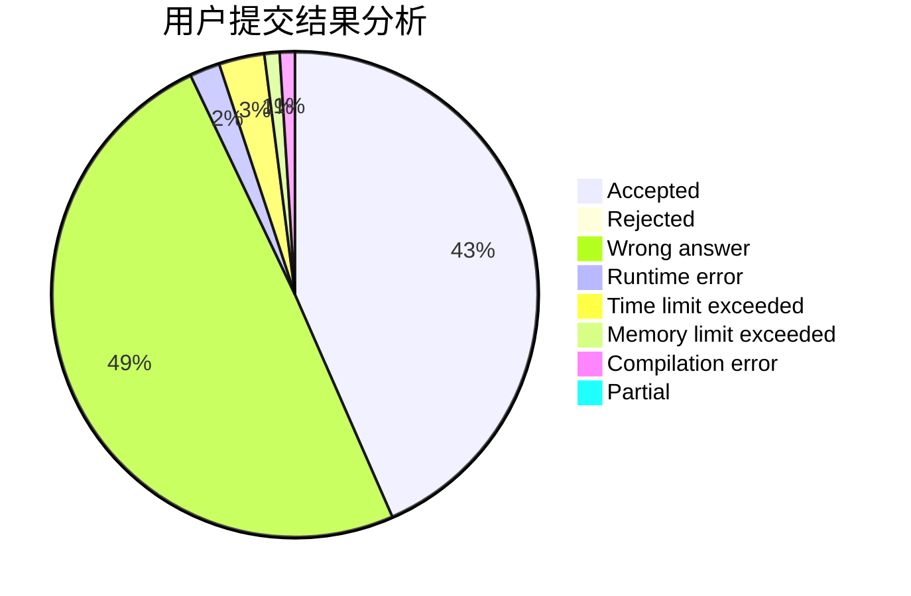
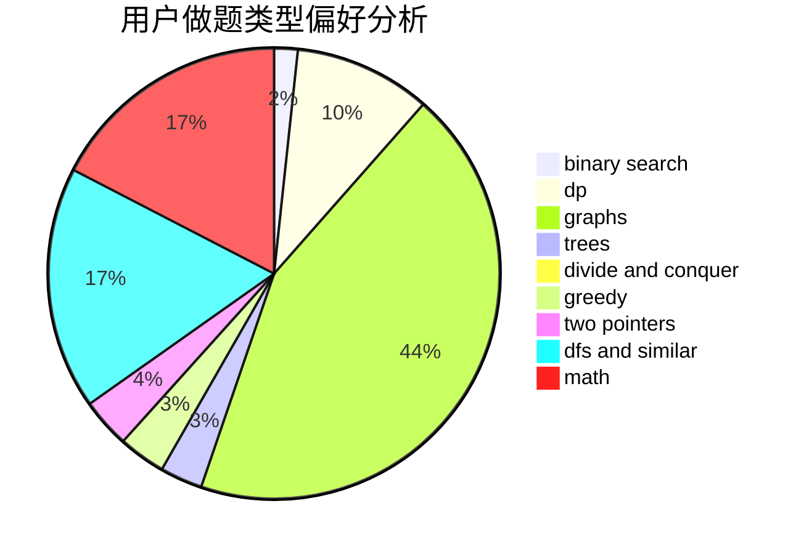

# JingLuozz

<!-- tabs:start -->

#### **用户提交结果分析**

#### **用户做题类型偏好分析**

<!-- tabs:end -->
# 推荐题目
[1433D](https://codeforces.com/contest/1433/problem/D)
[1437F](https://codeforces.com/contest/1437/problem/F)
[724C](https://codeforces.com/contest/724/problem/C)
[723C](https://codeforces.com/contest/723/problem/C)
[723D](https://codeforces.com/contest/723/problem/D)
[13571](https://codeforces.com/contest/1357/problem/1)
[932B](https://codeforces.com/contest/932/problem/B)
[286C](https://codeforces.com/contest/286/problem/C)
[814B](https://codeforces.com/contest/814/problem/B)
[732B](https://codeforces.com/contest/732/problem/B)
