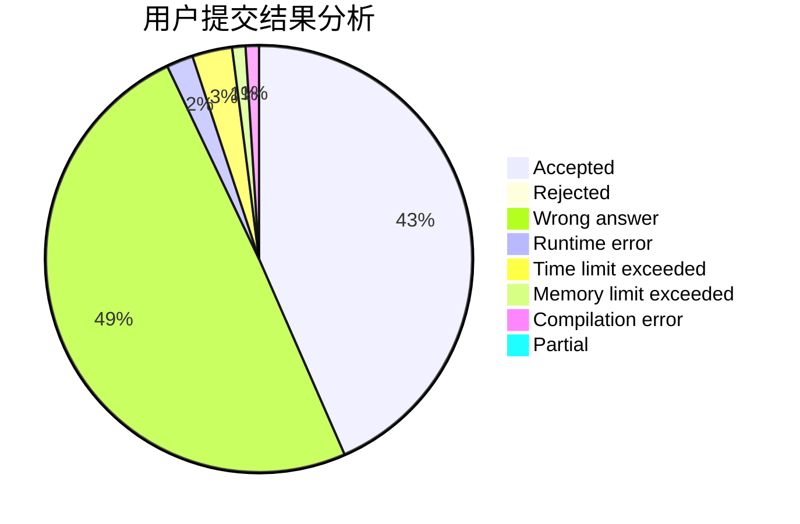
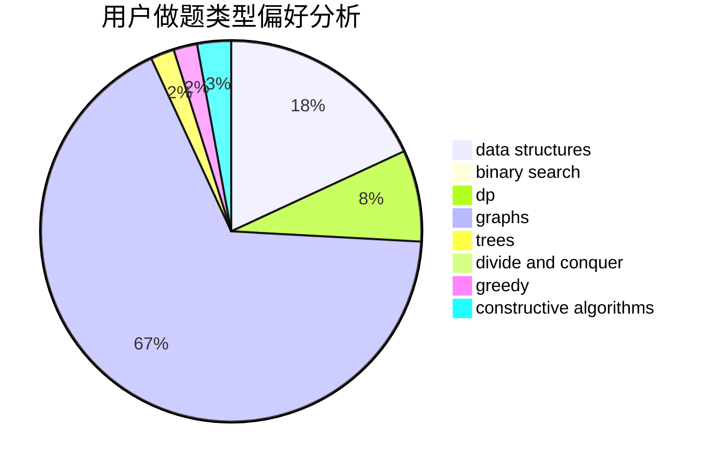
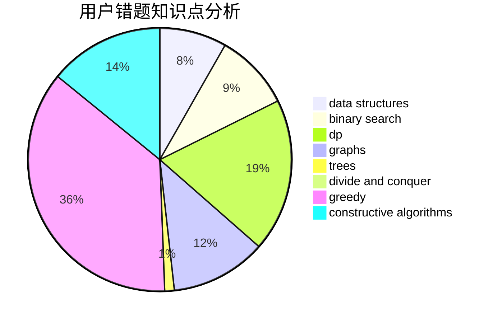

# JingLuozz

<!-- tabs:start -->

#### **用户提交结果分析**

#### **用户做题类型偏好分析**

#### **用户错题知识点分析**

<!-- tabs:end -->
# 推荐题目
[1433D](https://codeforces.com/contest/1433/problem/D)		constructive algorithms,
                        dfs and similar		  
[1437F](https://codeforces.com/contest/1437/problem/F)		combinatorics,
                        dp,
                        math,
                        two pointers		  
[724C](https://codeforces.com/contest/724/problem/C)		greedy,
                        hashing,
                        implementation,
                        math,
                        number theory,
                        sortings		  
[723C](https://codeforces.com/contest/723/problem/C)		greedy		  
[723D](https://codeforces.com/contest/723/problem/D)		dfs and similar,
                        dsu,
                        graphs,
                        greedy,
                        implementation		  
[13571](https://codeforces.com/contest/1357/problem/1)		dsu,graphs,sortings,trees		  
[932B](https://codeforces.com/contest/932/problem/B)		binary search,
                        data structures,
                        dfs and similar		  
[286C](https://codeforces.com/contest/286/problem/C)		greedy,
                        implementation		  
[814B](https://codeforces.com/contest/814/problem/B)		constructive algorithms		  
[732B](https://codeforces.com/contest/732/problem/B)		dp,
                        greedy		  
