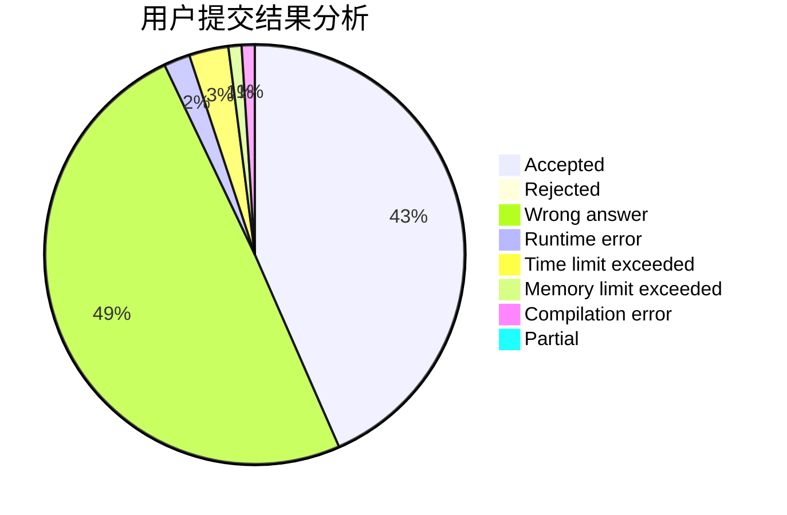
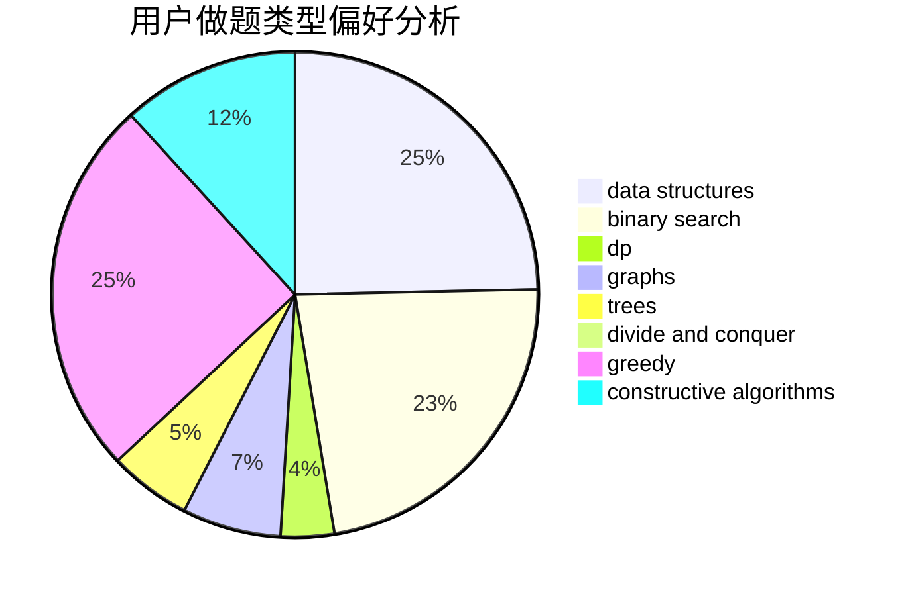
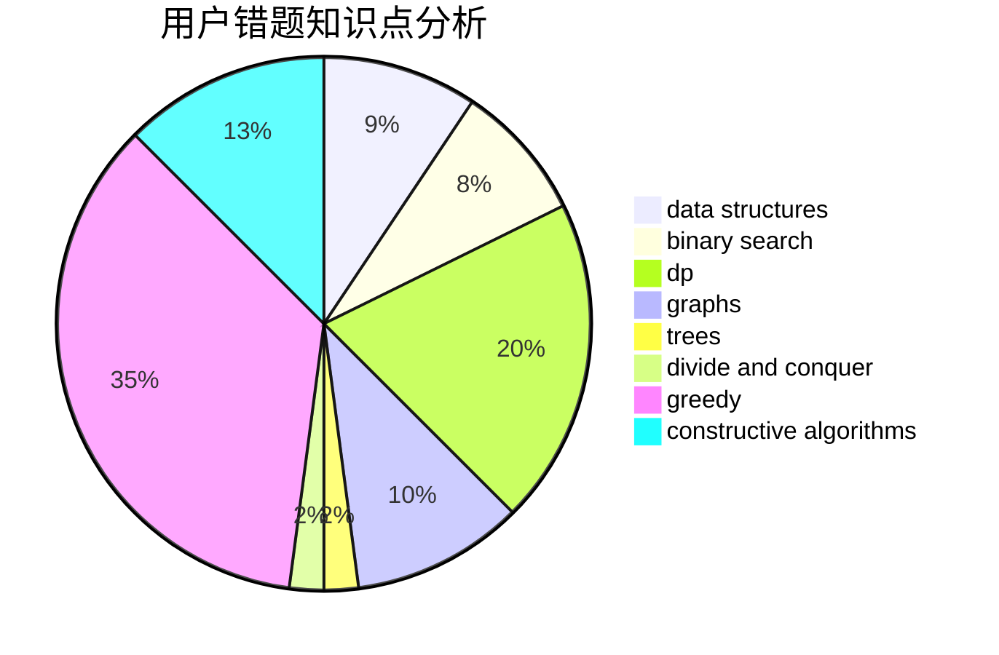

# JingLuozz

<!-- tabs:start -->

#### **用户提交结果分析**

#### **用户做题类型偏好分析**

#### **用户错题知识点分析**

<!-- tabs:end -->
# 推荐题目
[1425A](https://codeforces.com/contest/1425/problem/A)		games,
                        greedy		  
[1428F](https://codeforces.com/contest/1428/problem/F)		binary search,
                        data structures,
                        divide and conquer,
                        dp,
                        two pointers		  
[705B](https://codeforces.com/contest/705/problem/B)		games,
                        math		  
[704C](https://codeforces.com/contest/704/problem/C)		dp,
                        graphs,
                        implementation,
                        math		  
[704D](https://codeforces.com/contest/704/problem/D)		flows,
                        greedy		  
[1349F1](https://codeforces.com/contest/1349F/problem/1)		dp,
                        fft,
                        math		  
[913D](https://codeforces.com/contest/913/problem/D)		binary search,
                        brute force,
                        data structures,
                        greedy,
                        sortings		  
[26B](https://codeforces.com/contest/26/problem/B)		greedy		  
[7A](https://codeforces.com/contest/7/problem/A)		brute force,
                        constructive algorithms		  
[713A](https://codeforces.com/contest/713/problem/A)		data structures,
                        implementation		  
