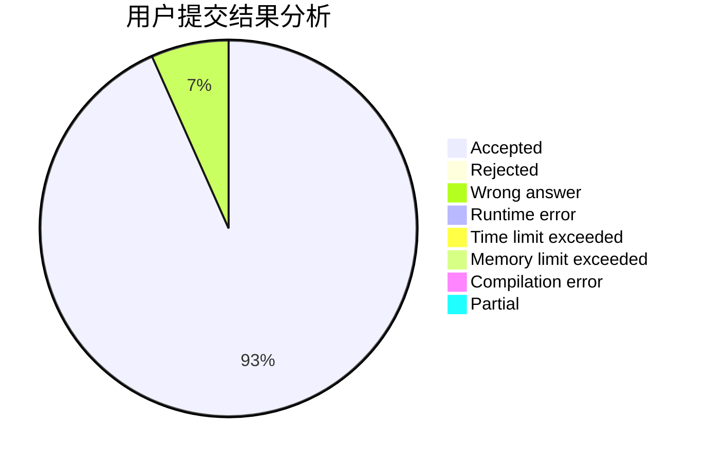
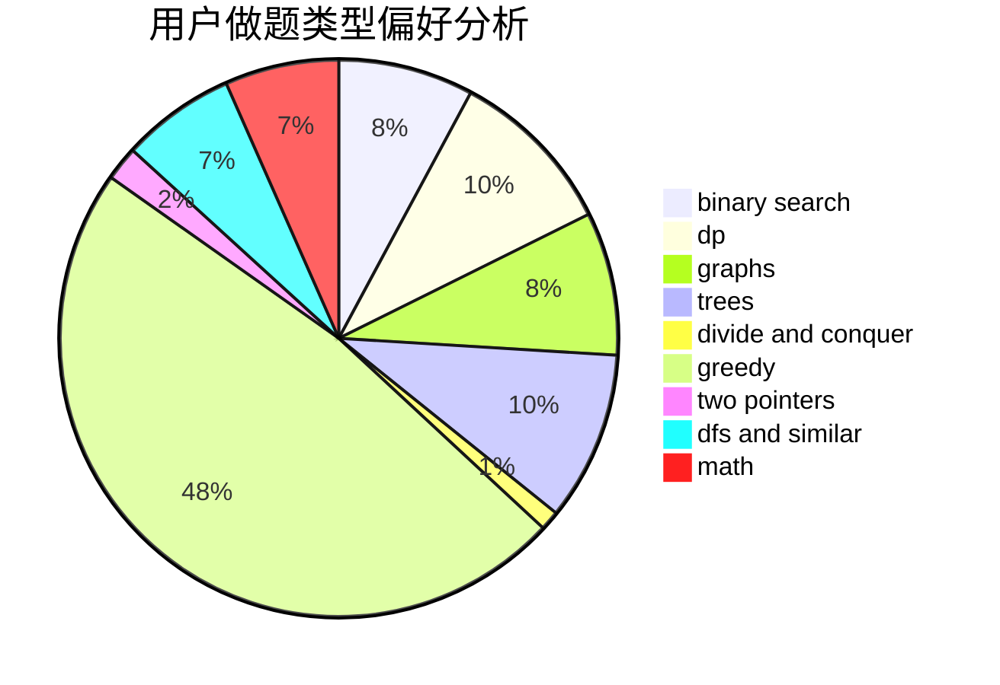

# Jizhi

<!-- tabs:start -->

#### **用户提交结果分析**

#### **用户做题类型偏好分析**

<!-- tabs:end -->
# 推荐题目
[1039B](https://codeforces.com/contest/1039/problem/B)
[725F](https://codeforces.com/contest/725/problem/F)
[1063F](https://codeforces.com/contest/1063/problem/F)
[1310C](https://codeforces.com/contest/1310/problem/C)
[842C](https://codeforces.com/contest/842/problem/C)
[1237F](https://codeforces.com/contest/1237/problem/F)
[645G](https://codeforces.com/contest/645/problem/G)
[165A](https://codeforces.com/contest/165/problem/A)
[446D](https://codeforces.com/contest/446/problem/D)
[1105E](https://codeforces.com/contest/1105/problem/E)
