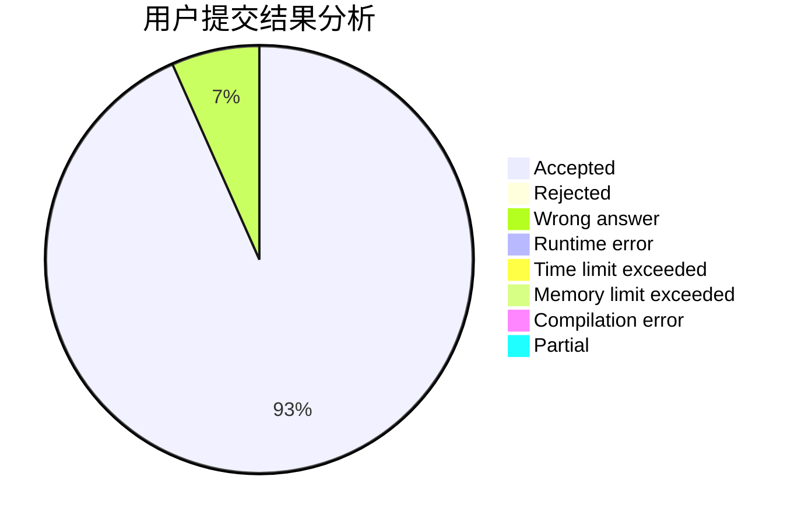
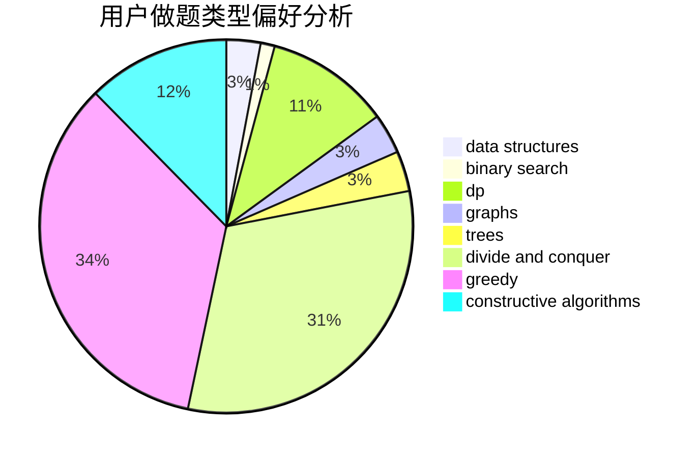

# Jizhi

<!-- tabs:start -->

#### **用户提交结果分析**

#### **用户做题类型偏好分析**

#### **用户错题知识点分析**

<!-- tabs:end -->
# 推荐题目
[1038D](https://codeforces.com/contest/1038/problem/D)		dp,
                        greedy,
                        implementation		  
[707D](https://codeforces.com/contest/707/problem/D)		bitmasks,
                        data structures,
                        dfs and similar,
                        implementation		  
[1063C](https://codeforces.com/contest/1063/problem/C)		binary search,
                        constructive algorithms,
                        geometry,
                        interactive		  
[1300E](https://codeforces.com/contest/1300/problem/E)		dsu,graphs,sortings,trees		  
[822D](https://codeforces.com/contest/822/problem/D)		brute force,
                        dp,
                        greedy,
                        math,
                        number theory		  
[1229B](https://codeforces.com/contest/1229/problem/B)		dsu,graphs,sortings,trees		  
[621E](https://codeforces.com/contest/621/problem/E)		dp,
                        matrices		  
[1510E](https://codeforces.com/contest/1510/problem/E)		nan		  
[421B](https://codeforces.com/contest/421/problem/B)		dsu,graphs,sortings,trees		  
[1105B](https://codeforces.com/contest/1105/problem/B)		brute force,
                        implementation,
                        strings		  
