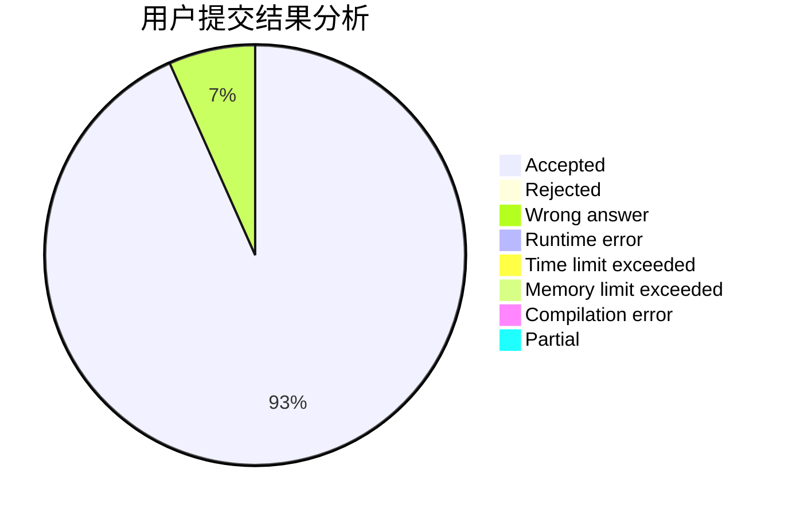
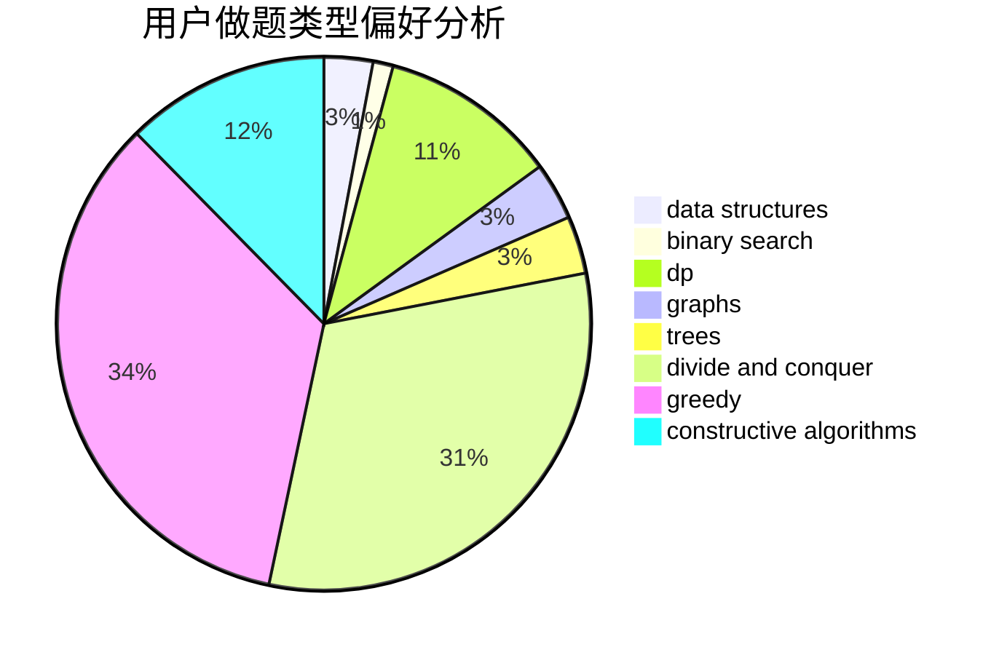

# Jizhi
<!-- tabs:start -->
#### **用户提交结果分析**

#### **用户做题类型偏好分析**

#### **用户错题知识点分析**

<!-- tabs:end -->
# 推荐题目
[Water Balance](https://codeforces.com/contest/1300/problem/E)		data structures,
                        geometry,
                        greedy		  
[Dwarves, Hats and Extrasensory Abilities](http://codeforces.com/problemset/problem/1063/C)		binary search,
                        constructive algorithms,
                        geometry,
                        interactive		  
[Kamil and Making a Stream](https://codeforces.com/contest/1229/problem/B)		math,
                        number theory,
                        trees		  
[Persistent Bookcase](http://codeforces.com/problemset/problem/707/D)		bitmasks,
                        data structures,
                        dfs and similar,
                        implementation		  
[Slime](http://codeforces.com/problemset/problem/1038/D)		dp,
                        greedy,
                        implementation		  
[Table with Letters - 2](http://codeforces.com/problemset/problem/253/D)		brute force,
                        two pointers		  
[Ball in Berland](http://codeforces.com/problemset/problem/1475/C)		combinatorics,
                        graphs,
                        math		  
[Coprime Permutation](http://codeforces.com/problemset/problem/698/F)		combinatorics,
                        number theory		  
[Representative Sampling](http://codeforces.com/problemset/problem/178/F2)		dp,
                        sortings,
                        strings		  
[Zuhair and Strings](http://codeforces.com/problemset/problem/1105/B)		brute force,
                        implementation,
                        strings		  
<!-- tabs:start -->
#### **data structures**
[Water Balance](https://codeforces.com/contest/1300/problem/E)		data structures,
                        geometry,
                        greedy		  
[Dwarves, Hats and Extrasensory Abilities](http://codeforces.com/problemset/problem/707/D)		bitmasks,
                        data structures,
                        dfs and similar,
                        implementation		  
[Kamil and Making a Stream](http://codeforces.com/problemset/problem/115/E)		data structures,
                        dp		  
[Persistent Bookcase](http://codeforces.com/problemset/problem/1083/D)		data structures,
                        implementation		  
[Slime](http://codeforces.com/problemset/problem/156/B)		constructive algorithms,
                        data structures,
                        implementation		  
[Table with Letters - 2](http://codeforces.com/problemset/problem/176/E)		data structures,
                        dfs and similar,
                        trees		  
[Ball in Berland](https://codeforces.com/contest/1287/problem/D)		constructive algorithms,
                        data structures,
                        dfs and similar,
                        graphs,
                        greedy,
                        trees		  
[Coprime Permutation](http://codeforces.com/problemset/problem/1416/C)		bitmasks,
                        data structures,
                        divide and conquer,
                        dp,
                        greedy,
                        math,
                        sortings,
                        strings,
                        trees		  
[Representative Sampling](http://codeforces.com/problemset/problem/1492/C)		binary search,
                        data structures,
                        dp,
                        greedy,
                        two pointers		  
[Zuhair and Strings](http://codeforces.com/problemset/problem/1490/G)		binary search,
                        data structures,
                        math		  
#### **binary search**
[Water Balance](http://codeforces.com/problemset/problem/1063/C)		binary search,
                        constructive algorithms,
                        geometry,
                        interactive		  
[Dwarves, Hats and Extrasensory Abilities](http://codeforces.com/problemset/problem/1195/B)		binary search,
                        brute force,
                        math		  
[Kamil and Making a Stream](http://codeforces.com/problemset/problem/1279/B)		binary search,
                        brute force,
                        implementation		  
[Persistent Bookcase](http://codeforces.com/problemset/problem/380/A)		binary search,
                        brute force		  
[Slime](https://codeforces.com/contest/1020/problem/D)		binary search,
                        interactive		  
[Table with Letters - 2](http://codeforces.com/problemset/problem/1492/C)		binary search,
                        data structures,
                        dp,
                        greedy,
                        two pointers		  
[Ball in Berland](http://codeforces.com/problemset/problem/1463/D)		binary search,
                        constructive algorithms,
                        greedy,
                        two pointers		  
[Coprime Permutation](http://codeforces.com/problemset/problem/1490/G)		binary search,
                        data structures,
                        math		  
[Representative Sampling](http://codeforces.com/problemset/problem/1479/D)		binary search,
                        bitmasks,
                        brute force,
                        data structures,
                        probabilities,
                        trees		  
[Zuhair and Strings](http://codeforces.com/problemset/problem/1436/E)		binary search,
                        data structures,
                        two pointers		  
#### **dp**
[Water Balance](http://codeforces.com/problemset/problem/1038/D)		dp,
                        greedy,
                        implementation		  
[Dwarves, Hats and Extrasensory Abilities](http://codeforces.com/problemset/problem/178/F2)		dp,
                        sortings,
                        strings		  
[Kamil and Making a Stream](http://codeforces.com/problemset/problem/822/D)		brute force,
                        dp,
                        greedy,
                        math,
                        number theory		  
[Persistent Bookcase](http://codeforces.com/problemset/problem/621/E)		dp,
                        matrices		  
[Slime](http://codeforces.com/problemset/problem/261/B)		dp,
                        math,
                        probabilities		  
[Table with Letters - 2](http://codeforces.com/problemset/problem/132/C)		dp		  
[Ball in Berland](http://codeforces.com/problemset/problem/115/E)		data structures,
                        dp		  
[Coprime Permutation](http://codeforces.com/problemset/problem/886/E)		combinatorics,
                        dp,
                        math		  
[Representative Sampling](http://codeforces.com/problemset/problem/1180/A)		dp,
                        implementation,
                        math		  
[Zuhair and Strings](https://codeforces.com/contest/1261/problem/D1)		dp		  
#### **graph**
[Water Balance](http://codeforces.com/problemset/problem/1475/C)		combinatorics,
                        graphs,
                        math		  
[Dwarves, Hats and Extrasensory Abilities](http://codeforces.com/problemset/problem/1343/E)		brute force,
                        graphs,
                        greedy,
                        shortest paths,
                        sortings		  
[Kamil and Making a Stream](https://codeforces.com/contest/1230/problem/F)		graphs		  
[Persistent Bookcase](http://codeforces.com/problemset/problem/1454/E)		combinatorics,
                        dfs and similar,
                        graphs,
                        trees		  
[Slime](http://codeforces.com/problemset/problem/510/C)		dfs and similar,
                        graphs,
                        sortings		  
[Table with Letters - 2](https://codeforces.com/contest/1287/problem/D)		constructive algorithms,
                        data structures,
                        dfs and similar,
                        graphs,
                        greedy,
                        trees		  
[Ball in Berland](http://codeforces.com/problemset/problem/1487/C)		brute force,
                        constructive algorithms,
                        dfs and similar,
                        graphs,
                        greedy,
                        implementation,
                        math		  
[Coprime Permutation](http://codeforces.com/problemset/problem/1437/C)		dp,
                        flows,
                        graph matchings,
                        greedy,
                        math,
                        sortings		  
[Representative Sampling](http://codeforces.com/problemset/problem/1470/D)		constructive algorithms,
                        dfs and similar,
                        graph matchings,
                        graphs,
                        greedy		  
[Zuhair and Strings](http://codeforces.com/problemset/problem/1476/C)		dp,
                        graphs,
                        greedy		  
#### **trees**
[Water Balance](https://codeforces.com/contest/1229/problem/B)		math,
                        number theory,
                        trees		  
[Dwarves, Hats and Extrasensory Abilities](http://codeforces.com/problemset/problem/1454/E)		combinatorics,
                        dfs and similar,
                        graphs,
                        trees		  
[Kamil and Making a Stream](http://codeforces.com/problemset/problem/176/E)		data structures,
                        dfs and similar,
                        trees		  
[Persistent Bookcase](https://codeforces.com/contest/1287/problem/D)		constructive algorithms,
                        data structures,
                        dfs and similar,
                        graphs,
                        greedy,
                        trees		  
[Slime](http://codeforces.com/problemset/problem/1416/C)		bitmasks,
                        data structures,
                        divide and conquer,
                        dp,
                        greedy,
                        math,
                        sortings,
                        strings,
                        trees		  
[Table with Letters - 2](http://codeforces.com/problemset/problem/1479/D)		binary search,
                        bitmasks,
                        brute force,
                        data structures,
                        probabilities,
                        trees		  
[Ball in Berland](http://codeforces.com/problemset/problem/1511/C)		brute force,
                        data structures,
                        implementation,
                        trees		  
[Coprime Permutation](http://codeforces.com/problemset/problem/1499/F)		combinatorics,
                        dfs and similar,
                        dp,
                        trees		  
[Representative Sampling](http://codeforces.com/problemset/problem/1491/E)		brute force,
                        dfs and similar,
                        divide and conquer,
                        number theory,
                        trees		  
[Zuhair and Strings](http://codeforces.com/problemset/problem/1466/D)		data structures,
                        greedy,
                        sortings,
                        trees		  
#### **divide and conquer**
[Water Balance](http://codeforces.com/problemset/problem/1416/C)		bitmasks,
                        data structures,
                        divide and conquer,
                        dp,
                        greedy,
                        math,
                        sortings,
                        strings,
                        trees		  
[Dwarves, Hats and Extrasensory Abilities](http://codeforces.com/problemset/problem/1461/D)		binary search,
                        brute force,
                        data structures,
                        divide and conquer,
                        implementation,
                        sortings		  
[Kamil and Making a Stream](http://codeforces.com/problemset/problem/1466/G)		combinatorics,
                        divide and conquer,
                        hashing,
                        math,
                        string suffix structures,
                        strings		  
[Persistent Bookcase](http://codeforces.com/problemset/problem/1490/D)		dfs and similar,
                        divide and conquer,
                        implementation		  
[Slime](https://codeforces.com/contest/1483/problem/C)		data structures,
                        divide and conquer,
                        dp		  
[Table with Letters - 2](http://codeforces.com/problemset/problem/1491/E)		brute force,
                        dfs and similar,
                        divide and conquer,
                        number theory,
                        trees		  
[Ball in Berland](http://codeforces.com/problemset/problem/1303/G)		data structures,
                        divide and conquer,
                        geometry,
                        trees		  
[Coprime Permutation](http://codeforces.com/problemset/problem/1494/D)		constructive algorithms,
                        data structures,
                        dfs and similar,
                        divide and conquer,
                        dsu,
                        greedy,
                        sortings,
                        trees		  
[Representative Sampling](http://codeforces.com/problemset/problem/1482/E)		data structures,
                        divide and conquer,
                        dp		  
[Zuhair and Strings](http://codeforces.com/problemset/problem/566/C)		dfs and similar,
                        divide and conquer,
                        trees		  
#### **greedy**
[Water Balance](https://codeforces.com/contest/1300/problem/E)		data structures,
                        geometry,
                        greedy		  
[Dwarves, Hats and Extrasensory Abilities](http://codeforces.com/problemset/problem/1038/D)		dp,
                        greedy,
                        implementation		  
[Kamil and Making a Stream](http://codeforces.com/problemset/problem/822/D)		brute force,
                        dp,
                        greedy,
                        math,
                        number theory		  
[Persistent Bookcase](http://codeforces.com/problemset/problem/1367/D)		constructive algorithms,
                        greedy,
                        implementation,
                        sortings		  
[Slime](http://codeforces.com/problemset/problem/1172/A)		greedy,
                        implementation		  
[Table with Letters - 2](http://codeforces.com/problemset/problem/1343/E)		brute force,
                        graphs,
                        greedy,
                        shortest paths,
                        sortings		  
[Ball in Berland](http://codeforces.com/problemset/problem/1469/C)		dp,
                        greedy,
                        implementation,
                        two pointers		  
[Coprime Permutation](http://codeforces.com/problemset/problem/464/A)		greedy,
                        strings		  
[Representative Sampling](https://codeforces.com/contest/1287/problem/D)		constructive algorithms,
                        data structures,
                        dfs and similar,
                        graphs,
                        greedy,
                        trees		  
[Zuhair and Strings](https://codeforces.com/contest/1265/problem/C)		greedy,
                        implementation		  
#### **constructive algorithms**
[Water Balance](http://codeforces.com/problemset/problem/1063/C)		binary search,
                        constructive algorithms,
                        geometry,
                        interactive		  
[Dwarves, Hats and Extrasensory Abilities](http://codeforces.com/problemset/problem/1367/D)		constructive algorithms,
                        greedy,
                        implementation,
                        sortings		  
[Kamil and Making a Stream](http://codeforces.com/problemset/problem/1137/D)		constructive algorithms,
                        interactive,
                        number theory		  
[Persistent Bookcase](http://codeforces.com/problemset/problem/544/B)		constructive algorithms,
                        implementation		  
[Slime](http://codeforces.com/problemset/problem/42/C)		brute force,
                        constructive algorithms		  
[Table with Letters - 2](http://codeforces.com/problemset/problem/156/B)		constructive algorithms,
                        data structures,
                        implementation		  
[Ball in Berland](http://codeforces.com/problemset/problem/303/A)		constructive algorithms,
                        implementation,
                        math		  
[Coprime Permutation](https://codeforces.com/contest/1287/problem/D)		constructive algorithms,
                        data structures,
                        dfs and similar,
                        graphs,
                        greedy,
                        trees		  
[Representative Sampling](http://codeforces.com/problemset/problem/1148/F)		bitmasks,
                        constructive algorithms		  
[Zuhair and Strings](http://codeforces.com/problemset/problem/1493/A)		constructive algorithms,
                        greedy		  
#### **sortings**
[Water Balance](http://codeforces.com/problemset/problem/178/F2)		dp,
                        sortings,
                        strings		  
[Dwarves, Hats and Extrasensory Abilities](http://codeforces.com/problemset/problem/1367/D)		constructive algorithms,
                        greedy,
                        implementation,
                        sortings		  
[Kamil and Making a Stream](http://codeforces.com/problemset/problem/1343/E)		brute force,
                        graphs,
                        greedy,
                        shortest paths,
                        sortings		  
[Persistent Bookcase](http://codeforces.com/problemset/problem/510/C)		dfs and similar,
                        graphs,
                        sortings		  
[Slime](http://codeforces.com/problemset/problem/1416/C)		bitmasks,
                        data structures,
                        divide and conquer,
                        dp,
                        greedy,
                        math,
                        sortings,
                        strings,
                        trees		  
[Table with Letters - 2](https://codeforces.com/contest/1496/problem/C)		geometry,
                        greedy,
                        math,
                        sortings		  
[Ball in Berland](http://codeforces.com/problemset/problem/1495/A)		geometry,
                        greedy,
                        math,
                        sortings		  
[Coprime Permutation](http://codeforces.com/problemset/problem/1497/A)		brute force,
                        data structures,
                        greedy,
                        sortings		  
[Representative Sampling](http://codeforces.com/problemset/problem/1427/A)		math,
                        sortings		  
[Zuhair and Strings](http://codeforces.com/problemset/problem/1461/D)		binary search,
                        brute force,
                        data structures,
                        divide and conquer,
                        implementation,
                        sortings		  
<!-- tabs:end -->
