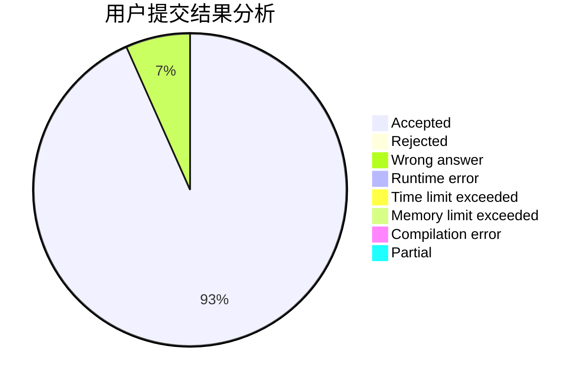
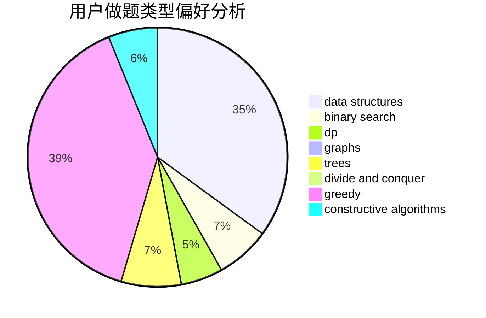

# Jizhi

<!-- tabs:start -->

#### **用户提交结果分析**

#### **用户做题类型偏好分析**

#### **用户错题知识点分析**

<!-- tabs:end -->
# 推荐题目
[1039B](https://codeforces.com/contest/1039/problem/B)		binary search,
                        interactive,
                        probabilities		  
[725F](https://codeforces.com/contest/725/problem/F)		games,
                        greedy		  
[1063F](https://codeforces.com/contest/1063/problem/F)		data structures,
                        dp,
                        string suffix structures		  
[1310C](https://codeforces.com/contest/1310/problem/C)		binary search,
                        dp,
                        strings		  
[842C](https://codeforces.com/contest/842/problem/C)		dfs and similar,
                        graphs,
                        math,
                        number theory,
                        trees		  
[1237F](https://codeforces.com/contest/1237/problem/F)		combinatorics,
                        dp		  
[645G](https://codeforces.com/contest/645/problem/G)		binary search,
                        geometry		  
[165A](https://codeforces.com/contest/165/problem/A)		implementation		  
[446D](https://codeforces.com/contest/446/problem/D)		math,
                        matrices,
                        probabilities		  
[1105E](https://codeforces.com/contest/1105/problem/E)		bitmasks,
                        brute force,
                        dp,
                        meet-in-the-middle		  
