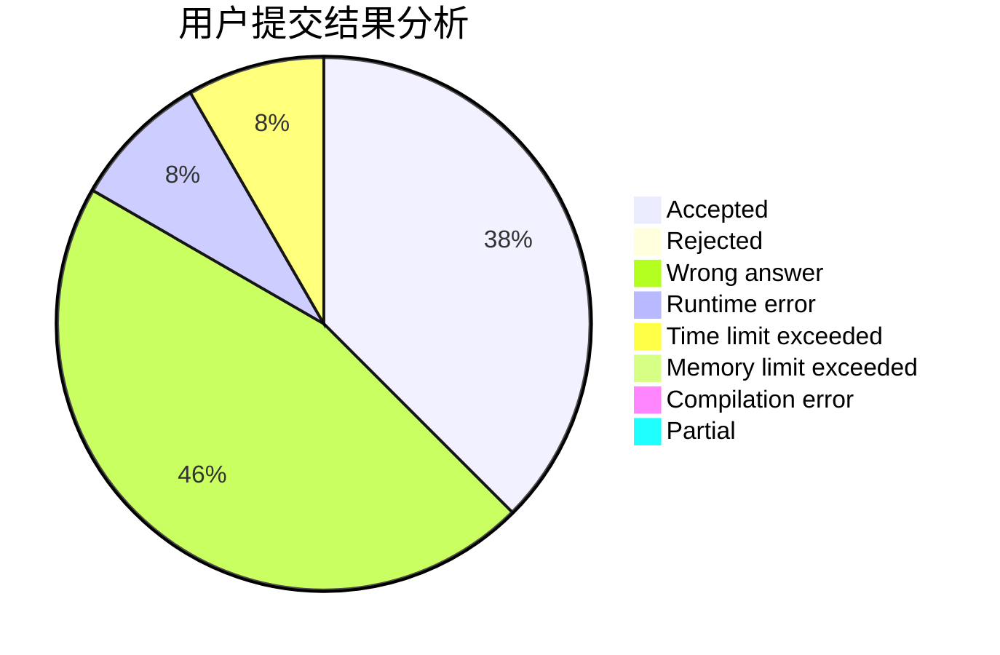
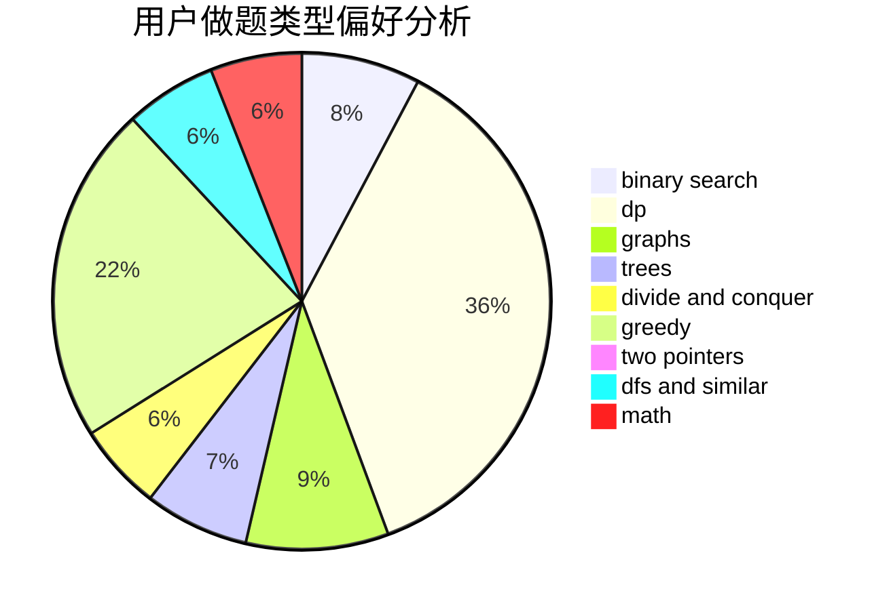

# Jlytxdy

<!-- tabs:start -->

#### **用户提交结果分析**

#### **用户做题类型偏好分析**

<!-- tabs:end -->
# 推荐题目
[1477A](https://codeforces.com/contest/1477/problem/A)
[1287C](https://codeforces.com/contest/1287/problem/C)
[920B](https://codeforces.com/contest/920/problem/B)
[1423I](https://codeforces.com/contest/1423/problem/I)
[578B](https://codeforces.com/contest/578/problem/B)
[370A](https://codeforces.com/contest/370/problem/A)
[827D](https://codeforces.com/contest/827/problem/D)
[437B](https://codeforces.com/contest/437/problem/B)
[567F](https://codeforces.com/contest/567/problem/F)
[1205F](https://codeforces.com/contest/1205/problem/F)
