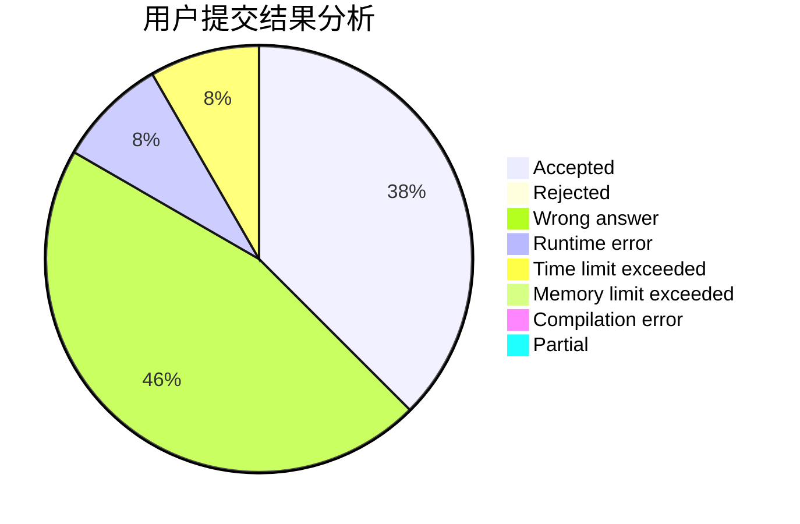
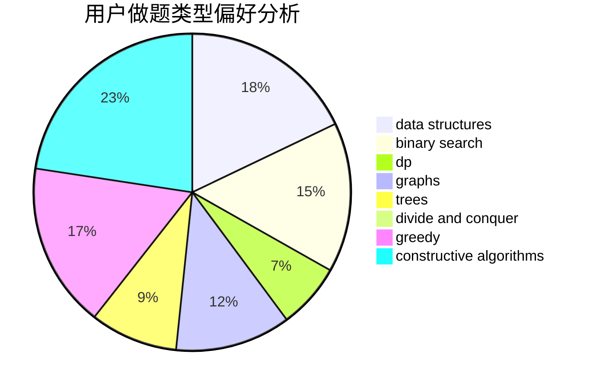
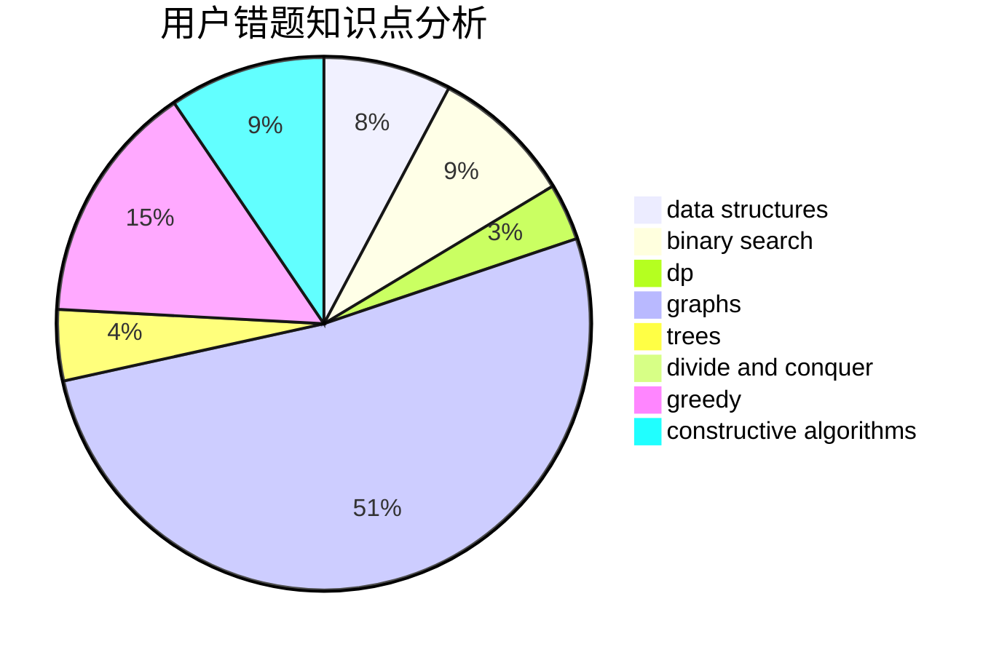

# Jlytxdy

<!-- tabs:start -->

#### **用户提交结果分析**

#### **用户做题类型偏好分析**

#### **用户错题知识点分析**

<!-- tabs:end -->
# 推荐题目
[1468N](https://codeforces.com/contest/1468/problem/N)		greedy,
                        implementation		  
[1281C](https://codeforces.com/contest/1281/problem/C)		dsu,graphs,sortings,trees		  
[906D](https://codeforces.com/contest/906/problem/D)		chinese remainder theorem,
                        math,
                        number theory		  
[1415E](https://codeforces.com/contest/1415/problem/E)		constructive algorithms,
                        greedy,
                        math		  
[552E](https://codeforces.com/contest/552/problem/E)		brute force,
                        dp,
                        expression parsing,
                        greedy,
                        implementation,
                        strings		  
[343E](https://codeforces.com/contest/343/problem/E)		brute force,
                        dfs and similar,
                        divide and conquer,
                        flows,
                        graphs,
                        greedy,
                        trees		  
[809E](https://codeforces.com/contest/809/problem/E)		divide and conquer,
                        math,
                        number theory,
                        trees		  
[409H](https://codeforces.com/contest/409/problem/H)		*special problem,
                        brute force,
                        constructive algorithms,
                        dsu,
                        implementation		  
[543D](https://codeforces.com/contest/543/problem/D)		dp,
                        trees		  
[1201B](https://codeforces.com/contest/1201/problem/B)		greedy,
                        math		  
