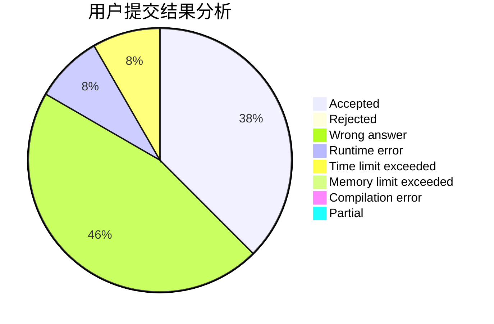
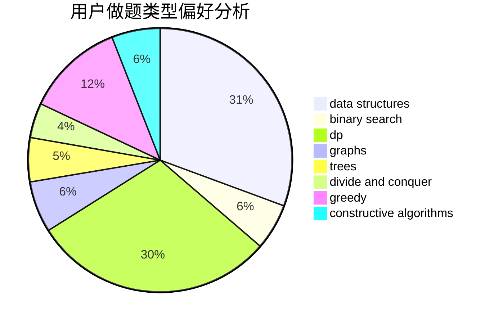
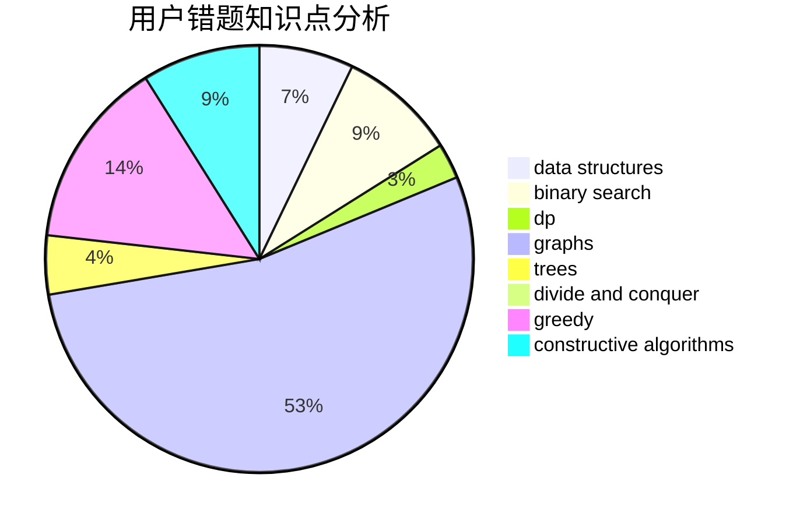

# Jlytxdy

<!-- tabs:start -->

#### **用户提交结果分析**

#### **用户做题类型偏好分析**

#### **用户错题知识点分析**

<!-- tabs:end -->
# 推荐题目
[1477A](https://codeforces.com/contest/1477/problem/A)		constructive algorithms,
                        math,
                        number theory		  
[1287C](https://codeforces.com/contest/1287/problem/C)		dsu,graphs,sortings,trees		  
[920B](https://codeforces.com/contest/920/problem/B)		implementation		  
[1423I](https://codeforces.com/contest/1423/problem/I)		bitmasks		  
[578B](https://codeforces.com/contest/578/problem/B)		brute force,
                        greedy		  
[370A](https://codeforces.com/contest/370/problem/A)		graphs,
                        math,
                        shortest paths		  
[827D](https://codeforces.com/contest/827/problem/D)		data structures,
                        dfs and similar,
                        graphs,
                        trees		  
[437B](https://codeforces.com/contest/437/problem/B)		bitmasks,
                        greedy,
                        implementation,
                        sortings		  
[567F](https://codeforces.com/contest/567/problem/F)		dp		  
[1205F](https://codeforces.com/contest/1205/problem/F)		constructive algorithms,
                        math		  
