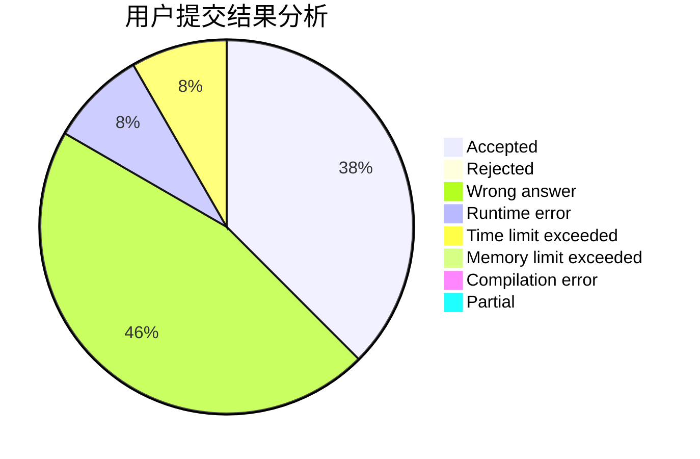
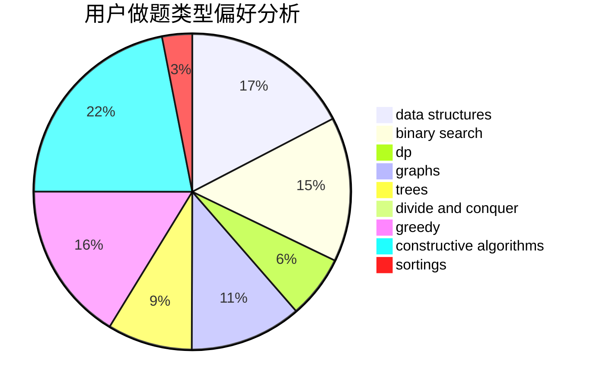
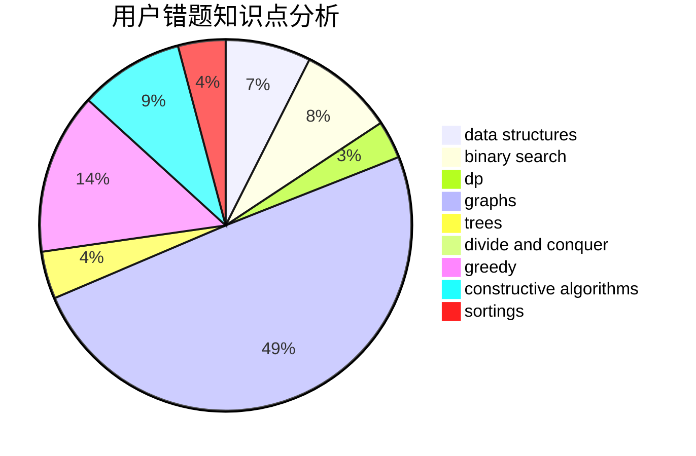

# Jlytxdy
<!-- tabs:start -->
#### **用户提交结果分析**

#### **用户做题类型偏好分析**

#### **用户错题知识点分析**

<!-- tabs:end -->
# 推荐题目
[809E](http://codeforces.com/problemset/problem/809/E)		divide and conquer,
                        math,
                        number theory,
                        trees		  
[1354A](http://codeforces.com/problemset/problem/1354/A)		math		  
[552E](http://codeforces.com/problemset/problem/552/E)		brute force,
                        dp,
                        expression parsing,
                        greedy,
                        implementation,
                        strings		  
[1246B](https://codeforces.com/contest/1246/problem/B)		hashing,
                        math,
                        number theory		  
[343E](http://codeforces.com/problemset/problem/343/E)		brute force,
                        dfs and similar,
                        divide and conquer,
                        flows,
                        graphs,
                        greedy,
                        trees		  
[417D](http://codeforces.com/problemset/problem/417/D)		bitmasks,
                        dp,
                        greedy,
                        sortings		  
[543D](http://codeforces.com/problemset/problem/543/D)		dp,
                        trees		  
[1415E](http://codeforces.com/problemset/problem/1415/E)		constructive algorithms,
                        greedy,
                        math		  
[898E](http://codeforces.com/problemset/problem/898/E)		constructive algorithms,
                        greedy		  
[641F](http://codeforces.com/problemset/problem/641/F)		nan		  
<!-- tabs:start -->
#### **data structures**
[1326E](http://codeforces.com/problemset/problem/1326/E)		data structures,
                        two pointers		  
[818E](http://codeforces.com/problemset/problem/818/E)		binary search,
                        data structures,
                        number theory,
                        two pointers		  
[1248E](https://codeforces.com/contest/1248/problem/E)		data structures,
                        greedy,
                        implementation		  
[1288E](http://codeforces.com/problemset/problem/1288/E)		data structures		  
[1492C](http://codeforces.com/problemset/problem/1492/C)		binary search,
                        data structures,
                        dp,
                        greedy,
                        two pointers		  
[1490G](http://codeforces.com/problemset/problem/1490/G)		binary search,
                        data structures,
                        math		  
[1479D](http://codeforces.com/problemset/problem/1479/D)		binary search,
                        bitmasks,
                        brute force,
                        data structures,
                        probabilities,
                        trees		  
[1497A](http://codeforces.com/problemset/problem/1497/A)		brute force,
                        data structures,
                        greedy,
                        sortings		  
[1491C](http://codeforces.com/problemset/problem/1491/C)		brute force,
                        data structures,
                        dp,
                        greedy,
                        implementation		  
[1492B](http://codeforces.com/problemset/problem/1492/B)		data structures,
                        greedy,
                        math		  
#### **binary search**
[837F](http://codeforces.com/problemset/problem/837/F)		binary search,
                        brute force,
                        combinatorics,
                        math,
                        matrices		  
[672D](https://codeforces.com/contest/672/problem/D)		binary search,
                        greedy		  
[818E](http://codeforces.com/problemset/problem/818/E)		binary search,
                        data structures,
                        number theory,
                        two pointers		  
[1329E](http://codeforces.com/problemset/problem/1329/E)		binary search,
                        greedy		  
[1352C](http://codeforces.com/problemset/problem/1352/C)		binary search,
                        math		  
[1492C](http://codeforces.com/problemset/problem/1492/C)		binary search,
                        data structures,
                        dp,
                        greedy,
                        two pointers		  
[1463D](http://codeforces.com/problemset/problem/1463/D)		binary search,
                        constructive algorithms,
                        greedy,
                        two pointers		  
[1490G](http://codeforces.com/problemset/problem/1490/G)		binary search,
                        data structures,
                        math		  
[1479D](http://codeforces.com/problemset/problem/1479/D)		binary search,
                        bitmasks,
                        brute force,
                        data structures,
                        probabilities,
                        trees		  
[1436E](http://codeforces.com/problemset/problem/1436/E)		binary search,
                        data structures,
                        two pointers		  
#### **dp**
[552E](http://codeforces.com/problemset/problem/552/E)		brute force,
                        dp,
                        expression parsing,
                        greedy,
                        implementation,
                        strings		  
[417D](http://codeforces.com/problemset/problem/417/D)		bitmasks,
                        dp,
                        greedy,
                        sortings		  
[543D](http://codeforces.com/problemset/problem/543/D)		dp,
                        trees		  
[544E](https://codeforces.com/contest/544/problem/E)		bitmasks,
                        dp		  
[696C](http://codeforces.com/problemset/problem/696/C)		combinatorics,
                        dp,
                        implementation,
                        math,
                        matrices		  
[835F](http://codeforces.com/problemset/problem/835/F)		dfs and similar,
                        dp,
                        graphs,
                        trees		  
[17C](http://codeforces.com/problemset/problem/17/C)		dp		  
[734E](http://codeforces.com/problemset/problem/734/E)		dfs and similar,
                        dp,
                        trees		  
[1492C](http://codeforces.com/problemset/problem/1492/C)		binary search,
                        data structures,
                        dp,
                        greedy,
                        two pointers		  
[1457C](https://codeforces.com/contest/1457/problem/C)		brute force,
                        dp,
                        implementation		  
#### **graph**
[343E](http://codeforces.com/problemset/problem/343/E)		brute force,
                        dfs and similar,
                        divide and conquer,
                        flows,
                        graphs,
                        greedy,
                        trees		  
[835F](http://codeforces.com/problemset/problem/835/F)		dfs and similar,
                        dp,
                        graphs,
                        trees		  
[724G](http://codeforces.com/problemset/problem/724/G)		bitmasks,
                        graphs,
                        math,
                        number theory,
                        trees		  
[590E](http://codeforces.com/problemset/problem/590/E)		graph matchings,
                        strings		  
[118E](http://codeforces.com/problemset/problem/118/E)		dfs and similar,
                        graphs		  
[1487C](http://codeforces.com/problemset/problem/1487/C)		brute force,
                        constructive algorithms,
                        dfs and similar,
                        graphs,
                        greedy,
                        implementation,
                        math		  
[1437C](http://codeforces.com/problemset/problem/1437/C)		dp,
                        flows,
                        graph matchings,
                        greedy,
                        math,
                        sortings		  
[1470D](http://codeforces.com/problemset/problem/1470/D)		constructive algorithms,
                        dfs and similar,
                        graph matchings,
                        graphs,
                        greedy		  
[1476C](http://codeforces.com/problemset/problem/1476/C)		dp,
                        graphs,
                        greedy		  
[1304D](http://codeforces.com/problemset/problem/1304/D)		constructive algorithms,
                        graphs,
                        greedy,
                        two pointers		  
#### **trees**
[809E](http://codeforces.com/problemset/problem/809/E)		divide and conquer,
                        math,
                        number theory,
                        trees		  
[343E](http://codeforces.com/problemset/problem/343/E)		brute force,
                        dfs and similar,
                        divide and conquer,
                        flows,
                        graphs,
                        greedy,
                        trees		  
[543D](http://codeforces.com/problemset/problem/543/D)		dp,
                        trees		  
[835F](http://codeforces.com/problemset/problem/835/F)		dfs and similar,
                        dp,
                        graphs,
                        trees		  
[724G](http://codeforces.com/problemset/problem/724/G)		bitmasks,
                        graphs,
                        math,
                        number theory,
                        trees		  
[734E](http://codeforces.com/problemset/problem/734/E)		dfs and similar,
                        dp,
                        trees		  
[1479D](http://codeforces.com/problemset/problem/1479/D)		binary search,
                        bitmasks,
                        brute force,
                        data structures,
                        probabilities,
                        trees		  
[1511C](http://codeforces.com/problemset/problem/1511/C)		brute force,
                        data structures,
                        implementation,
                        trees		  
[1499F](http://codeforces.com/problemset/problem/1499/F)		combinatorics,
                        dfs and similar,
                        dp,
                        trees		  
[1491E](http://codeforces.com/problemset/problem/1491/E)		brute force,
                        dfs and similar,
                        divide and conquer,
                        number theory,
                        trees		  
#### **divide and conquer**
[809E](http://codeforces.com/problemset/problem/809/E)		divide and conquer,
                        math,
                        number theory,
                        trees		  
[343E](http://codeforces.com/problemset/problem/343/E)		brute force,
                        dfs and similar,
                        divide and conquer,
                        flows,
                        graphs,
                        greedy,
                        trees		  
[1461D](http://codeforces.com/problemset/problem/1461/D)		binary search,
                        brute force,
                        data structures,
                        divide and conquer,
                        implementation,
                        sortings		  
[1466G](http://codeforces.com/problemset/problem/1466/G)		combinatorics,
                        divide and conquer,
                        hashing,
                        math,
                        string suffix structures,
                        strings		  
[1490D](http://codeforces.com/problemset/problem/1490/D)		dfs and similar,
                        divide and conquer,
                        implementation		  
[1483C](https://codeforces.com/contest/1483/problem/C)		data structures,
                        divide and conquer,
                        dp		  
[1491E](http://codeforces.com/problemset/problem/1491/E)		brute force,
                        dfs and similar,
                        divide and conquer,
                        number theory,
                        trees		  
[1303G](http://codeforces.com/problemset/problem/1303/G)		data structures,
                        divide and conquer,
                        geometry,
                        trees		  
[1494D](http://codeforces.com/problemset/problem/1494/D)		constructive algorithms,
                        data structures,
                        dfs and similar,
                        divide and conquer,
                        dsu,
                        greedy,
                        sortings,
                        trees		  
[1482E](http://codeforces.com/problemset/problem/1482/E)		data structures,
                        divide and conquer,
                        dp		  
#### **greedy**
[552E](http://codeforces.com/problemset/problem/552/E)		brute force,
                        dp,
                        expression parsing,
                        greedy,
                        implementation,
                        strings		  
[343E](http://codeforces.com/problemset/problem/343/E)		brute force,
                        dfs and similar,
                        divide and conquer,
                        flows,
                        graphs,
                        greedy,
                        trees		  
[417D](http://codeforces.com/problemset/problem/417/D)		bitmasks,
                        dp,
                        greedy,
                        sortings		  
[1415E](http://codeforces.com/problemset/problem/1415/E)		constructive algorithms,
                        greedy,
                        math		  
[898E](http://codeforces.com/problemset/problem/898/E)		constructive algorithms,
                        greedy		  
[672D](https://codeforces.com/contest/672/problem/D)		binary search,
                        greedy		  
[1201B](http://codeforces.com/problemset/problem/1201/B)		greedy,
                        math		  
[1248E](https://codeforces.com/contest/1248/problem/E)		data structures,
                        greedy,
                        implementation		  
[1468N](http://codeforces.com/problemset/problem/1468/N)		greedy,
                        implementation		  
[1329E](http://codeforces.com/problemset/problem/1329/E)		binary search,
                        greedy		  
#### **constructive algorithms**
[1415E](http://codeforces.com/problemset/problem/1415/E)		constructive algorithms,
                        greedy,
                        math		  
[898E](http://codeforces.com/problemset/problem/898/E)		constructive algorithms,
                        greedy		  
[317E](http://codeforces.com/problemset/problem/317/E)		constructive algorithms,
                        shortest paths		  
[409H](http://codeforces.com/problemset/problem/409/H)		*special problem,
                        brute force,
                        constructive algorithms,
                        dsu,
                        implementation		  
[493D](http://codeforces.com/problemset/problem/493/D)		constructive algorithms,
                        games,
                        math		  
[1438C](http://codeforces.com/problemset/problem/1438/C)		2-sat,
                        chinese remainder theorem,
                        constructive algorithms,
                        fft,
                        flows		  
[1493A](http://codeforces.com/problemset/problem/1493/A)		constructive algorithms,
                        greedy		  
[1463D](http://codeforces.com/problemset/problem/1463/D)		binary search,
                        constructive algorithms,
                        greedy,
                        two pointers		  
[1456B](https://codeforces.com/contest/1456/problem/B)		bitmasks,
                        brute force,
                        constructive algorithms		  
[1492D](http://codeforces.com/problemset/problem/1492/D)		bitmasks,
                        constructive algorithms,
                        greedy,
                        math		  
#### **sortings**
[417D](http://codeforces.com/problemset/problem/417/D)		bitmasks,
                        dp,
                        greedy,
                        sortings		  
[1496C](https://codeforces.com/contest/1496/problem/C)		geometry,
                        greedy,
                        math,
                        sortings		  
[1495A](http://codeforces.com/problemset/problem/1495/A)		geometry,
                        greedy,
                        math,
                        sortings		  
[1497A](http://codeforces.com/problemset/problem/1497/A)		brute force,
                        data structures,
                        greedy,
                        sortings		  
[1427A](http://codeforces.com/problemset/problem/1427/A)		math,
                        sortings		  
[1461D](http://codeforces.com/problemset/problem/1461/D)		binary search,
                        brute force,
                        data structures,
                        divide and conquer,
                        implementation,
                        sortings		  
[1437C](http://codeforces.com/problemset/problem/1437/C)		dp,
                        flows,
                        graph matchings,
                        greedy,
                        math,
                        sortings		  
[1473A](http://codeforces.com/problemset/problem/1473/A)		greedy,
                        implementation,
                        math,
                        sortings		  
[1486B](http://codeforces.com/problemset/problem/1486/B)		binary search,
                        geometry,
                        shortest paths,
                        sortings		  
[1480B](http://codeforces.com/problemset/problem/1480/B)		greedy,
                        implementation,
                        sortings		  
<!-- tabs:end -->
