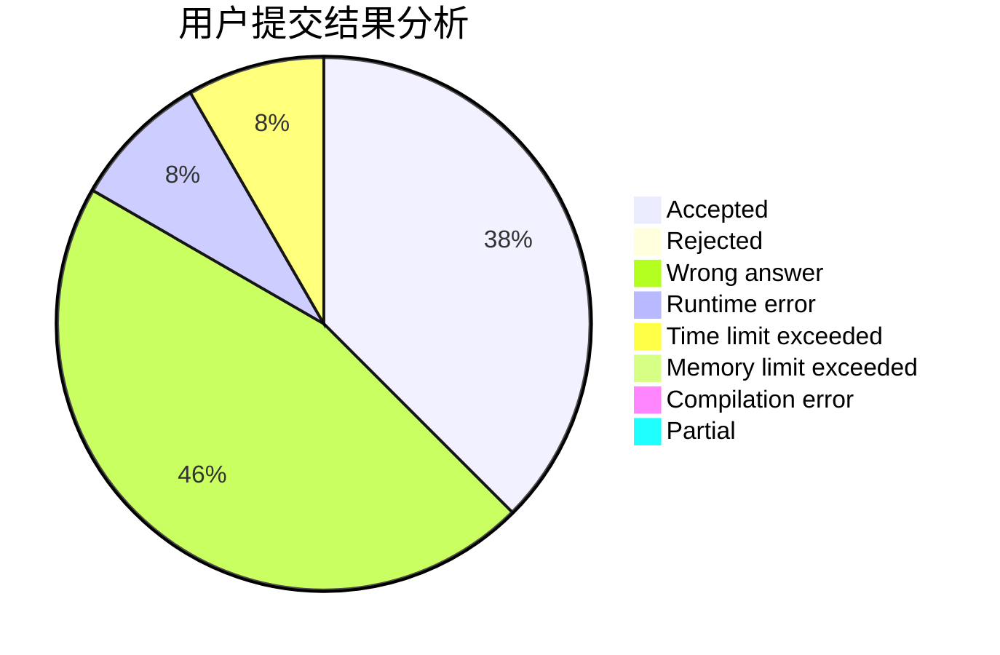
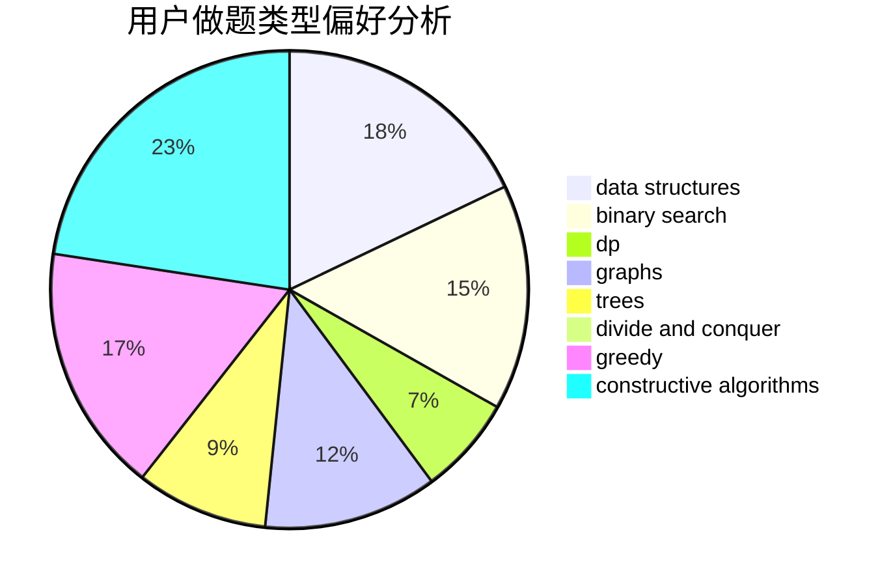
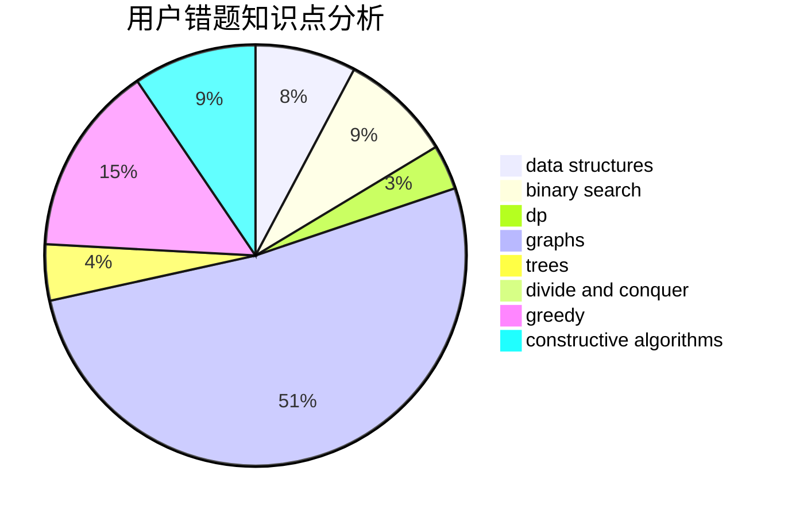

# Jlytxdy
<!-- tabs:start -->
#### **用户提交结果分析**

#### **用户做题类型偏好分析**

#### **用户错题知识点分析**

<!-- tabs:end -->
# 推荐题目
[Surprise me!](http://codeforces.com/problemset/problem/809/E)		divide and conquer,
                        math,
                        number theory,
                        trees		  
[Alarm Clock](http://codeforces.com/problemset/problem/1354/A)		math		  
[Vanya and Brackets](http://codeforces.com/problemset/problem/552/E)		brute force,
                        dp,
                        expression parsing,
                        greedy,
                        implementation,
                        strings		  
[Power Products](https://codeforces.com/contest/1246/problem/B)		hashing,
                        math,
                        number theory		  
[Pumping Stations](http://codeforces.com/problemset/problem/343/E)		brute force,
                        dfs and similar,
                        divide and conquer,
                        flows,
                        graphs,
                        greedy,
                        trees		  
[Cunning Gena](http://codeforces.com/problemset/problem/417/D)		bitmasks,
                        dp,
                        greedy,
                        sortings		  
[Road Improvement](http://codeforces.com/problemset/problem/543/D)		dp,
                        trees		  
[New Game Plus!](http://codeforces.com/problemset/problem/1415/E)		constructive algorithms,
                        greedy,
                        math		  
[Squares and not squares](http://codeforces.com/problemset/problem/898/E)		constructive algorithms,
                        greedy		  
[Little Artem and 2-SAT](http://codeforces.com/problemset/problem/641/F)		nan		  
<!-- tabs:start -->
#### **data structures**
[Surprise me!](http://codeforces.com/problemset/problem/1326/E)		data structures,
                        two pointers		  
[Alarm Clock](http://codeforces.com/problemset/problem/818/E)		binary search,
                        data structures,
                        number theory,
                        two pointers		  
[Vanya and Brackets](https://codeforces.com/contest/1248/problem/E)		data structures,
                        greedy,
                        implementation		  
[Power Products](http://codeforces.com/problemset/problem/1288/E)		data structures		  
[Pumping Stations](http://codeforces.com/problemset/problem/1492/C)		binary search,
                        data structures,
                        dp,
                        greedy,
                        two pointers		  
[Cunning Gena](http://codeforces.com/problemset/problem/1490/G)		binary search,
                        data structures,
                        math		  
[Road Improvement](http://codeforces.com/problemset/problem/1479/D)		binary search,
                        bitmasks,
                        brute force,
                        data structures,
                        probabilities,
                        trees		  
[New Game Plus!](http://codeforces.com/problemset/problem/1497/A)		brute force,
                        data structures,
                        greedy,
                        sortings		  
[Squares and not squares](http://codeforces.com/problemset/problem/1491/C)		brute force,
                        data structures,
                        dp,
                        greedy,
                        implementation		  
[Little Artem and 2-SAT](http://codeforces.com/problemset/problem/1492/B)		data structures,
                        greedy,
                        math		  
#### **binary search**
[Surprise me!](http://codeforces.com/problemset/problem/837/F)		binary search,
                        brute force,
                        combinatorics,
                        math,
                        matrices		  
[Alarm Clock](https://codeforces.com/contest/672/problem/D)		binary search,
                        greedy		  
[Vanya and Brackets](http://codeforces.com/problemset/problem/818/E)		binary search,
                        data structures,
                        number theory,
                        two pointers		  
[Power Products](http://codeforces.com/problemset/problem/1329/E)		binary search,
                        greedy		  
[Pumping Stations](http://codeforces.com/problemset/problem/1352/C)		binary search,
                        math		  
[Cunning Gena](http://codeforces.com/problemset/problem/1492/C)		binary search,
                        data structures,
                        dp,
                        greedy,
                        two pointers		  
[Road Improvement](http://codeforces.com/problemset/problem/1463/D)		binary search,
                        constructive algorithms,
                        greedy,
                        two pointers		  
[New Game Plus!](http://codeforces.com/problemset/problem/1490/G)		binary search,
                        data structures,
                        math		  
[Squares and not squares](http://codeforces.com/problemset/problem/1479/D)		binary search,
                        bitmasks,
                        brute force,
                        data structures,
                        probabilities,
                        trees		  
[Little Artem and 2-SAT](http://codeforces.com/problemset/problem/1436/E)		binary search,
                        data structures,
                        two pointers		  
#### **dp**
[Surprise me!](http://codeforces.com/problemset/problem/552/E)		brute force,
                        dp,
                        expression parsing,
                        greedy,
                        implementation,
                        strings		  
[Alarm Clock](http://codeforces.com/problemset/problem/417/D)		bitmasks,
                        dp,
                        greedy,
                        sortings		  
[Vanya and Brackets](http://codeforces.com/problemset/problem/543/D)		dp,
                        trees		  
[Power Products](https://codeforces.com/contest/544/problem/E)		bitmasks,
                        dp		  
[Pumping Stations](http://codeforces.com/problemset/problem/696/C)		combinatorics,
                        dp,
                        implementation,
                        math,
                        matrices		  
[Cunning Gena](http://codeforces.com/problemset/problem/835/F)		dfs and similar,
                        dp,
                        graphs,
                        trees		  
[Road Improvement](http://codeforces.com/problemset/problem/17/C)		dp		  
[New Game Plus!](http://codeforces.com/problemset/problem/734/E)		dfs and similar,
                        dp,
                        trees		  
[Squares and not squares](http://codeforces.com/problemset/problem/1492/C)		binary search,
                        data structures,
                        dp,
                        greedy,
                        two pointers		  
[Little Artem and 2-SAT](https://codeforces.com/contest/1457/problem/C)		brute force,
                        dp,
                        implementation		  
#### **graph**
[Surprise me!](http://codeforces.com/problemset/problem/343/E)		brute force,
                        dfs and similar,
                        divide and conquer,
                        flows,
                        graphs,
                        greedy,
                        trees		  
[Alarm Clock](http://codeforces.com/problemset/problem/835/F)		dfs and similar,
                        dp,
                        graphs,
                        trees		  
[Vanya and Brackets](http://codeforces.com/problemset/problem/724/G)		bitmasks,
                        graphs,
                        math,
                        number theory,
                        trees		  
[Power Products](http://codeforces.com/problemset/problem/590/E)		graph matchings,
                        strings		  
[Pumping Stations](http://codeforces.com/problemset/problem/118/E)		dfs and similar,
                        graphs		  
[Cunning Gena](http://codeforces.com/problemset/problem/1487/C)		brute force,
                        constructive algorithms,
                        dfs and similar,
                        graphs,
                        greedy,
                        implementation,
                        math		  
[Road Improvement](http://codeforces.com/problemset/problem/1437/C)		dp,
                        flows,
                        graph matchings,
                        greedy,
                        math,
                        sortings		  
[New Game Plus!](http://codeforces.com/problemset/problem/1470/D)		constructive algorithms,
                        dfs and similar,
                        graph matchings,
                        graphs,
                        greedy		  
[Squares and not squares](http://codeforces.com/problemset/problem/1476/C)		dp,
                        graphs,
                        greedy		  
[Little Artem and 2-SAT](http://codeforces.com/problemset/problem/1304/D)		constructive algorithms,
                        graphs,
                        greedy,
                        two pointers		  
#### **trees**
[Surprise me!](http://codeforces.com/problemset/problem/809/E)		divide and conquer,
                        math,
                        number theory,
                        trees		  
[Alarm Clock](http://codeforces.com/problemset/problem/343/E)		brute force,
                        dfs and similar,
                        divide and conquer,
                        flows,
                        graphs,
                        greedy,
                        trees		  
[Vanya and Brackets](http://codeforces.com/problemset/problem/543/D)		dp,
                        trees		  
[Power Products](http://codeforces.com/problemset/problem/835/F)		dfs and similar,
                        dp,
                        graphs,
                        trees		  
[Pumping Stations](http://codeforces.com/problemset/problem/724/G)		bitmasks,
                        graphs,
                        math,
                        number theory,
                        trees		  
[Cunning Gena](http://codeforces.com/problemset/problem/734/E)		dfs and similar,
                        dp,
                        trees		  
[Road Improvement](http://codeforces.com/problemset/problem/1479/D)		binary search,
                        bitmasks,
                        brute force,
                        data structures,
                        probabilities,
                        trees		  
[New Game Plus!](http://codeforces.com/problemset/problem/1511/C)		brute force,
                        data structures,
                        implementation,
                        trees		  
[Squares and not squares](http://codeforces.com/problemset/problem/1499/F)		combinatorics,
                        dfs and similar,
                        dp,
                        trees		  
[Little Artem and 2-SAT](http://codeforces.com/problemset/problem/1491/E)		brute force,
                        dfs and similar,
                        divide and conquer,
                        number theory,
                        trees		  
#### **divide and conquer**
[Surprise me!](http://codeforces.com/problemset/problem/809/E)		divide and conquer,
                        math,
                        number theory,
                        trees		  
[Alarm Clock](http://codeforces.com/problemset/problem/343/E)		brute force,
                        dfs and similar,
                        divide and conquer,
                        flows,
                        graphs,
                        greedy,
                        trees		  
[Vanya and Brackets](http://codeforces.com/problemset/problem/1461/D)		binary search,
                        brute force,
                        data structures,
                        divide and conquer,
                        implementation,
                        sortings		  
[Power Products](http://codeforces.com/problemset/problem/1466/G)		combinatorics,
                        divide and conquer,
                        hashing,
                        math,
                        string suffix structures,
                        strings		  
[Pumping Stations](http://codeforces.com/problemset/problem/1490/D)		dfs and similar,
                        divide and conquer,
                        implementation		  
[Cunning Gena](https://codeforces.com/contest/1483/problem/C)		data structures,
                        divide and conquer,
                        dp		  
[Road Improvement](http://codeforces.com/problemset/problem/1491/E)		brute force,
                        dfs and similar,
                        divide and conquer,
                        number theory,
                        trees		  
[New Game Plus!](http://codeforces.com/problemset/problem/1303/G)		data structures,
                        divide and conquer,
                        geometry,
                        trees		  
[Squares and not squares](http://codeforces.com/problemset/problem/1494/D)		constructive algorithms,
                        data structures,
                        dfs and similar,
                        divide and conquer,
                        dsu,
                        greedy,
                        sortings,
                        trees		  
[Little Artem and 2-SAT](http://codeforces.com/problemset/problem/1482/E)		data structures,
                        divide and conquer,
                        dp		  
#### **greedy**
[Surprise me!](http://codeforces.com/problemset/problem/552/E)		brute force,
                        dp,
                        expression parsing,
                        greedy,
                        implementation,
                        strings		  
[Alarm Clock](http://codeforces.com/problemset/problem/343/E)		brute force,
                        dfs and similar,
                        divide and conquer,
                        flows,
                        graphs,
                        greedy,
                        trees		  
[Vanya and Brackets](http://codeforces.com/problemset/problem/417/D)		bitmasks,
                        dp,
                        greedy,
                        sortings		  
[Power Products](http://codeforces.com/problemset/problem/1415/E)		constructive algorithms,
                        greedy,
                        math		  
[Pumping Stations](http://codeforces.com/problemset/problem/898/E)		constructive algorithms,
                        greedy		  
[Cunning Gena](https://codeforces.com/contest/672/problem/D)		binary search,
                        greedy		  
[Road Improvement](http://codeforces.com/problemset/problem/1201/B)		greedy,
                        math		  
[New Game Plus!](https://codeforces.com/contest/1248/problem/E)		data structures,
                        greedy,
                        implementation		  
[Squares and not squares](http://codeforces.com/problemset/problem/1468/N)		greedy,
                        implementation		  
[Little Artem and 2-SAT](http://codeforces.com/problemset/problem/1329/E)		binary search,
                        greedy		  
#### **constructive algorithms**
[Surprise me!](http://codeforces.com/problemset/problem/1415/E)		constructive algorithms,
                        greedy,
                        math		  
[Alarm Clock](http://codeforces.com/problemset/problem/898/E)		constructive algorithms,
                        greedy		  
[Vanya and Brackets](http://codeforces.com/problemset/problem/317/E)		constructive algorithms,
                        shortest paths		  
[Power Products](http://codeforces.com/problemset/problem/409/H)		*special problem,
                        brute force,
                        constructive algorithms,
                        dsu,
                        implementation		  
[Pumping Stations](http://codeforces.com/problemset/problem/493/D)		constructive algorithms,
                        games,
                        math		  
[Cunning Gena](http://codeforces.com/problemset/problem/1438/C)		2-sat,
                        chinese remainder theorem,
                        constructive algorithms,
                        fft,
                        flows		  
[Road Improvement](http://codeforces.com/problemset/problem/1493/A)		constructive algorithms,
                        greedy		  
[New Game Plus!](http://codeforces.com/problemset/problem/1463/D)		binary search,
                        constructive algorithms,
                        greedy,
                        two pointers		  
[Squares and not squares](https://codeforces.com/contest/1456/problem/B)		bitmasks,
                        brute force,
                        constructive algorithms		  
[Little Artem and 2-SAT](http://codeforces.com/problemset/problem/1492/D)		bitmasks,
                        constructive algorithms,
                        greedy,
                        math		  
#### **sortings**
[Surprise me!](http://codeforces.com/problemset/problem/417/D)		bitmasks,
                        dp,
                        greedy,
                        sortings		  
[Alarm Clock](https://codeforces.com/contest/1496/problem/C)		geometry,
                        greedy,
                        math,
                        sortings		  
[Vanya and Brackets](http://codeforces.com/problemset/problem/1495/A)		geometry,
                        greedy,
                        math,
                        sortings		  
[Power Products](http://codeforces.com/problemset/problem/1497/A)		brute force,
                        data structures,
                        greedy,
                        sortings		  
[Pumping Stations](http://codeforces.com/problemset/problem/1427/A)		math,
                        sortings		  
[Cunning Gena](http://codeforces.com/problemset/problem/1461/D)		binary search,
                        brute force,
                        data structures,
                        divide and conquer,
                        implementation,
                        sortings		  
[Road Improvement](http://codeforces.com/problemset/problem/1437/C)		dp,
                        flows,
                        graph matchings,
                        greedy,
                        math,
                        sortings		  
[New Game Plus!](http://codeforces.com/problemset/problem/1473/A)		greedy,
                        implementation,
                        math,
                        sortings		  
[Squares and not squares](http://codeforces.com/problemset/problem/1486/B)		binary search,
                        geometry,
                        shortest paths,
                        sortings		  
[Little Artem and 2-SAT](http://codeforces.com/problemset/problem/1480/B)		greedy,
                        implementation,
                        sortings		  
<!-- tabs:end -->
