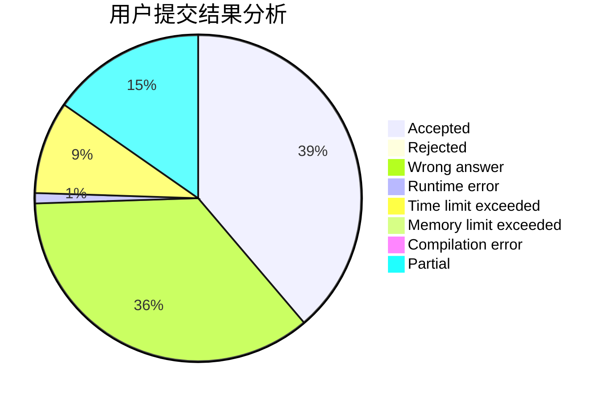
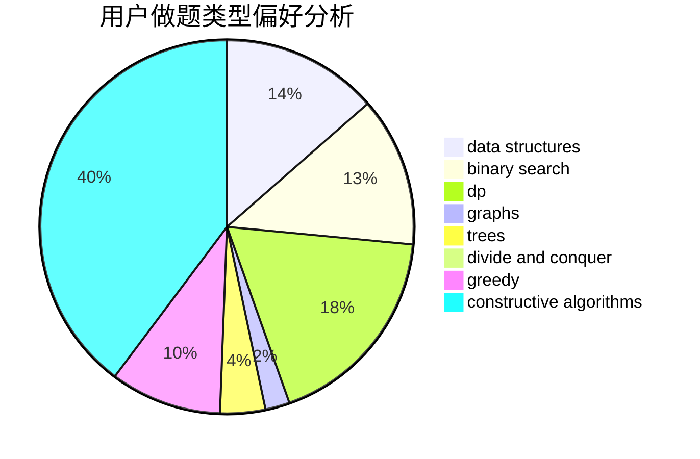
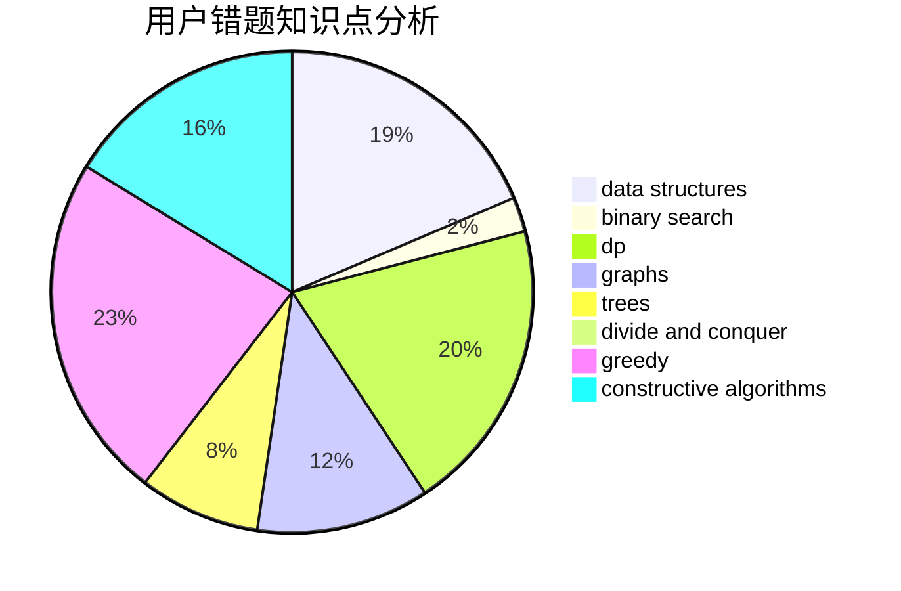

# Johnson_sky

<!-- tabs:start -->

#### **用户提交结果分析**

#### **用户做题类型偏好分析**

#### **用户错题知识点分析**

<!-- tabs:end -->
# 推荐题目
[1043E](https://codeforces.com/contest/1043/problem/E)		constructive algorithms,
                        greedy,
                        math,
                        sortings		  
[920E](https://codeforces.com/contest/920/problem/E)		data structures,
                        dfs and similar,
                        dsu,
                        graphs		  
[1340A](https://codeforces.com/contest/1340/problem/A)		brute force,
                        data structures,
                        greedy,
                        implementation		  
[1312E](https://codeforces.com/contest/1312/problem/E)		dp,
                        greedy		  
[1217E](https://codeforces.com/contest/1217/problem/E)		data structures,
                        greedy,
                        implementation,
                        math		  
[1009E](https://codeforces.com/contest/1009/problem/E)		combinatorics,
                        math,
                        probabilities		  
[650D](https://codeforces.com/contest/650/problem/D)		binary search,
                        data structures,
                        dp,
                        hashing		  
[528C](https://codeforces.com/contest/528/problem/C)		dsu,graphs,sortings,trees		  
[668D](https://codeforces.com/contest/668/problem/D)		dsu,graphs,sortings,trees		  
[1425E](https://codeforces.com/contest/1425/problem/E)		greedy,
                        implementation		  
