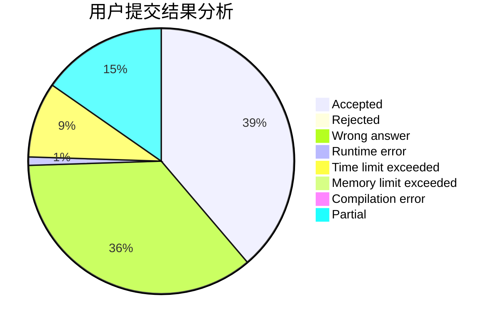
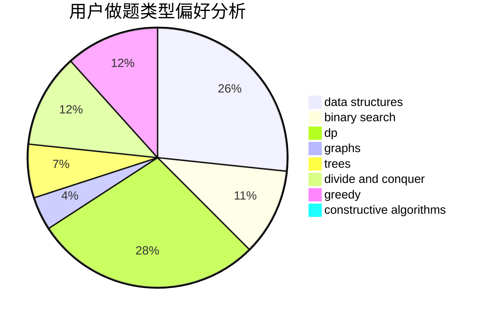
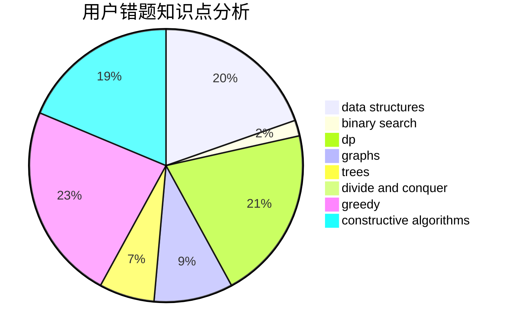

# Johnson_sky
<!-- tabs:start -->
#### **用户提交结果分析**

#### **用户做题类型偏好分析**

#### **用户错题知识点分析**

<!-- tabs:end -->
# 推荐题目
[Minimum Ternary String](http://codeforces.com/problemset/problem/1009/B)		greedy,
                        implementation		  
[Book Reading](http://codeforces.com/problemset/problem/1213/C)		math		  
[Anya and Ghosts](http://codeforces.com/problemset/problem/508/C)		constructive algorithms,
                        greedy		  
[Sum of Prefix Sums](http://codeforces.com/problemset/problem/1303/G)		data structures,
                        divide and conquer,
                        geometry,
                        trees		  
[World of Darkraft](http://codeforces.com/problemset/problem/138/D)		dp,
                        games		  
[Masha and Bears](http://codeforces.com/problemset/problem/907/A)		brute force,
                        implementation		  
[Masha and Cactus](http://codeforces.com/problemset/problem/856/D)		dp,
                        trees		  
[Bamboo Partition](https://codeforces.com/contest/831/problem/F)		brute force,
                        data structures,
                        implementation,
                        math,
                        number theory,
                        sortings,
                        two pointers		  
[Birthday](http://codeforces.com/problemset/problem/494/D)		data structures,
                        dfs and similar,
                        dp,
                        trees		  
[Minimize The Integer](http://codeforces.com/problemset/problem/1251/C)		greedy,
                        two pointers		  
<!-- tabs:start -->
#### **data structures**
[Minimum Ternary String](http://codeforces.com/problemset/problem/1303/G)		data structures,
                        divide and conquer,
                        geometry,
                        trees		  
[Book Reading](https://codeforces.com/contest/831/problem/F)		brute force,
                        data structures,
                        implementation,
                        math,
                        number theory,
                        sortings,
                        two pointers		  
[Anya and Ghosts](http://codeforces.com/problemset/problem/494/D)		data structures,
                        dfs and similar,
                        dp,
                        trees		  
[Sum of Prefix Sums](http://codeforces.com/problemset/problem/1239/C)		data structures,
                        greedy,
                        implementation		  
[World of Darkraft](http://codeforces.com/problemset/problem/1492/C)		binary search,
                        data structures,
                        dp,
                        greedy,
                        two pointers		  
[Masha and Bears](http://codeforces.com/problemset/problem/1490/G)		binary search,
                        data structures,
                        math		  
[Masha and Cactus](http://codeforces.com/problemset/problem/1479/D)		binary search,
                        bitmasks,
                        brute force,
                        data structures,
                        probabilities,
                        trees		  
[Bamboo Partition](http://codeforces.com/problemset/problem/1497/A)		brute force,
                        data structures,
                        greedy,
                        sortings		  
[Birthday](http://codeforces.com/problemset/problem/1491/C)		brute force,
                        data structures,
                        dp,
                        greedy,
                        implementation		  
[Minimize The Integer](http://codeforces.com/problemset/problem/1492/B)		data structures,
                        greedy,
                        math		  
#### **binary search**
[Minimum Ternary String](http://codeforces.com/problemset/problem/1492/C)		binary search,
                        data structures,
                        dp,
                        greedy,
                        two pointers		  
[Book Reading](http://codeforces.com/problemset/problem/1463/D)		binary search,
                        constructive algorithms,
                        greedy,
                        two pointers		  
[Anya and Ghosts](http://codeforces.com/problemset/problem/1490/G)		binary search,
                        data structures,
                        math		  
[Sum of Prefix Sums](http://codeforces.com/problemset/problem/1479/D)		binary search,
                        bitmasks,
                        brute force,
                        data structures,
                        probabilities,
                        trees		  
[World of Darkraft](http://codeforces.com/problemset/problem/1436/E)		binary search,
                        data structures,
                        two pointers		  
[Masha and Bears](http://codeforces.com/problemset/problem/1461/D)		binary search,
                        brute force,
                        data structures,
                        divide and conquer,
                        implementation,
                        sortings		  
[Masha and Cactus](http://codeforces.com/problemset/problem/1493/C)		binary search,
                        brute force,
                        constructive algorithms,
                        greedy,
                        strings		  
[Bamboo Partition](http://codeforces.com/problemset/problem/1487/D)		binary search,
                        brute force,
                        math,
                        number theory		  
[Birthday](http://codeforces.com/problemset/problem/1486/B)		binary search,
                        geometry,
                        shortest paths,
                        sortings		  
[Minimize The Integer](http://codeforces.com/problemset/problem/1486/C1)		binary search,
                        interactive		  
#### **dp**
[Minimum Ternary String](http://codeforces.com/problemset/problem/138/D)		dp,
                        games		  
[Book Reading](http://codeforces.com/problemset/problem/856/D)		dp,
                        trees		  
[Anya and Ghosts](http://codeforces.com/problemset/problem/494/D)		data structures,
                        dfs and similar,
                        dp,
                        trees		  
[Sum of Prefix Sums](http://codeforces.com/problemset/problem/1296/E1)		constructive algorithms,
                        dp,
                        graphs,
                        greedy,
                        sortings		  
[World of Darkraft](http://codeforces.com/problemset/problem/283/C)		dp		  
[Masha and Bears](http://codeforces.com/problemset/problem/1492/C)		binary search,
                        data structures,
                        dp,
                        greedy,
                        two pointers		  
[Masha and Cactus](https://codeforces.com/contest/1457/problem/C)		brute force,
                        dp,
                        implementation		  
[Bamboo Partition](http://codeforces.com/problemset/problem/1491/C)		brute force,
                        data structures,
                        dp,
                        greedy,
                        implementation		  
[Birthday](http://codeforces.com/problemset/problem/1437/C)		dp,
                        flows,
                        graph matchings,
                        greedy,
                        math,
                        sortings		  
[Minimize The Integer](http://codeforces.com/problemset/problem/1499/B)		brute force,
                        dp,
                        greedy,
                        implementation		  
#### **graph**
[Minimum Ternary String](http://codeforces.com/problemset/problem/639/B)		constructive algorithms,
                        graphs,
                        trees		  
[Book Reading](http://codeforces.com/problemset/problem/1296/E1)		constructive algorithms,
                        dp,
                        graphs,
                        greedy,
                        sortings		  
[Anya and Ghosts](http://codeforces.com/problemset/problem/1213/G)		divide and conquer,
                        dsu,
                        graphs,
                        sortings,
                        trees		  
[Sum of Prefix Sums](http://codeforces.com/problemset/problem/1487/C)		brute force,
                        constructive algorithms,
                        dfs and similar,
                        graphs,
                        greedy,
                        implementation,
                        math		  
[World of Darkraft](http://codeforces.com/problemset/problem/1437/C)		dp,
                        flows,
                        graph matchings,
                        greedy,
                        math,
                        sortings		  
[Masha and Bears](http://codeforces.com/problemset/problem/1470/D)		constructive algorithms,
                        dfs and similar,
                        graph matchings,
                        graphs,
                        greedy		  
[Masha and Cactus](http://codeforces.com/problemset/problem/1476/C)		dp,
                        graphs,
                        greedy		  
[Bamboo Partition](http://codeforces.com/problemset/problem/1304/D)		constructive algorithms,
                        graphs,
                        greedy,
                        two pointers		  
[Birthday](http://codeforces.com/problemset/problem/1475/C)		combinatorics,
                        graphs,
                        math		  
[Minimize The Integer](http://codeforces.com/problemset/problem/553/E)		dp,
                        fft,
                        graphs,
                        math,
                        probabilities		  
#### **trees**
[Minimum Ternary String](http://codeforces.com/problemset/problem/1303/G)		data structures,
                        divide and conquer,
                        geometry,
                        trees		  
[Book Reading](http://codeforces.com/problemset/problem/856/D)		dp,
                        trees		  
[Anya and Ghosts](http://codeforces.com/problemset/problem/494/D)		data structures,
                        dfs and similar,
                        dp,
                        trees		  
[Sum of Prefix Sums](http://codeforces.com/problemset/problem/639/B)		constructive algorithms,
                        graphs,
                        trees		  
[World of Darkraft](http://codeforces.com/problemset/problem/1213/G)		divide and conquer,
                        dsu,
                        graphs,
                        sortings,
                        trees		  
[Masha and Bears](http://codeforces.com/problemset/problem/1479/D)		binary search,
                        bitmasks,
                        brute force,
                        data structures,
                        probabilities,
                        trees		  
[Masha and Cactus](http://codeforces.com/problemset/problem/1511/C)		brute force,
                        data structures,
                        implementation,
                        trees		  
[Bamboo Partition](http://codeforces.com/problemset/problem/1499/F)		combinatorics,
                        dfs and similar,
                        dp,
                        trees		  
[Birthday](http://codeforces.com/problemset/problem/1491/E)		brute force,
                        dfs and similar,
                        divide and conquer,
                        number theory,
                        trees		  
[Minimize The Integer](http://codeforces.com/problemset/problem/1466/D)		data structures,
                        greedy,
                        sortings,
                        trees		  
#### **divide and conquer**
[Minimum Ternary String](http://codeforces.com/problemset/problem/1303/G)		data structures,
                        divide and conquer,
                        geometry,
                        trees		  
[Book Reading](http://codeforces.com/problemset/problem/1213/G)		divide and conquer,
                        dsu,
                        graphs,
                        sortings,
                        trees		  
[Anya and Ghosts](http://codeforces.com/problemset/problem/1461/D)		binary search,
                        brute force,
                        data structures,
                        divide and conquer,
                        implementation,
                        sortings		  
[Sum of Prefix Sums](http://codeforces.com/problemset/problem/1466/G)		combinatorics,
                        divide and conquer,
                        hashing,
                        math,
                        string suffix structures,
                        strings		  
[World of Darkraft](http://codeforces.com/problemset/problem/1490/D)		dfs and similar,
                        divide and conquer,
                        implementation		  
[Masha and Bears](https://codeforces.com/contest/1483/problem/C)		data structures,
                        divide and conquer,
                        dp		  
[Masha and Cactus](http://codeforces.com/problemset/problem/1491/E)		brute force,
                        dfs and similar,
                        divide and conquer,
                        number theory,
                        trees		  
[Bamboo Partition](http://codeforces.com/problemset/problem/1303/G)		data structures,
                        divide and conquer,
                        geometry,
                        trees		  
[Birthday](http://codeforces.com/problemset/problem/1494/D)		constructive algorithms,
                        data structures,
                        dfs and similar,
                        divide and conquer,
                        dsu,
                        greedy,
                        sortings,
                        trees		  
[Minimize The Integer](http://codeforces.com/problemset/problem/1482/E)		data structures,
                        divide and conquer,
                        dp		  
#### **greedy**
[Minimum Ternary String](http://codeforces.com/problemset/problem/1009/B)		greedy,
                        implementation		  
[Book Reading](http://codeforces.com/problemset/problem/508/C)		constructive algorithms,
                        greedy		  
[Anya and Ghosts](http://codeforces.com/problemset/problem/1251/C)		greedy,
                        two pointers		  
[Sum of Prefix Sums](http://codeforces.com/problemset/problem/1008/B)		greedy,
                        sortings		  
[World of Darkraft](http://codeforces.com/problemset/problem/808/C)		constructive algorithms,
                        greedy,
                        sortings		  
[Masha and Bears](http://codeforces.com/problemset/problem/1296/E1)		constructive algorithms,
                        dp,
                        graphs,
                        greedy,
                        sortings		  
[Masha and Cactus](http://codeforces.com/problemset/problem/1239/C)		data structures,
                        greedy,
                        implementation		  
[Bamboo Partition](https://codeforces.com/contest/1071/problem/B)		greedy		  
[Birthday](http://codeforces.com/problemset/problem/1333/B)		greedy,
                        implementation		  
[Minimize The Integer](http://codeforces.com/problemset/problem/1492/C)		binary search,
                        data structures,
                        dp,
                        greedy,
                        two pointers		  
#### **constructive algorithms**
[Minimum Ternary String](http://codeforces.com/problemset/problem/508/C)		constructive algorithms,
                        greedy		  
[Book Reading](http://codeforces.com/problemset/problem/808/C)		constructive algorithms,
                        greedy,
                        sortings		  
[Anya and Ghosts](http://codeforces.com/problemset/problem/639/B)		constructive algorithms,
                        graphs,
                        trees		  
[Sum of Prefix Sums](http://codeforces.com/problemset/problem/622/D)		constructive algorithms		  
[World of Darkraft](http://codeforces.com/problemset/problem/1296/E1)		constructive algorithms,
                        dp,
                        graphs,
                        greedy,
                        sortings		  
[Masha and Bears](http://codeforces.com/problemset/problem/932/A)		constructive algorithms		  
[Masha and Cactus](http://codeforces.com/problemset/problem/923/D)		constructive algorithms,
                        implementation,
                        strings		  
[Bamboo Partition](https://codeforces.com/contest/1243/problem/C)		constructive algorithms,
                        math,
                        number theory		  
[Birthday](http://codeforces.com/problemset/problem/1493/A)		constructive algorithms,
                        greedy		  
[Minimize The Integer](http://codeforces.com/problemset/problem/1463/D)		binary search,
                        constructive algorithms,
                        greedy,
                        two pointers		  
#### **sortings**
[Minimum Ternary String](https://codeforces.com/contest/831/problem/F)		brute force,
                        data structures,
                        implementation,
                        math,
                        number theory,
                        sortings,
                        two pointers		  
[Book Reading](http://codeforces.com/problemset/problem/1008/B)		greedy,
                        sortings		  
[Anya and Ghosts](http://codeforces.com/problemset/problem/808/C)		constructive algorithms,
                        greedy,
                        sortings		  
[Sum of Prefix Sums](http://codeforces.com/problemset/problem/1296/E1)		constructive algorithms,
                        dp,
                        graphs,
                        greedy,
                        sortings		  
[World of Darkraft](http://codeforces.com/problemset/problem/1213/G)		divide and conquer,
                        dsu,
                        graphs,
                        sortings,
                        trees		  
[Masha and Bears](https://codeforces.com/contest/1496/problem/C)		geometry,
                        greedy,
                        math,
                        sortings		  
[Masha and Cactus](http://codeforces.com/problemset/problem/1495/A)		geometry,
                        greedy,
                        math,
                        sortings		  
[Bamboo Partition](http://codeforces.com/problemset/problem/1497/A)		brute force,
                        data structures,
                        greedy,
                        sortings		  
[Birthday](http://codeforces.com/problemset/problem/1427/A)		math,
                        sortings		  
[Minimize The Integer](http://codeforces.com/problemset/problem/1461/D)		binary search,
                        brute force,
                        data structures,
                        divide and conquer,
                        implementation,
                        sortings		  
<!-- tabs:end -->
