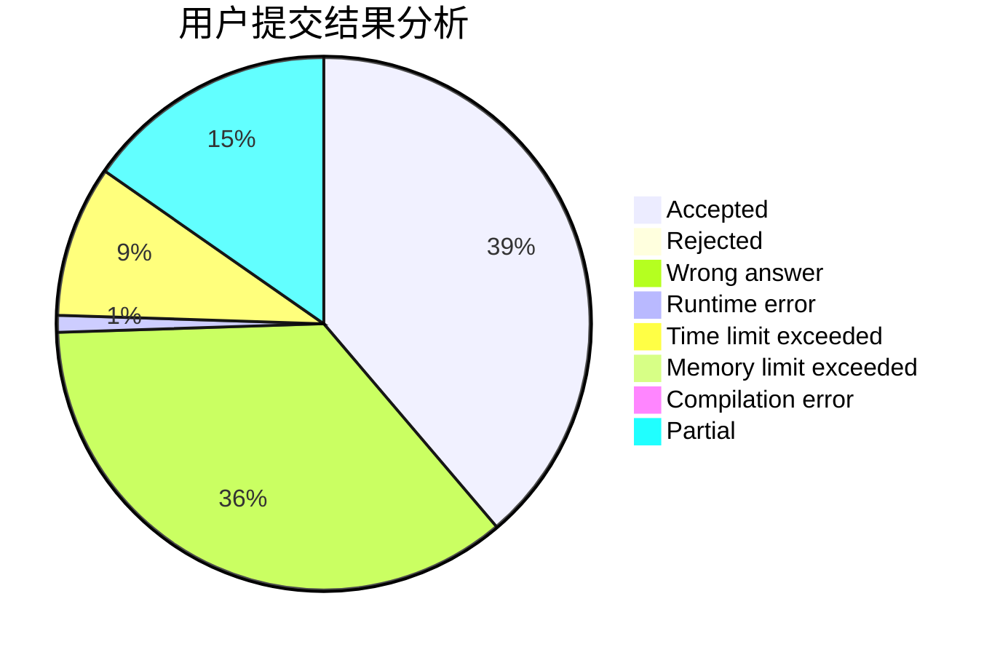
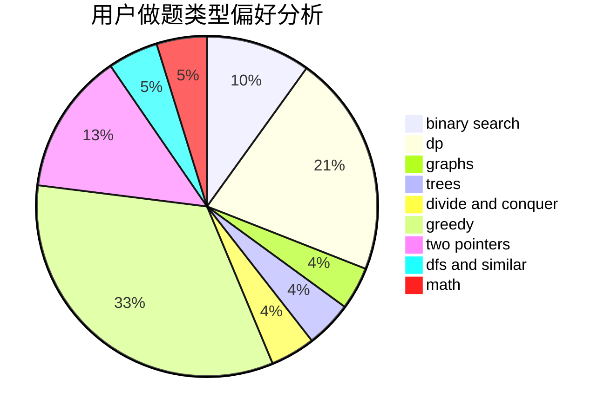

# Johnson_sky

<!-- tabs:start -->

#### **用户提交结果分析**

#### **用户做题类型偏好分析**

<!-- tabs:end -->
# 推荐题目
[1043E](https://codeforces.com/contest/1043/problem/E)
[920E](https://codeforces.com/contest/920/problem/E)
[1340A](https://codeforces.com/contest/1340/problem/A)
[1312E](https://codeforces.com/contest/1312/problem/E)
[1217E](https://codeforces.com/contest/1217/problem/E)
[1009E](https://codeforces.com/contest/1009/problem/E)
[650D](https://codeforces.com/contest/650/problem/D)
[528C](https://codeforces.com/contest/528/problem/C)
[668D](https://codeforces.com/contest/668/problem/D)
[1425E](https://codeforces.com/contest/1425/problem/E)
