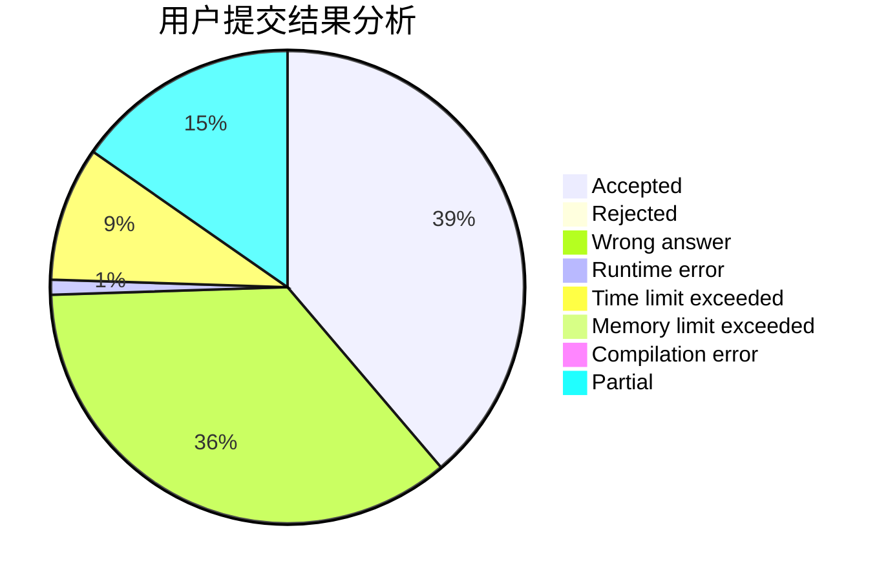
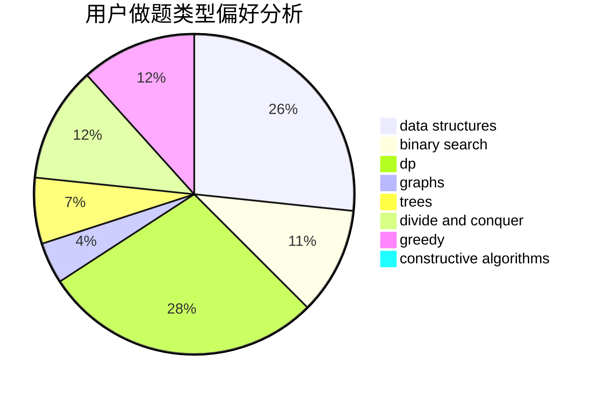
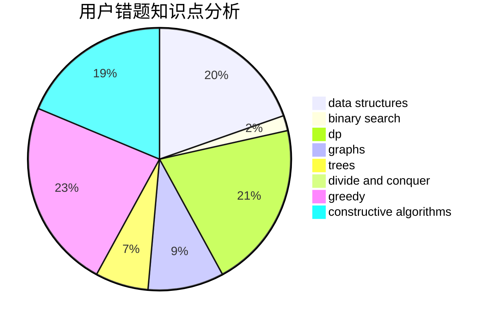

# Johnson_sky

<!-- tabs:start -->

#### **用户提交结果分析**

#### **用户做题类型偏好分析**

#### **用户错题知识点分析**

<!-- tabs:end -->
# 推荐题目
[1043B](https://codeforces.com/contest/1043/problem/B)		implementation		  
[907A](https://codeforces.com/contest/907/problem/A)		brute force,
                        implementation		  
[1333B](https://codeforces.com/contest/1333/problem/B)		greedy,
                        implementation		  
[1303G](https://codeforces.com/contest/1303/problem/G)		data structures,
                        divide and conquer,
                        geometry,
                        trees		  
[1213C](https://codeforces.com/contest/1213/problem/C)		math		  
[1009B](https://codeforces.com/contest/1009/problem/B)		greedy,
                        implementation		  
[622D](https://codeforces.com/contest/622/problem/D)		constructive algorithms		  
[508C](https://codeforces.com/contest/508/problem/C)		constructive algorithms,
                        greedy		  
[639B](https://codeforces.com/contest/639/problem/B)		constructive algorithms,
                        graphs,
                        trees		  
[1418A](https://codeforces.com/contest/1418/problem/A)		math		  
