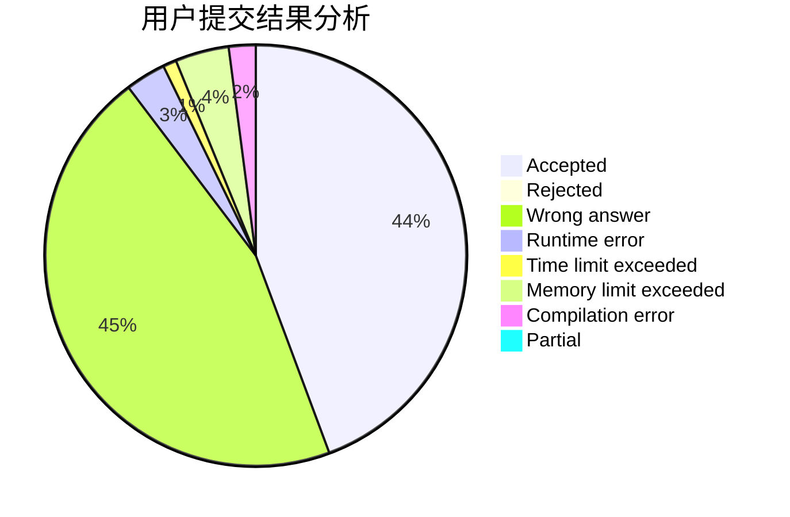
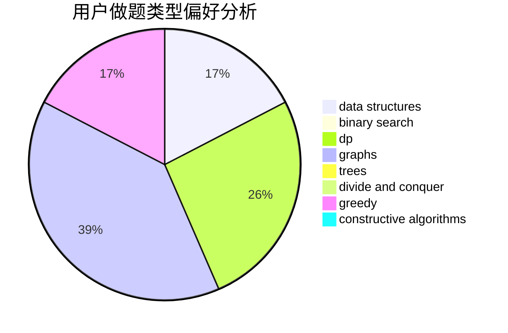
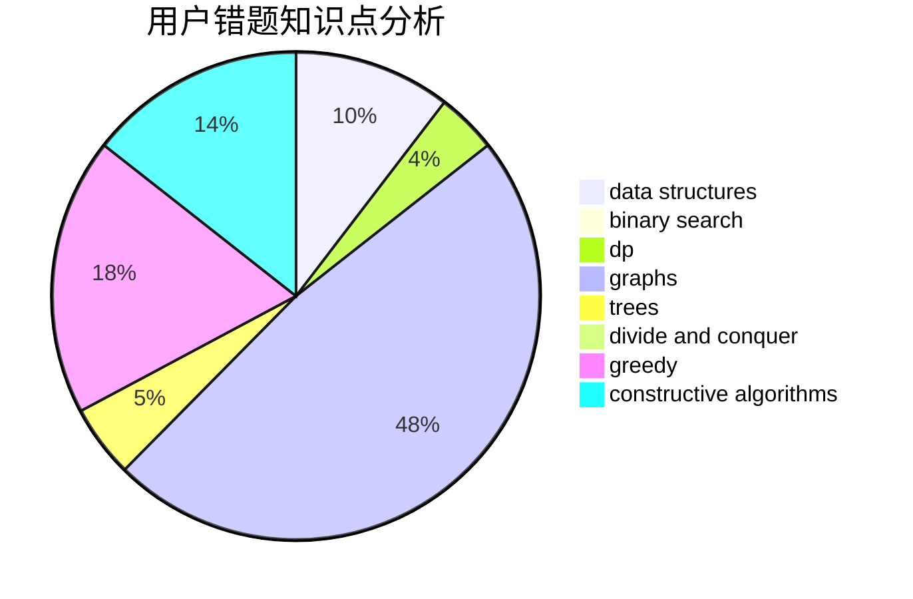

# Joler_

<!-- tabs:start -->

#### **用户提交结果分析**

#### **用户做题类型偏好分析**

#### **用户错题知识点分析**

<!-- tabs:end -->
# 推荐题目
[828C](https://codeforces.com/contest/828/problem/C)		dsu,graphs,sortings,trees		  
[1266H](https://codeforces.com/contest/1266/problem/H)		dp,
                        graphs,
                        math,
                        matrices,
                        meet-in-the-middle		  
[782A](https://codeforces.com/contest/782/problem/A)		dsu,graphs,sortings,trees		  
[935F](https://codeforces.com/contest/935/problem/F)		data structures,
                        greedy		  
[429E](https://codeforces.com/contest/429/problem/E)		graphs		  
[900C](https://codeforces.com/contest/900/problem/C)		brute force,
                        data structures,
                        math		  
[187D](https://codeforces.com/contest/187/problem/D)		data structures		  
[1359A](https://codeforces.com/contest/1359/problem/A)		brute force,
                        greedy,
                        math		  
[1416C](https://codeforces.com/contest/1416/problem/C)		bitmasks,
                        data structures,
                        divide and conquer,
                        dp,
                        greedy,
                        math,
                        sortings,
                        strings,
                        trees		  
[366C](https://codeforces.com/contest/366/problem/C)		dp		  
