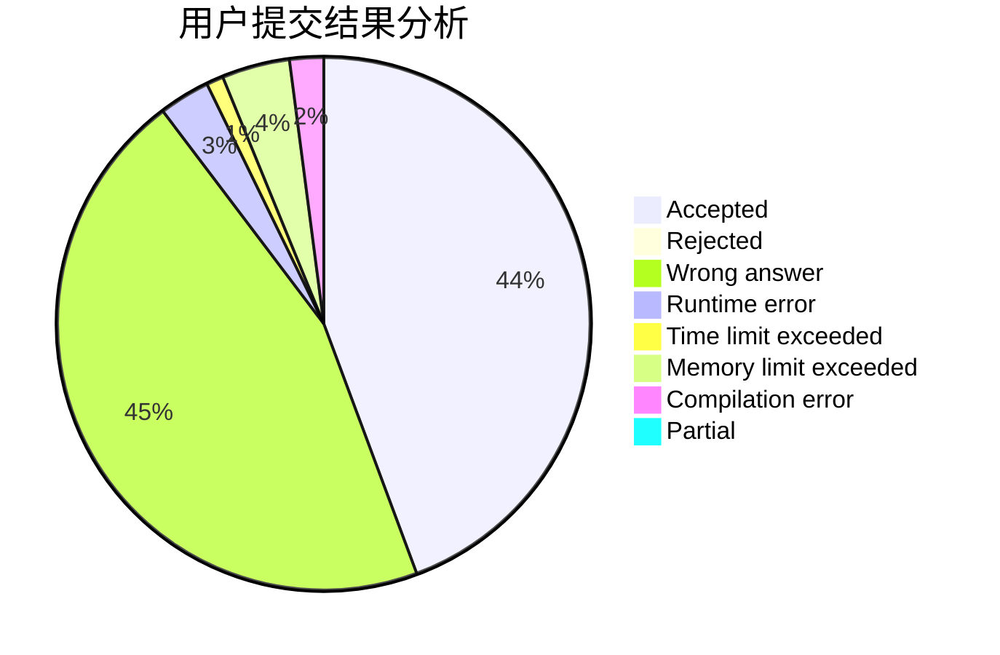
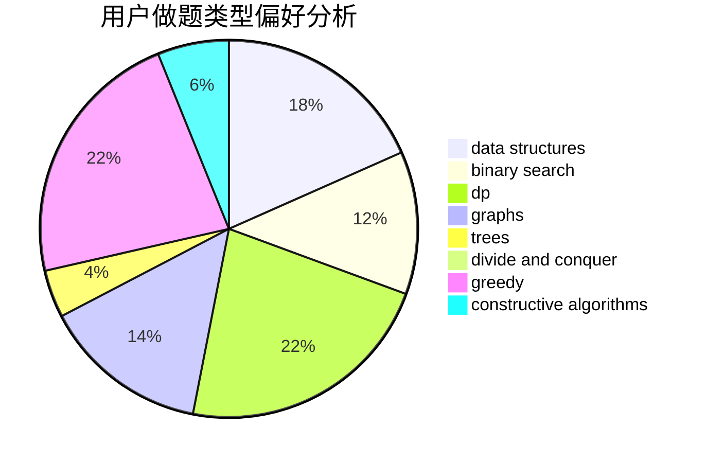
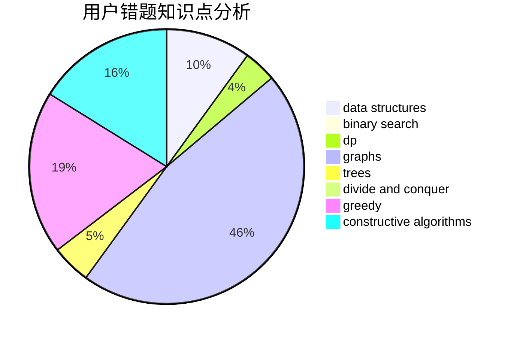

# Joler_

<!-- tabs:start -->

#### **用户提交结果分析**

#### **用户做题类型偏好分析**

#### **用户错题知识点分析**

<!-- tabs:end -->
# 推荐题目
[810C](https://codeforces.com/contest/810/problem/C)		dsu,graphs,sortings,trees		  
[1261B1](https://codeforces.com/contest/1261B/problem/1)		dsu,graphs,sortings,trees		  
[763C](https://codeforces.com/contest/763/problem/C)		brute force,
                        implementation,
                        math,
                        number theory		  
[915G](https://codeforces.com/contest/915/problem/G)		math,
                        number theory		  
[3D](https://codeforces.com/contest/3/problem/D)		greedy		  
[883D](https://codeforces.com/contest/883/problem/D)		binary search,
                        dp,
                        math		  
[161D](https://codeforces.com/contest/161/problem/D)		dfs and similar,
                        dp,
                        trees		  
[1352C](https://codeforces.com/contest/1352/problem/C)		binary search,
                        math		  
[1405B](https://codeforces.com/contest/1405/problem/B)		constructive algorithms,
                        implementation		  
[339C](https://codeforces.com/contest/339/problem/C)		constructive algorithms,
                        dfs and similar,
                        dp,
                        graphs,
                        greedy,
                        shortest paths		  
