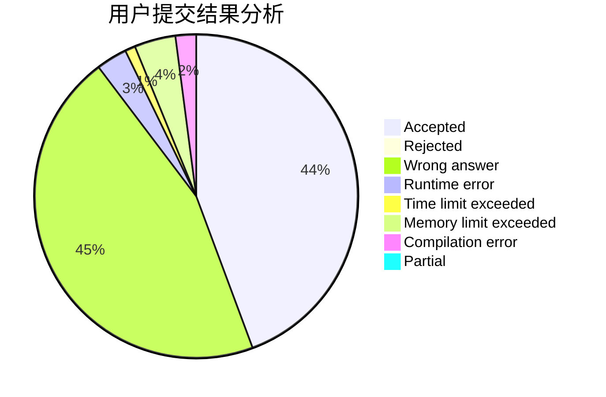
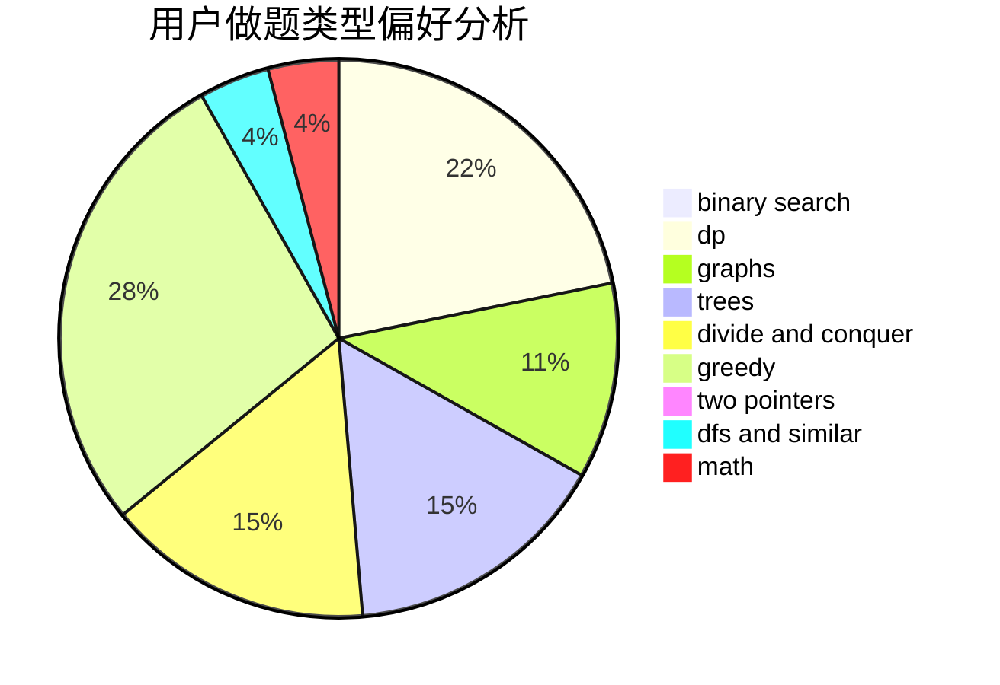

# Joler_

<!-- tabs:start -->

#### **用户提交结果分析**

#### **用户做题类型偏好分析**

<!-- tabs:end -->
# 推荐题目
[828C](https://codeforces.com/contest/828/problem/C)
[1266H](https://codeforces.com/contest/1266/problem/H)
[782A](https://codeforces.com/contest/782/problem/A)
[935F](https://codeforces.com/contest/935/problem/F)
[429E](https://codeforces.com/contest/429/problem/E)
[900C](https://codeforces.com/contest/900/problem/C)
[187D](https://codeforces.com/contest/187/problem/D)
[1359A](https://codeforces.com/contest/1359/problem/A)
[1416C](https://codeforces.com/contest/1416/problem/C)
[366C](https://codeforces.com/contest/366/problem/C)
