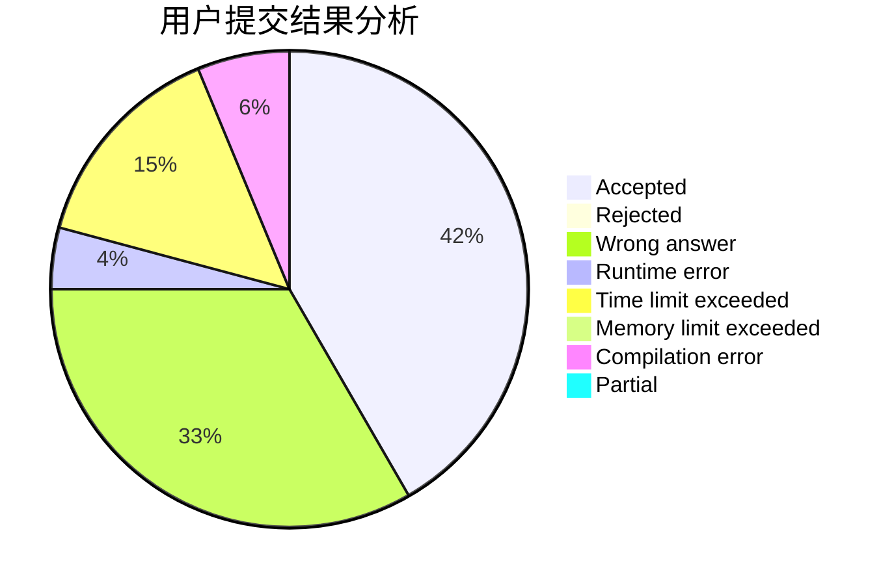
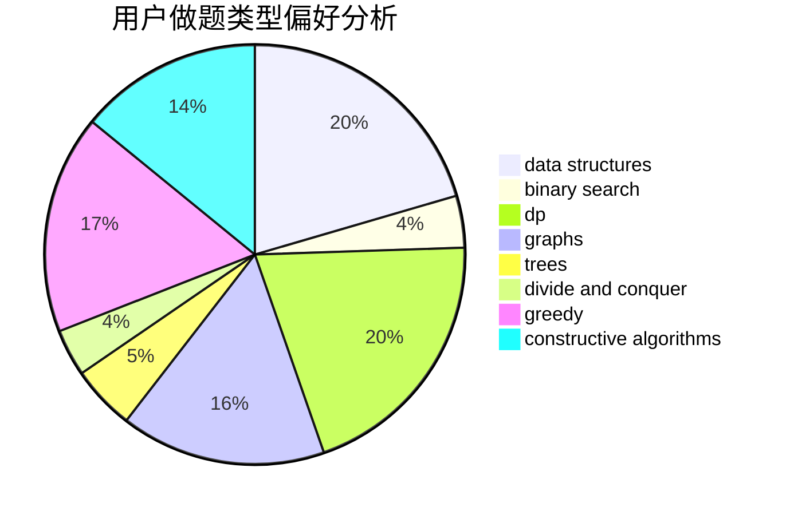
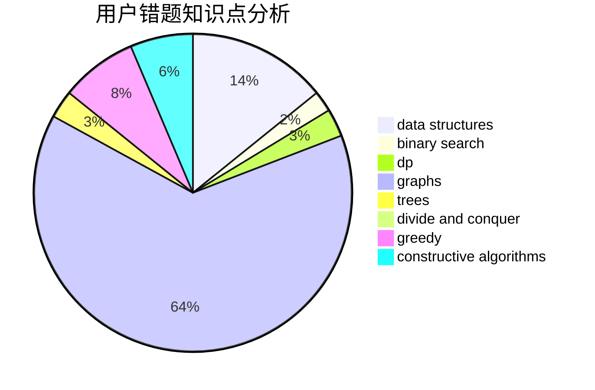

# Joney
<!-- tabs:start -->
#### **用户提交结果分析**

#### **用户做题类型偏好分析**

#### **用户错题知识点分析**

<!-- tabs:end -->
# 推荐题目
[01 Game](http://codeforces.com/problemset/problem/1373/B)		games		  
[Hydra](http://codeforces.com/problemset/problem/243/B)		graphs,
                        sortings		  
[Dima and Game](http://codeforces.com/problemset/problem/273/E)		dp,
                        games		  
[Not Wool Sequences](http://codeforces.com/problemset/problem/238/A)		constructive algorithms,
                        math		  
[Permutation Cycle](http://codeforces.com/problemset/problem/932/C)		brute force,
                        constructive algorithms		  
[Suits](http://codeforces.com/problemset/problem/1271/A)		brute force,
                        greedy,
                        math		  
[Optimal Subsequences (Easy Version)](http://codeforces.com/problemset/problem/1227/D1)		data structures,
                        greedy		  
[Producing Snow](http://codeforces.com/problemset/problem/923/B)		binary search,
                        data structures		  
[Painting Numbers](http://codeforces.com/problemset/problem/1488/G)		*special problem,
                        data structures,
                        greedy,
                        number theory		  
[Shell Game](http://codeforces.com/problemset/problem/777/A)		constructive algorithms,
                        implementation,
                        math		  
<!-- tabs:start -->
#### **data structures**
[Optimal Subsequences (Easy Version)](http://codeforces.com/problemset/problem/1227/D1)		data structures,
                        greedy		  
[Producing Snow](http://codeforces.com/problemset/problem/923/B)		binary search,
                        data structures		  
[Painting Numbers](http://codeforces.com/problemset/problem/1488/G)		*special problem,
                        data structures,
                        greedy,
                        number theory		  
[Recursive Queries](http://codeforces.com/problemset/problem/932/B)		binary search,
                        data structures,
                        dfs and similar		  
[Build From Suffixes](http://codeforces.com/problemset/problem/1488/H)		*special problem,
                        combinatorics,
                        data structures		  
[Editor](http://codeforces.com/problemset/problem/1263/E)		data structures,
                        implementation		  
[Multidimensional Queries](http://codeforces.com/problemset/problem/1093/G)		bitmasks,
                        data structures		  
[Recommendations](http://codeforces.com/problemset/problem/1310/A)		data structures,
                        greedy,
                        sortings		  
[Modulo Sum](http://codeforces.com/problemset/problem/577/B)		combinatorics,
                        data structures,
                        dp,
                        two pointers		  
[Mind Control](http://codeforces.com/problemset/problem/1290/A)		brute force,
                        data structures,
                        implementation		  
#### **binary search**
[Producing Snow](http://codeforces.com/problemset/problem/923/B)		binary search,
                        data structures		  
[Recursive Queries](http://codeforces.com/problemset/problem/932/B)		binary search,
                        data structures,
                        dfs and similar		  
[Rest In The Shades](http://codeforces.com/problemset/problem/1016/E)		binary search,
                        geometry		  
[Tree](http://codeforces.com/problemset/problem/932/D)		binary search,
                        dp,
                        trees		  
[Xenia and Colorful Gems](http://codeforces.com/problemset/problem/1336/B)		binary search,
                        greedy,
                        math,
                        sortings,
                        two pointers		  
[Maximum width](http://codeforces.com/problemset/problem/1492/C)		binary search,
                        data structures,
                        dp,
                        greedy,
                        two pointers		  
[Pairs](http://codeforces.com/problemset/problem/1463/D)		binary search,
                        constructive algorithms,
                        greedy,
                        two pointers		  
[Old Floppy Drive](http://codeforces.com/problemset/problem/1490/G)		binary search,
                        data structures,
                        math		  
[Odd Mineral Resource](http://codeforces.com/problemset/problem/1479/D)		binary search,
                        bitmasks,
                        brute force,
                        data structures,
                        probabilities,
                        trees		  
[Complicated Computations](http://codeforces.com/problemset/problem/1436/E)		binary search,
                        data structures,
                        two pointers		  
#### **dp**
[Dima and Game](http://codeforces.com/problemset/problem/273/E)		dp,
                        games		  
[Cakes for Clones](http://codeforces.com/problemset/problem/1415/F)		dp		  
[Karen and Supermarket](https://codeforces.com/contest/816/problem/E)		brute force,
                        dp,
                        trees		  
[Flying Sort (Easy Version)](http://codeforces.com/problemset/problem/1367/F1)		dp,
                        greedy,
                        two pointers		  
[Weather](http://codeforces.com/problemset/problem/234/C)		dp,
                        implementation		  
[Bargaining Table](http://codeforces.com/problemset/problem/22/B)		brute force,
                        dp		  
[Chocolate Bar](http://codeforces.com/problemset/problem/598/E)		brute force,
                        dp		  
[Tree](http://codeforces.com/problemset/problem/932/D)		binary search,
                        dp,
                        trees		  
[Make It One](http://codeforces.com/problemset/problem/1043/F)		bitmasks,
                        combinatorics,
                        dp,
                        math,
                        number theory,
                        shortest paths		  
[Colored Rectangles](http://codeforces.com/problemset/problem/1398/D)		dp,
                        greedy,
                        sortings		  
#### **graph**
[Hydra](http://codeforces.com/problemset/problem/243/B)		graphs,
                        sortings		  
[Graph Coloring](http://codeforces.com/problemset/problem/662/B)		dfs and similar,
                        graphs		  
[Vus the Cossack and a Graph](http://codeforces.com/problemset/problem/1186/F)		dfs and similar,
                        graphs,
                        greedy,
                        implementation		  
[The Coronation](http://codeforces.com/problemset/problem/1250/E)		graphs,
                        implementation		  
[Olympiad in Programming and Sports](http://codeforces.com/problemset/problem/730/I)		dp,
                        flows,
                        graphs,
                        greedy		  
[Ant Man](http://codeforces.com/problemset/problem/704/B)		dp,
                        graphs,
                        greedy		  
[k-Maximum Subsequence Sum](http://codeforces.com/problemset/problem/280/D)		data structures,
                        flows,
                        graphs,
                        implementation		  
[Road Reform](http://codeforces.com/problemset/problem/1468/J)		dsu,
                        graphs,
                        greedy		  
[Mortal Kombat Tower](http://codeforces.com/problemset/problem/1418/C)		dp,
                        graphs,
                        greedy,
                        shortest paths		  
[Minimum Ties](http://codeforces.com/problemset/problem/1487/C)		brute force,
                        constructive algorithms,
                        dfs and similar,
                        graphs,
                        greedy,
                        implementation,
                        math		  
#### **trees**
[Karen and Supermarket](https://codeforces.com/contest/816/problem/E)		brute force,
                        dp,
                        trees		  
[Tree](http://codeforces.com/problemset/problem/932/D)		binary search,
                        dp,
                        trees		  
[Linova and Kingdom](https://codeforces.com/contest/1337/problem/C)		dfs and similar,
                        dp,
                        greedy,
                        sortings,
                        trees		  
[Odd Mineral Resource](http://codeforces.com/problemset/problem/1479/D)		binary search,
                        bitmasks,
                        brute force,
                        data structures,
                        probabilities,
                        trees		  
[Yet Another Card Deck](http://codeforces.com/problemset/problem/1511/C)		brute force,
                        data structures,
                        implementation,
                        trees		  
[Diameter Cuts](http://codeforces.com/problemset/problem/1499/F)		combinatorics,
                        dfs and similar,
                        dp,
                        trees		  
[Fib-tree](http://codeforces.com/problemset/problem/1491/E)		brute force,
                        dfs and similar,
                        divide and conquer,
                        number theory,
                        trees		  
[13th Labour of Heracles](http://codeforces.com/problemset/problem/1466/D)		data structures,
                        greedy,
                        sortings,
                        trees		  
[BFS Trees](http://codeforces.com/problemset/problem/1495/D)		combinatorics,
                        dfs and similar,
                        graphs,
                        math,
                        shortest paths,
                        trees		  
[Sum of Prefix Sums](http://codeforces.com/problemset/problem/1303/G)		data structures,
                        divide and conquer,
                        geometry,
                        trees		  
#### **divide and conquer**
[Divide and Summarize](http://codeforces.com/problemset/problem/1461/D)		binary search,
                        brute force,
                        data structures,
                        divide and conquer,
                        implementation,
                        sortings		  
[Song of the Sirens](http://codeforces.com/problemset/problem/1466/G)		combinatorics,
                        divide and conquer,
                        hashing,
                        math,
                        string suffix structures,
                        strings		  
[Permutation Transformation](http://codeforces.com/problemset/problem/1490/D)		dfs and similar,
                        divide and conquer,
                        implementation		  
[Skyline Photo](https://codeforces.com/contest/1483/problem/C)		data structures,
                        divide and conquer,
                        dp		  
[Fib-tree](http://codeforces.com/problemset/problem/1491/E)		brute force,
                        dfs and similar,
                        divide and conquer,
                        number theory,
                        trees		  
[Sum of Prefix Sums](http://codeforces.com/problemset/problem/1303/G)		data structures,
                        divide and conquer,
                        geometry,
                        trees		  
[Dogeforces](http://codeforces.com/problemset/problem/1494/D)		constructive algorithms,
                        data structures,
                        dfs and similar,
                        divide and conquer,
                        dsu,
                        greedy,
                        sortings,
                        trees		  
[Skyline Photo](http://codeforces.com/problemset/problem/1482/E)		data structures,
                        divide and conquer,
                        dp		  
[Logistical Questions](http://codeforces.com/problemset/problem/566/C)		dfs and similar,
                        divide and conquer,
                        trees		  
[Fruit Sequences](http://codeforces.com/problemset/problem/1428/F)		binary search,
                        data structures,
                        divide and conquer,
                        dp,
                        two pointers		  
#### **greedy**
[Suits](http://codeforces.com/problemset/problem/1271/A)		brute force,
                        greedy,
                        math		  
[Optimal Subsequences (Easy Version)](http://codeforces.com/problemset/problem/1227/D1)		data structures,
                        greedy		  
[Painting Numbers](http://codeforces.com/problemset/problem/1488/G)		*special problem,
                        data structures,
                        greedy,
                        number theory		  
[Flying Sort (Easy Version)](http://codeforces.com/problemset/problem/1367/F1)		dp,
                        greedy,
                        two pointers		  
[Kirk and a Binary String (easy version)](http://codeforces.com/problemset/problem/1204/D1)		brute force,
                        greedy,
                        strings		  
[Colored Rectangles](http://codeforces.com/problemset/problem/1398/D)		dp,
                        greedy,
                        sortings		  
[Barrels](http://codeforces.com/problemset/problem/1430/B)		greedy,
                        implementation,
                        sortings		  
[Silly Mistake](http://codeforces.com/problemset/problem/1253/B)		greedy,
                        implementation		  
[Vus the Cossack and a Graph](http://codeforces.com/problemset/problem/1186/F)		dfs and similar,
                        graphs,
                        greedy,
                        implementation		  
[Linova and Kingdom](https://codeforces.com/contest/1337/problem/C)		dfs and similar,
                        dp,
                        greedy,
                        sortings,
                        trees		  
#### **constructive algorithms**
[Not Wool Sequences](http://codeforces.com/problemset/problem/238/A)		constructive algorithms,
                        math		  
[Permutation Cycle](http://codeforces.com/problemset/problem/932/C)		brute force,
                        constructive algorithms		  
[Shell Game](http://codeforces.com/problemset/problem/777/A)		constructive algorithms,
                        implementation,
                        math		  
[Santa Claus and Robot](http://codeforces.com/problemset/problem/748/C)		constructive algorithms,
                        math		  
[Domino](http://codeforces.com/problemset/problem/85/A)		constructive algorithms,
                        implementation		  
[Optimal Number Permutation](http://codeforces.com/problemset/problem/622/D)		constructive algorithms		  
[Four Points](http://codeforces.com/problemset/problem/1455/E)		brute force,
                        constructive algorithms,
                        flows,
                        geometry,
                        greedy,
                        implementation,
                        math,
                        ternary search		  
[Ehab and Prefix MEXs](http://codeforces.com/problemset/problem/1364/C)		brute force,
                        constructive algorithms,
                        greedy		  
[Anti-knapsack](http://codeforces.com/problemset/problem/1493/A)		constructive algorithms,
                        greedy		  
[Pairs](http://codeforces.com/problemset/problem/1463/D)		binary search,
                        constructive algorithms,
                        greedy,
                        two pointers		  
#### **sortings**
[Hydra](http://codeforces.com/problemset/problem/243/B)		graphs,
                        sortings		  
[Colored Rectangles](http://codeforces.com/problemset/problem/1398/D)		dp,
                        greedy,
                        sortings		  
[Barrels](http://codeforces.com/problemset/problem/1430/B)		greedy,
                        implementation,
                        sortings		  
[Linova and Kingdom](https://codeforces.com/contest/1337/problem/C)		dfs and similar,
                        dp,
                        greedy,
                        sortings,
                        trees		  
[New Bus Route](http://codeforces.com/problemset/problem/792/A)		implementation,
                        sortings		  
[Recommendations](http://codeforces.com/problemset/problem/1310/A)		data structures,
                        greedy,
                        sortings		  
[Xenia and Colorful Gems](http://codeforces.com/problemset/problem/1336/B)		binary search,
                        greedy,
                        math,
                        sortings,
                        two pointers		  
[Balanced Tunnel](http://codeforces.com/problemset/problem/1237/B)		data structures,
                        sortings,
                        two pointers		  
[Diamond Miner](https://codeforces.com/contest/1496/problem/C)		geometry,
                        greedy,
                        math,
                        sortings		  
[Diamond Miner](http://codeforces.com/problemset/problem/1495/A)		geometry,
                        greedy,
                        math,
                        sortings		  
<!-- tabs:end -->
