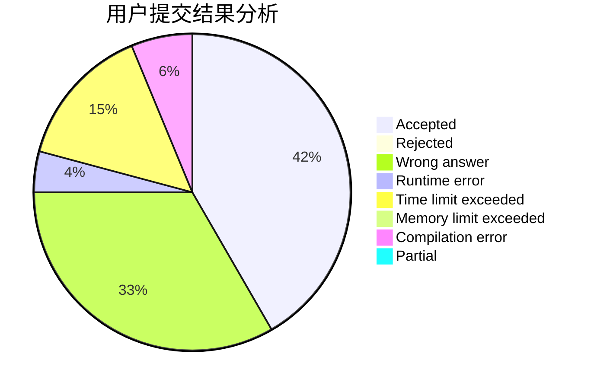
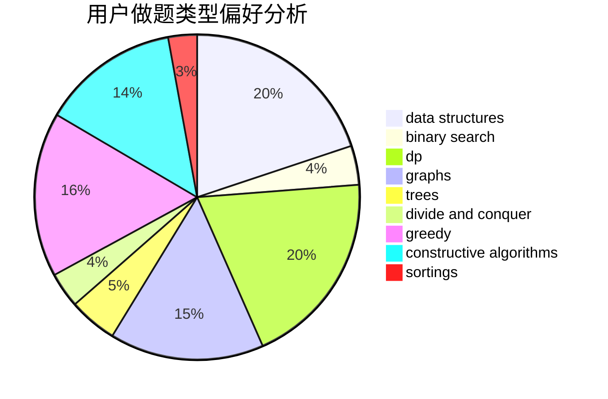
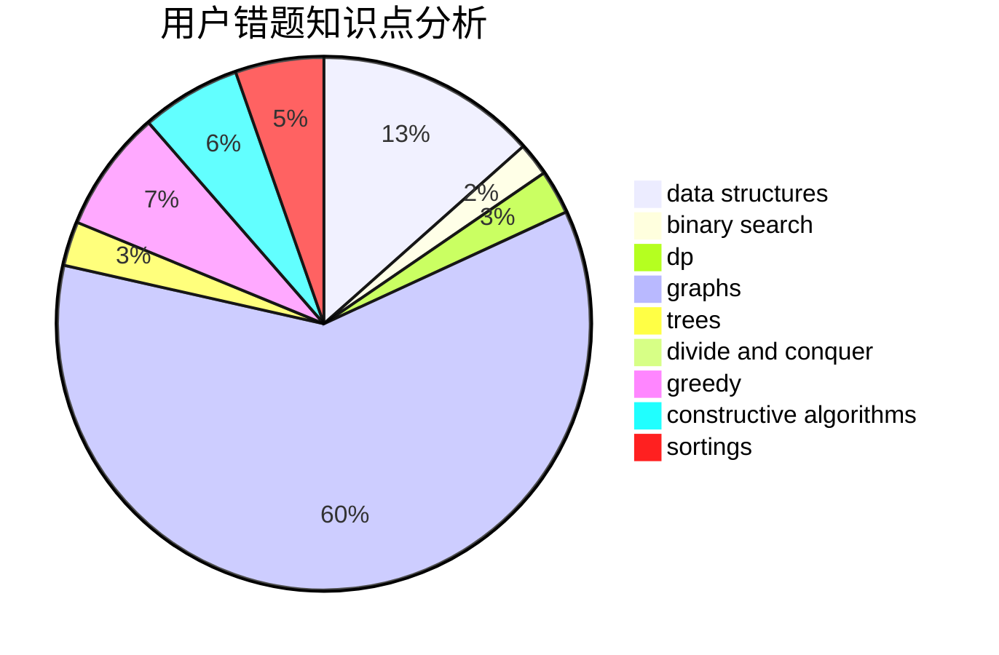

# Joney
<!-- tabs:start -->
#### **用户提交结果分析**

#### **用户做题类型偏好分析**

#### **用户错题知识点分析**

<!-- tabs:end -->
# 推荐题目
[1373B](http://codeforces.com/problemset/problem/1373/B)		games		  
[243B](http://codeforces.com/problemset/problem/243/B)		graphs,
                        sortings		  
[273E](http://codeforces.com/problemset/problem/273/E)		dp,
                        games		  
[238A](http://codeforces.com/problemset/problem/238/A)		constructive algorithms,
                        math		  
[932C](http://codeforces.com/problemset/problem/932/C)		brute force,
                        constructive algorithms		  
[1271A](http://codeforces.com/problemset/problem/1271/A)		brute force,
                        greedy,
                        math		  
[1227D1](http://codeforces.com/problemset/problem/1227/D1)		data structures,
                        greedy		  
[923B](http://codeforces.com/problemset/problem/923/B)		binary search,
                        data structures		  
[1488G](http://codeforces.com/problemset/problem/1488/G)		*special problem,
                        data structures,
                        greedy,
                        number theory		  
[777A](http://codeforces.com/problemset/problem/777/A)		constructive algorithms,
                        implementation,
                        math		  
<!-- tabs:start -->
#### **data structures**
[1227D1](http://codeforces.com/problemset/problem/1227/D1)		data structures,
                        greedy		  
[923B](http://codeforces.com/problemset/problem/923/B)		binary search,
                        data structures		  
[1488G](http://codeforces.com/problemset/problem/1488/G)		*special problem,
                        data structures,
                        greedy,
                        number theory		  
[932B](http://codeforces.com/problemset/problem/932/B)		binary search,
                        data structures,
                        dfs and similar		  
[1488H](http://codeforces.com/problemset/problem/1488/H)		*special problem,
                        combinatorics,
                        data structures		  
[1263E](http://codeforces.com/problemset/problem/1263/E)		data structures,
                        implementation		  
[1093G](http://codeforces.com/problemset/problem/1093/G)		bitmasks,
                        data structures		  
[1310A](http://codeforces.com/problemset/problem/1310/A)		data structures,
                        greedy,
                        sortings		  
[577B](http://codeforces.com/problemset/problem/577/B)		combinatorics,
                        data structures,
                        dp,
                        two pointers		  
[1290A](http://codeforces.com/problemset/problem/1290/A)		brute force,
                        data structures,
                        implementation		  
#### **binary search**
[923B](http://codeforces.com/problemset/problem/923/B)		binary search,
                        data structures		  
[932B](http://codeforces.com/problemset/problem/932/B)		binary search,
                        data structures,
                        dfs and similar		  
[1016E](http://codeforces.com/problemset/problem/1016/E)		binary search,
                        geometry		  
[932D](http://codeforces.com/problemset/problem/932/D)		binary search,
                        dp,
                        trees		  
[1336B](http://codeforces.com/problemset/problem/1336/B)		binary search,
                        greedy,
                        math,
                        sortings,
                        two pointers		  
[1492C](http://codeforces.com/problemset/problem/1492/C)		binary search,
                        data structures,
                        dp,
                        greedy,
                        two pointers		  
[1463D](http://codeforces.com/problemset/problem/1463/D)		binary search,
                        constructive algorithms,
                        greedy,
                        two pointers		  
[1490G](http://codeforces.com/problemset/problem/1490/G)		binary search,
                        data structures,
                        math		  
[1479D](http://codeforces.com/problemset/problem/1479/D)		binary search,
                        bitmasks,
                        brute force,
                        data structures,
                        probabilities,
                        trees		  
[1436E](http://codeforces.com/problemset/problem/1436/E)		binary search,
                        data structures,
                        two pointers		  
#### **dp**
[273E](http://codeforces.com/problemset/problem/273/E)		dp,
                        games		  
[1415F](http://codeforces.com/problemset/problem/1415/F)		dp		  
[816E](https://codeforces.com/contest/816/problem/E)		brute force,
                        dp,
                        trees		  
[1367F1](http://codeforces.com/problemset/problem/1367/F1)		dp,
                        greedy,
                        two pointers		  
[234C](http://codeforces.com/problemset/problem/234/C)		dp,
                        implementation		  
[22B](http://codeforces.com/problemset/problem/22/B)		brute force,
                        dp		  
[598E](http://codeforces.com/problemset/problem/598/E)		brute force,
                        dp		  
[932D](http://codeforces.com/problemset/problem/932/D)		binary search,
                        dp,
                        trees		  
[1043F](http://codeforces.com/problemset/problem/1043/F)		bitmasks,
                        combinatorics,
                        dp,
                        math,
                        number theory,
                        shortest paths		  
[1398D](http://codeforces.com/problemset/problem/1398/D)		dp,
                        greedy,
                        sortings		  
#### **graph**
[243B](http://codeforces.com/problemset/problem/243/B)		graphs,
                        sortings		  
[662B](http://codeforces.com/problemset/problem/662/B)		dfs and similar,
                        graphs		  
[1186F](http://codeforces.com/problemset/problem/1186/F)		dfs and similar,
                        graphs,
                        greedy,
                        implementation		  
[1250E](http://codeforces.com/problemset/problem/1250/E)		graphs,
                        implementation		  
[730I](http://codeforces.com/problemset/problem/730/I)		dp,
                        flows,
                        graphs,
                        greedy		  
[704B](http://codeforces.com/problemset/problem/704/B)		dp,
                        graphs,
                        greedy		  
[280D](http://codeforces.com/problemset/problem/280/D)		data structures,
                        flows,
                        graphs,
                        implementation		  
[1468J](http://codeforces.com/problemset/problem/1468/J)		dsu,
                        graphs,
                        greedy		  
[1418C](http://codeforces.com/problemset/problem/1418/C)		dp,
                        graphs,
                        greedy,
                        shortest paths		  
[1487C](http://codeforces.com/problemset/problem/1487/C)		brute force,
                        constructive algorithms,
                        dfs and similar,
                        graphs,
                        greedy,
                        implementation,
                        math		  
#### **trees**
[816E](https://codeforces.com/contest/816/problem/E)		brute force,
                        dp,
                        trees		  
[932D](http://codeforces.com/problemset/problem/932/D)		binary search,
                        dp,
                        trees		  
[1337C](https://codeforces.com/contest/1337/problem/C)		dfs and similar,
                        dp,
                        greedy,
                        sortings,
                        trees		  
[1479D](http://codeforces.com/problemset/problem/1479/D)		binary search,
                        bitmasks,
                        brute force,
                        data structures,
                        probabilities,
                        trees		  
[1511C](http://codeforces.com/problemset/problem/1511/C)		brute force,
                        data structures,
                        implementation,
                        trees		  
[1499F](http://codeforces.com/problemset/problem/1499/F)		combinatorics,
                        dfs and similar,
                        dp,
                        trees		  
[1491E](http://codeforces.com/problemset/problem/1491/E)		brute force,
                        dfs and similar,
                        divide and conquer,
                        number theory,
                        trees		  
[1466D](http://codeforces.com/problemset/problem/1466/D)		data structures,
                        greedy,
                        sortings,
                        trees		  
[1495D](http://codeforces.com/problemset/problem/1495/D)		combinatorics,
                        dfs and similar,
                        graphs,
                        math,
                        shortest paths,
                        trees		  
[1303G](http://codeforces.com/problemset/problem/1303/G)		data structures,
                        divide and conquer,
                        geometry,
                        trees		  
#### **divide and conquer**
[1461D](http://codeforces.com/problemset/problem/1461/D)		binary search,
                        brute force,
                        data structures,
                        divide and conquer,
                        implementation,
                        sortings		  
[1466G](http://codeforces.com/problemset/problem/1466/G)		combinatorics,
                        divide and conquer,
                        hashing,
                        math,
                        string suffix structures,
                        strings		  
[1490D](http://codeforces.com/problemset/problem/1490/D)		dfs and similar,
                        divide and conquer,
                        implementation		  
[1483C](https://codeforces.com/contest/1483/problem/C)		data structures,
                        divide and conquer,
                        dp		  
[1491E](http://codeforces.com/problemset/problem/1491/E)		brute force,
                        dfs and similar,
                        divide and conquer,
                        number theory,
                        trees		  
[1303G](http://codeforces.com/problemset/problem/1303/G)		data structures,
                        divide and conquer,
                        geometry,
                        trees		  
[1494D](http://codeforces.com/problemset/problem/1494/D)		constructive algorithms,
                        data structures,
                        dfs and similar,
                        divide and conquer,
                        dsu,
                        greedy,
                        sortings,
                        trees		  
[1482E](http://codeforces.com/problemset/problem/1482/E)		data structures,
                        divide and conquer,
                        dp		  
[566C](http://codeforces.com/problemset/problem/566/C)		dfs and similar,
                        divide and conquer,
                        trees		  
[1428F](http://codeforces.com/problemset/problem/1428/F)		binary search,
                        data structures,
                        divide and conquer,
                        dp,
                        two pointers		  
#### **greedy**
[1271A](http://codeforces.com/problemset/problem/1271/A)		brute force,
                        greedy,
                        math		  
[1227D1](http://codeforces.com/problemset/problem/1227/D1)		data structures,
                        greedy		  
[1488G](http://codeforces.com/problemset/problem/1488/G)		*special problem,
                        data structures,
                        greedy,
                        number theory		  
[1367F1](http://codeforces.com/problemset/problem/1367/F1)		dp,
                        greedy,
                        two pointers		  
[1204D1](http://codeforces.com/problemset/problem/1204/D1)		brute force,
                        greedy,
                        strings		  
[1398D](http://codeforces.com/problemset/problem/1398/D)		dp,
                        greedy,
                        sortings		  
[1430B](http://codeforces.com/problemset/problem/1430/B)		greedy,
                        implementation,
                        sortings		  
[1253B](http://codeforces.com/problemset/problem/1253/B)		greedy,
                        implementation		  
[1186F](http://codeforces.com/problemset/problem/1186/F)		dfs and similar,
                        graphs,
                        greedy,
                        implementation		  
[1337C](https://codeforces.com/contest/1337/problem/C)		dfs and similar,
                        dp,
                        greedy,
                        sortings,
                        trees		  
#### **constructive algorithms**
[238A](http://codeforces.com/problemset/problem/238/A)		constructive algorithms,
                        math		  
[932C](http://codeforces.com/problemset/problem/932/C)		brute force,
                        constructive algorithms		  
[777A](http://codeforces.com/problemset/problem/777/A)		constructive algorithms,
                        implementation,
                        math		  
[748C](http://codeforces.com/problemset/problem/748/C)		constructive algorithms,
                        math		  
[85A](http://codeforces.com/problemset/problem/85/A)		constructive algorithms,
                        implementation		  
[622D](http://codeforces.com/problemset/problem/622/D)		constructive algorithms		  
[1455E](http://codeforces.com/problemset/problem/1455/E)		brute force,
                        constructive algorithms,
                        flows,
                        geometry,
                        greedy,
                        implementation,
                        math,
                        ternary search		  
[1364C](http://codeforces.com/problemset/problem/1364/C)		brute force,
                        constructive algorithms,
                        greedy		  
[1493A](http://codeforces.com/problemset/problem/1493/A)		constructive algorithms,
                        greedy		  
[1463D](http://codeforces.com/problemset/problem/1463/D)		binary search,
                        constructive algorithms,
                        greedy,
                        two pointers		  
#### **sortings**
[243B](http://codeforces.com/problemset/problem/243/B)		graphs,
                        sortings		  
[1398D](http://codeforces.com/problemset/problem/1398/D)		dp,
                        greedy,
                        sortings		  
[1430B](http://codeforces.com/problemset/problem/1430/B)		greedy,
                        implementation,
                        sortings		  
[1337C](https://codeforces.com/contest/1337/problem/C)		dfs and similar,
                        dp,
                        greedy,
                        sortings,
                        trees		  
[792A](http://codeforces.com/problemset/problem/792/A)		implementation,
                        sortings		  
[1310A](http://codeforces.com/problemset/problem/1310/A)		data structures,
                        greedy,
                        sortings		  
[1336B](http://codeforces.com/problemset/problem/1336/B)		binary search,
                        greedy,
                        math,
                        sortings,
                        two pointers		  
[1237B](http://codeforces.com/problemset/problem/1237/B)		data structures,
                        sortings,
                        two pointers		  
[1496C](https://codeforces.com/contest/1496/problem/C)		geometry,
                        greedy,
                        math,
                        sortings		  
[1495A](http://codeforces.com/problemset/problem/1495/A)		geometry,
                        greedy,
                        math,
                        sortings		  
<!-- tabs:end -->
