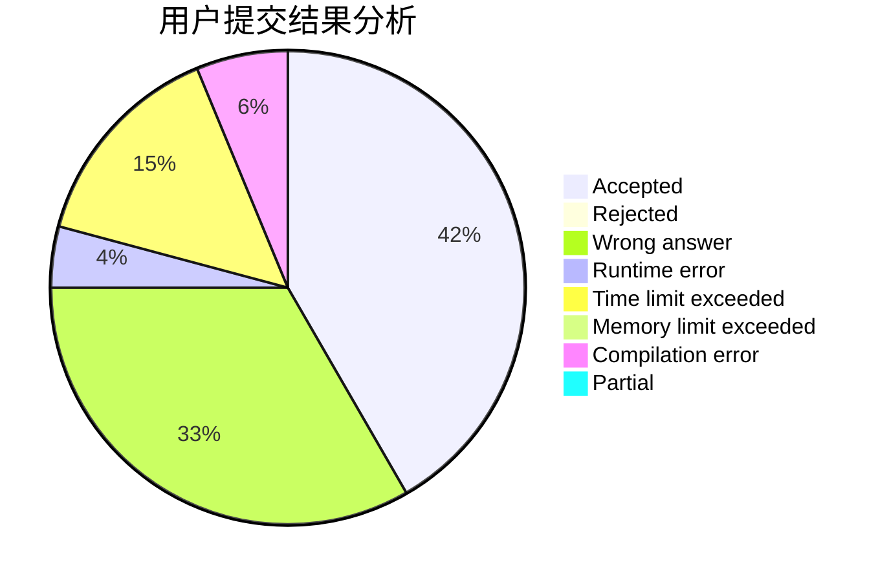
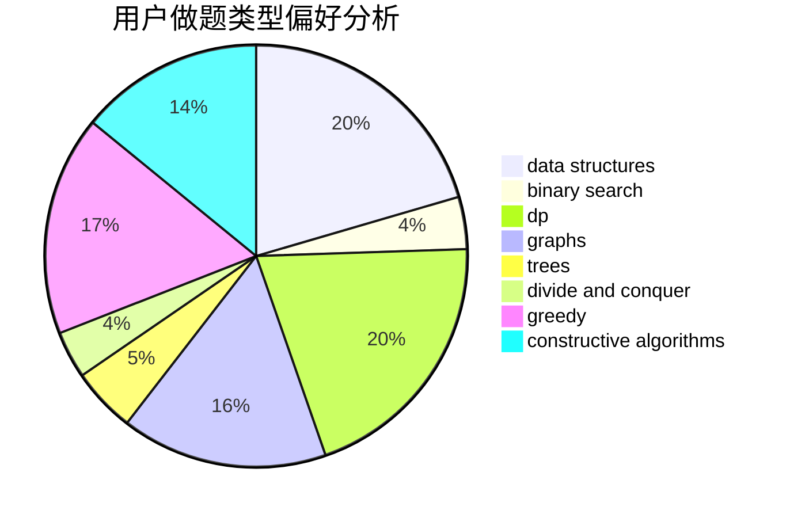
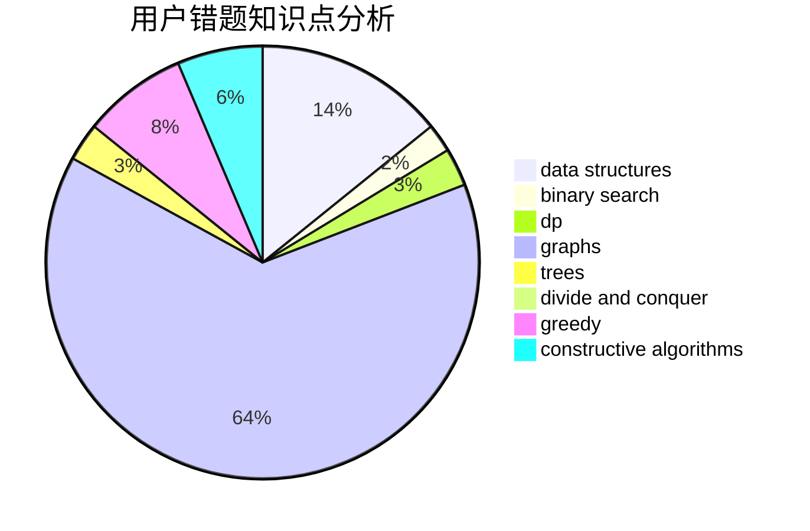

# Joney

<!-- tabs:start -->

#### **用户提交结果分析**

#### **用户做题类型偏好分析**

#### **用户错题知识点分析**

<!-- tabs:end -->
# 推荐题目
[1227D1](https://codeforces.com/contest/1227D/problem/1)		data structures,
                        greedy		  
[923B](https://codeforces.com/contest/923/problem/B)		binary search,
                        data structures		  
[238A](https://codeforces.com/contest/238/problem/A)		constructive algorithms,
                        math		  
[243B](https://codeforces.com/contest/243/problem/B)		graphs,
                        sortings		  
[932C](https://codeforces.com/contest/932/problem/C)		brute force,
                        constructive algorithms		  
[777A](https://codeforces.com/contest/777/problem/A)		constructive algorithms,
                        implementation,
                        math		  
[22B](https://codeforces.com/contest/22/problem/B)		brute force,
                        dp		  
[622D](https://codeforces.com/contest/622/problem/D)		constructive algorithms		  
[61B](https://codeforces.com/contest/61/problem/B)		strings		  
[1373B](https://codeforces.com/contest/1373/problem/B)		games		  
