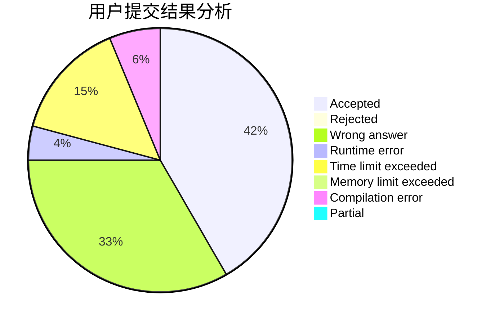
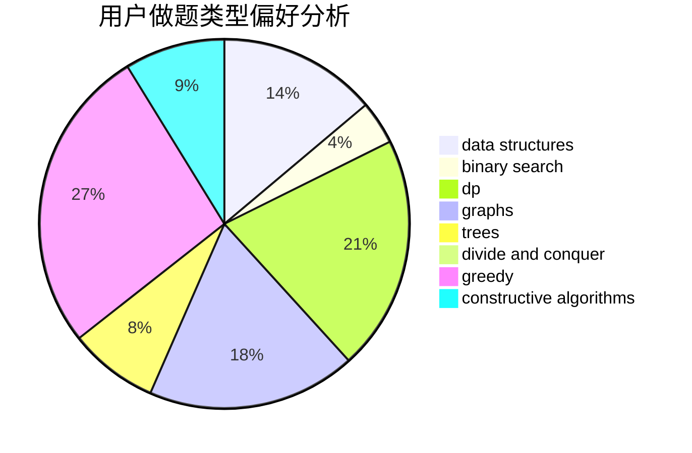
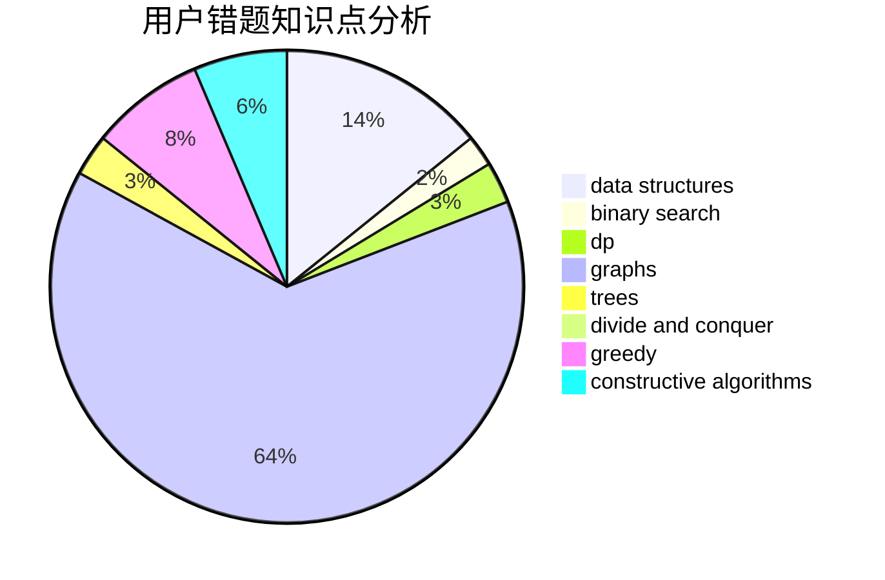

# Joney

<!-- tabs:start -->

#### **用户提交结果分析**

#### **用户做题类型偏好分析**

#### **用户错题知识点分析**

<!-- tabs:end -->
# 推荐题目
[1236A](https://codeforces.com/contest/1236/problem/A)		brute force,
                        greedy,
                        math		  
[946G](https://codeforces.com/contest/946/problem/G)		data structures,
                        dp		  
[25D](https://codeforces.com/contest/25/problem/D)		dsu,
                        graphs,
                        trees		  
[264C](https://codeforces.com/contest/264/problem/C)		dp		  
[954C](https://codeforces.com/contest/954/problem/C)		implementation		  
[794G](https://codeforces.com/contest/794/problem/G)		combinatorics,
                        dp,
                        math		  
[24E](https://codeforces.com/contest/24/problem/E)		binary search		  
[650D](https://codeforces.com/contest/650/problem/D)		binary search,
                        data structures,
                        dp,
                        hashing		  
[641E](https://codeforces.com/contest/641/problem/E)		data structures		  
[1381E](https://codeforces.com/contest/1381/problem/E)		geometry,
                        math,
                        sortings		  
