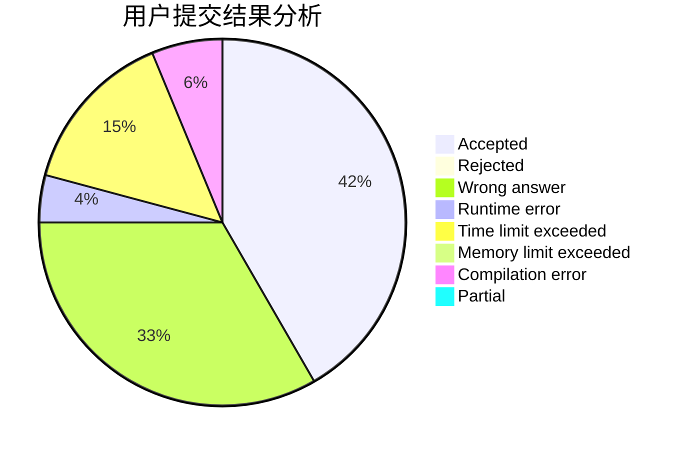
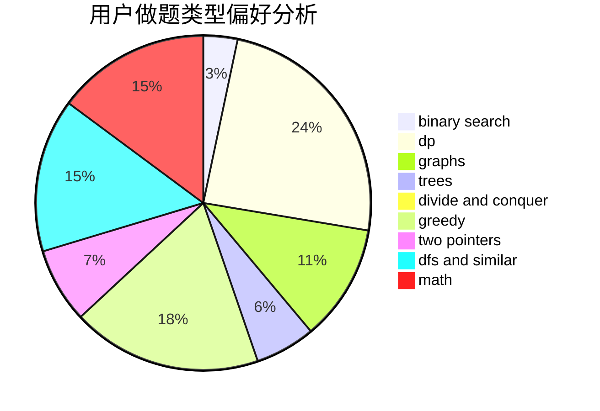

# Joney

<!-- tabs:start -->

#### **用户提交结果分析**

#### **用户做题类型偏好分析**

<!-- tabs:end -->
# 推荐题目
[1236A](https://codeforces.com/contest/1236/problem/A)
[946G](https://codeforces.com/contest/946/problem/G)
[25D](https://codeforces.com/contest/25/problem/D)
[264C](https://codeforces.com/contest/264/problem/C)
[954C](https://codeforces.com/contest/954/problem/C)
[794G](https://codeforces.com/contest/794/problem/G)
[24E](https://codeforces.com/contest/24/problem/E)
[650D](https://codeforces.com/contest/650/problem/D)
[641E](https://codeforces.com/contest/641/problem/E)
[1381E](https://codeforces.com/contest/1381/problem/E)
