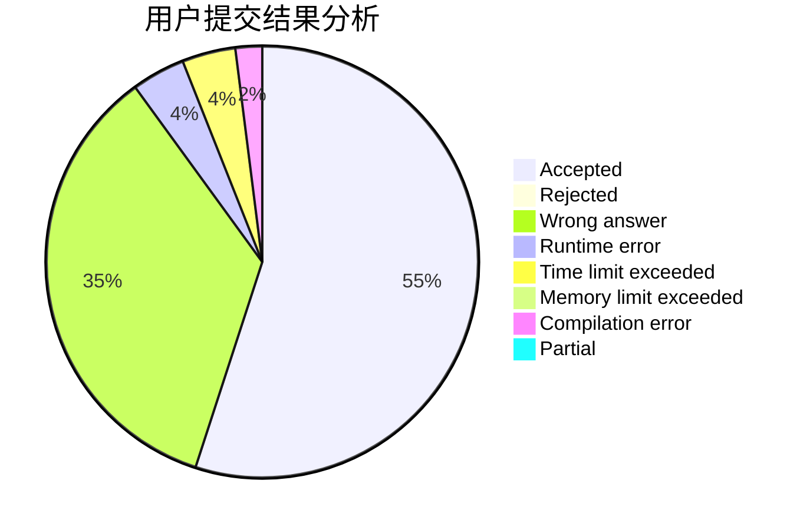
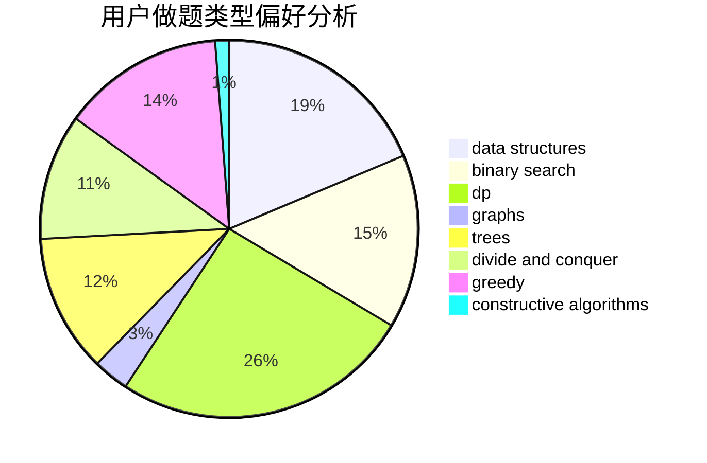
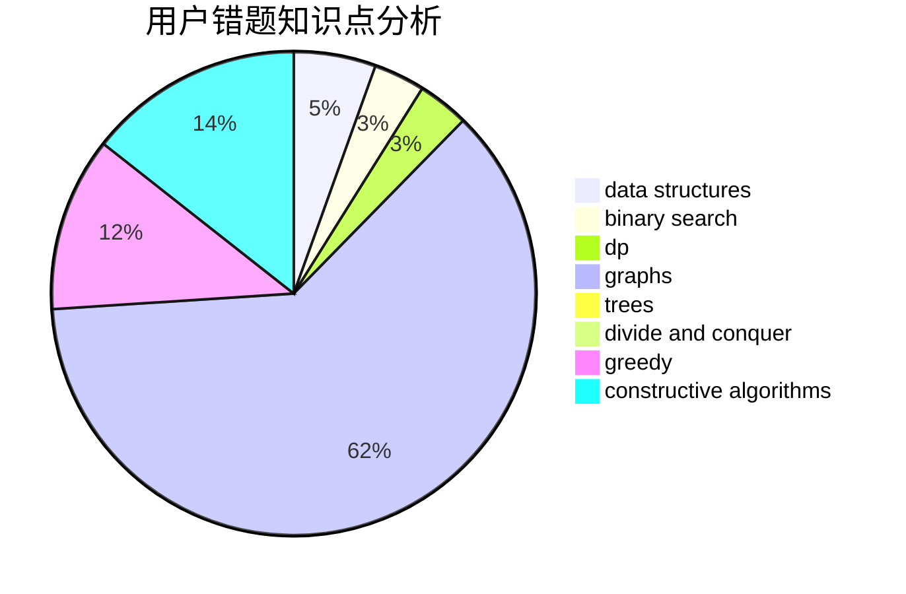

# JoneySun

<!-- tabs:start -->

#### **用户提交结果分析**

#### **用户做题类型偏好分析**

#### **用户错题知识点分析**

<!-- tabs:end -->
# 推荐题目
[1382A](https://codeforces.com/contest/1382/problem/A)		brute force		  
[1408D](https://codeforces.com/contest/1408/problem/D)		binary search,
                        brute force,
                        data structures,
                        dp,
                        implementation,
                        sortings,
                        two pointers		  
[729D](https://codeforces.com/contest/729/problem/D)		constructive algorithms,
                        greedy,
                        math		  
[1303F](https://codeforces.com/contest/1303/problem/F)		dsu,
                        implementation		  
[581B](https://codeforces.com/contest/581/problem/B)		implementation,
                        math		  
[295B](https://codeforces.com/contest/295/problem/B)		dp,
                        graphs,
                        shortest paths		  
[277E](https://codeforces.com/contest/277/problem/E)		flows,
                        trees		  
[243D](https://codeforces.com/contest/243/problem/D)		data structures,
                        dp,
                        geometry,
                        two pointers		  
[334B](https://codeforces.com/contest/334/problem/B)		sortings		  
[859F](https://codeforces.com/contest/859/problem/F)		greedy		  
