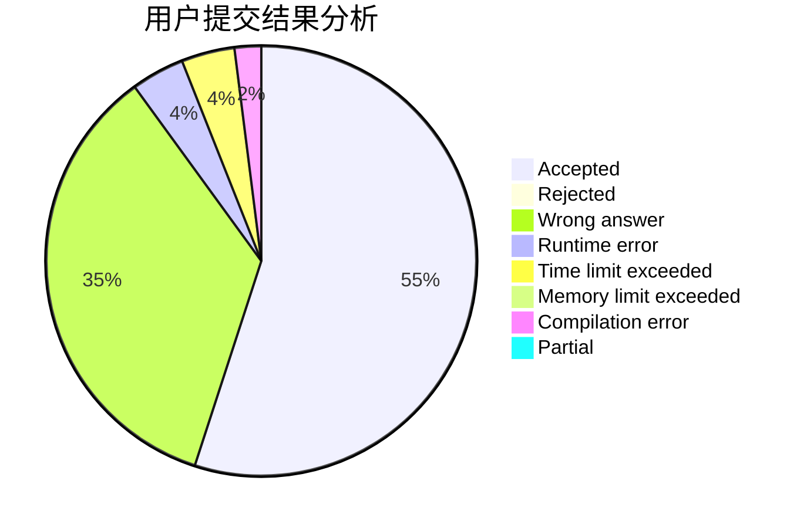
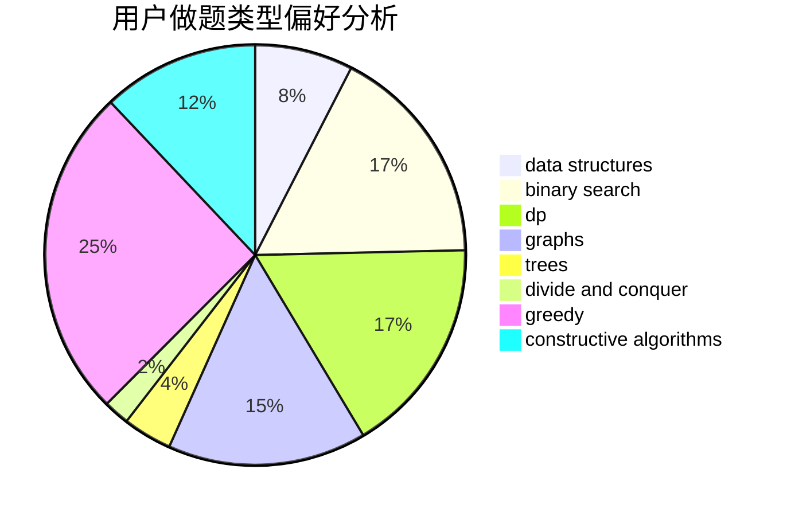
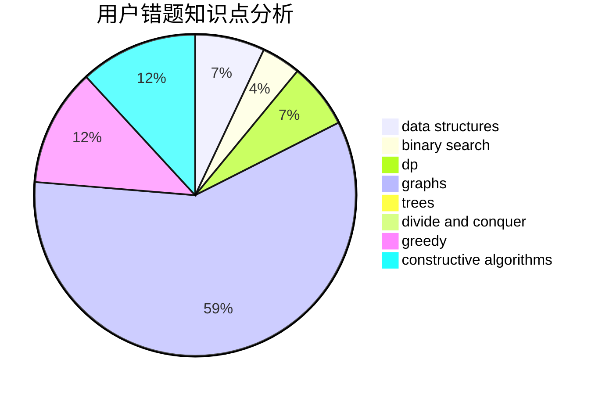

# JoneySun

<!-- tabs:start -->

#### **用户提交结果分析**

#### **用户做题类型偏好分析**

#### **用户错题知识点分析**

<!-- tabs:end -->
# 推荐题目
[1373E](https://codeforces.com/contest/1373/problem/E)		brute force,
                        constructive algorithms,
                        dp,
                        greedy		  
[1399C](https://codeforces.com/contest/1399/problem/C)		brute force,
                        greedy,
                        two pointers		  
[709C](https://codeforces.com/contest/709/problem/C)		dsu,graphs,sortings,trees		  
[1296D](https://codeforces.com/contest/1296/problem/D)		greedy,
                        sortings		  
[558D](https://codeforces.com/contest/558/problem/D)		data structures,
                        implementation,
                        sortings		  
[27C](https://codeforces.com/contest/27/problem/C)		constructive algorithms,
                        greedy		  
[25E](https://codeforces.com/contest/25/problem/E)		hashing,
                        strings		  
[225D](https://codeforces.com/contest/225/problem/D)		bitmasks,
                        dfs and similar,
                        graphs,
                        implementation		  
[311B](https://codeforces.com/contest/311/problem/B)		data structures,
                        dp		  
[840B](https://codeforces.com/contest/840/problem/B)		constructive algorithms,
                        data structures,
                        dfs and similar,
                        dp,
                        graphs		  
