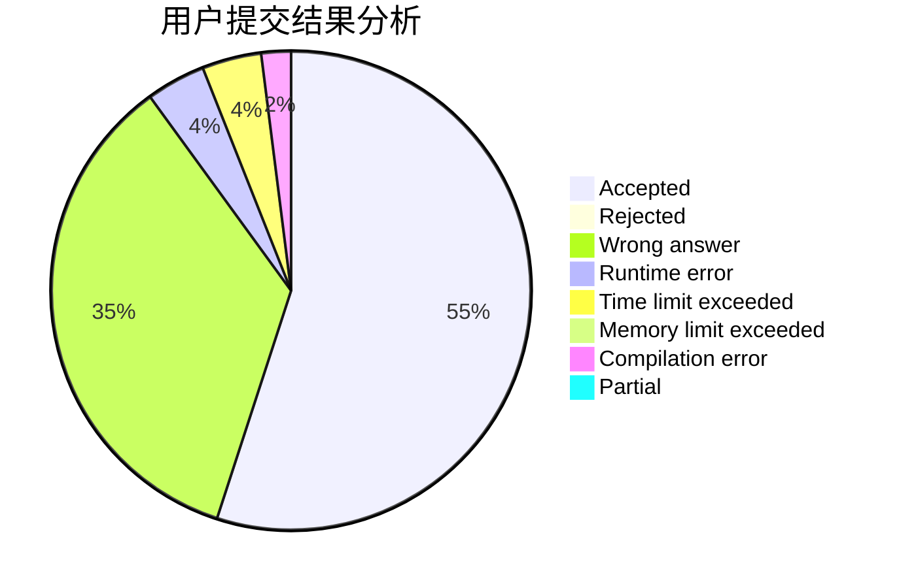
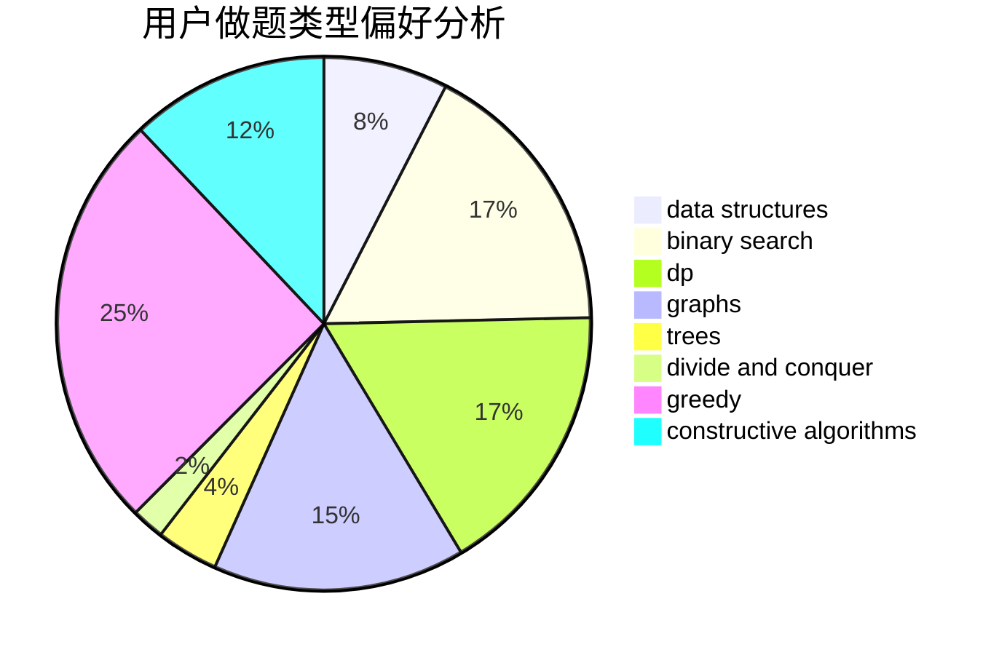
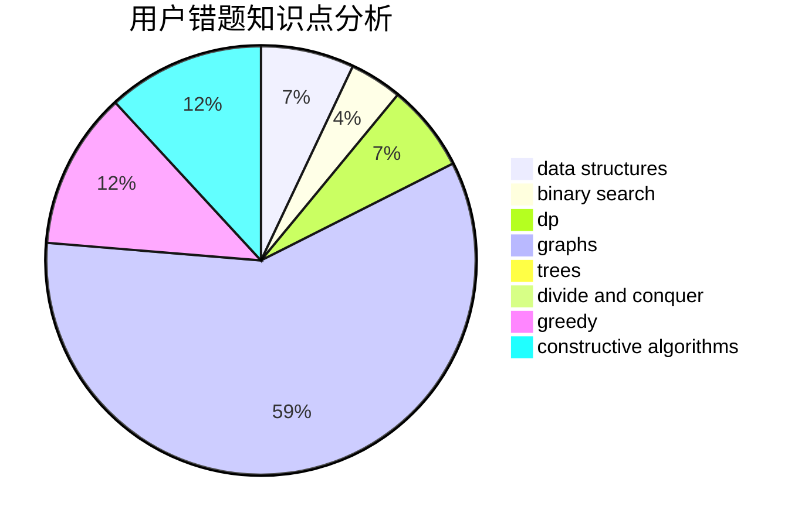

# JoneySun
<!-- tabs:start -->
#### **用户提交结果分析**

#### **用户做题类型偏好分析**

#### **用户错题知识点分析**

<!-- tabs:end -->
# 推荐题目
[Boats Competition](http://codeforces.com/problemset/problem/1399/C)		brute force,
                        greedy,
                        two pointers		  
[Test](http://codeforces.com/problemset/problem/25/E)		hashing,
                        strings		  
[Guess Your Way Out! II](http://codeforces.com/problemset/problem/558/D)		data structures,
                        implementation,
                        sortings		  
[Div. 64](http://codeforces.com/problemset/problem/887/A)		implementation		  
[Unordered Subsequence](http://codeforces.com/problemset/problem/27/C)		constructive algorithms,
                        greedy		  
[Gravity Flip](http://codeforces.com/problemset/problem/405/A)		greedy,
                        implementation,
                        sortings		  
[Maximum Reduction](http://codeforces.com/problemset/problem/1037/F)		combinatorics,
                        data structures,
                        math		  
[Snake](http://codeforces.com/problemset/problem/225/D)		bitmasks,
                        dfs and similar,
                        graphs,
                        implementation		  
[Ivan and Powers of Two](http://codeforces.com/problemset/problem/305/C)		greedy,
                        implementation		  
[Mr. Kitayuta, the Treasure Hunter](http://codeforces.com/problemset/problem/505/C)		dfs and similar,
                        dp,
                        two pointers		  
<!-- tabs:start -->
#### **data structures**
[Boats Competition](http://codeforces.com/problemset/problem/558/D)		data structures,
                        implementation,
                        sortings		  
[Test](http://codeforces.com/problemset/problem/1037/F)		combinatorics,
                        data structures,
                        math		  
[Guess Your Way Out! II](http://codeforces.com/problemset/problem/840/B)		constructive algorithms,
                        data structures,
                        dfs and similar,
                        dp,
                        graphs		  
[Div. 64](http://codeforces.com/problemset/problem/311/B)		data structures,
                        dp		  
[Unordered Subsequence](http://codeforces.com/problemset/problem/1476/F)		binary search,
                        data structures,
                        dp		  
[Gravity Flip](http://codeforces.com/problemset/problem/616/D)		binary search,
                        data structures,
                        two pointers		  
[Maximum Reduction](http://codeforces.com/problemset/problem/757/F)		data structures,
                        graphs,
                        shortest paths		  
[Snake](http://codeforces.com/problemset/problem/932/F)		data structures,
                        dp,
                        geometry		  
[Ivan and Powers of Two](http://codeforces.com/problemset/problem/1492/C)		binary search,
                        data structures,
                        dp,
                        greedy,
                        two pointers		  
[Mr. Kitayuta, the Treasure Hunter](http://codeforces.com/problemset/problem/1490/G)		binary search,
                        data structures,
                        math		  
#### **binary search**
[Boats Competition](http://codeforces.com/problemset/problem/180/E)		binary search,
                        dp,
                        two pointers		  
[Test](http://codeforces.com/problemset/problem/1476/F)		binary search,
                        data structures,
                        dp		  
[Guess Your Way Out! II](http://codeforces.com/problemset/problem/1100/C)		binary search,
                        geometry,
                        math		  
[Div. 64](http://codeforces.com/problemset/problem/616/D)		binary search,
                        data structures,
                        two pointers		  
[Unordered Subsequence](http://codeforces.com/problemset/problem/1492/C)		binary search,
                        data structures,
                        dp,
                        greedy,
                        two pointers		  
[Gravity Flip](http://codeforces.com/problemset/problem/1463/D)		binary search,
                        constructive algorithms,
                        greedy,
                        two pointers		  
[Maximum Reduction](http://codeforces.com/problemset/problem/1490/G)		binary search,
                        data structures,
                        math		  
[Snake](http://codeforces.com/problemset/problem/1479/D)		binary search,
                        bitmasks,
                        brute force,
                        data structures,
                        probabilities,
                        trees		  
[Ivan and Powers of Two](http://codeforces.com/problemset/problem/1436/E)		binary search,
                        data structures,
                        two pointers		  
[Mr. Kitayuta, the Treasure Hunter](http://codeforces.com/problemset/problem/1461/D)		binary search,
                        brute force,
                        data structures,
                        divide and conquer,
                        implementation,
                        sortings		  
#### **dp**
[Boats Competition](http://codeforces.com/problemset/problem/505/C)		dfs and similar,
                        dp,
                        two pointers		  
[Test](http://codeforces.com/problemset/problem/14/D)		dfs and similar,
                        dp,
                        graphs,
                        shortest paths,
                        trees,
                        two pointers		  
[Guess Your Way Out! II](http://codeforces.com/problemset/problem/180/E)		binary search,
                        dp,
                        two pointers		  
[Div. 64](http://codeforces.com/problemset/problem/840/B)		constructive algorithms,
                        data structures,
                        dfs and similar,
                        dp,
                        graphs		  
[Unordered Subsequence](http://codeforces.com/problemset/problem/311/B)		data structures,
                        dp		  
[Gravity Flip](http://codeforces.com/problemset/problem/1373/E)		brute force,
                        constructive algorithms,
                        dp,
                        greedy		  
[Maximum Reduction](http://codeforces.com/problemset/problem/700/B)		dfs and similar,
                        dp,
                        graphs,
                        trees		  
[Snake](http://codeforces.com/problemset/problem/163/A)		dp		  
[Ivan and Powers of Two](http://codeforces.com/problemset/problem/1476/F)		binary search,
                        data structures,
                        dp		  
[Mr. Kitayuta, the Treasure Hunter](http://codeforces.com/problemset/problem/932/F)		data structures,
                        dp,
                        geometry		  
#### **graph**
[Boats Competition](http://codeforces.com/problemset/problem/225/D)		bitmasks,
                        dfs and similar,
                        graphs,
                        implementation		  
[Test](http://codeforces.com/problemset/problem/14/D)		dfs and similar,
                        dp,
                        graphs,
                        shortest paths,
                        trees,
                        two pointers		  
[Guess Your Way Out! II](http://codeforces.com/problemset/problem/662/B)		dfs and similar,
                        graphs		  
[Div. 64](http://codeforces.com/problemset/problem/840/B)		constructive algorithms,
                        data structures,
                        dfs and similar,
                        dp,
                        graphs		  
[Unordered Subsequence](http://codeforces.com/problemset/problem/1133/F1)		graphs		  
[Gravity Flip](http://codeforces.com/problemset/problem/700/B)		dfs and similar,
                        dp,
                        graphs,
                        trees		  
[Maximum Reduction](http://codeforces.com/problemset/problem/1005/F)		brute force,
                        dfs and similar,
                        graphs,
                        shortest paths		  
[Snake](http://codeforces.com/problemset/problem/757/F)		data structures,
                        graphs,
                        shortest paths		  
[Ivan and Powers of Two](http://codeforces.com/problemset/problem/1487/C)		brute force,
                        constructive algorithms,
                        dfs and similar,
                        graphs,
                        greedy,
                        implementation,
                        math		  
[Mr. Kitayuta, the Treasure Hunter](http://codeforces.com/problemset/problem/1437/C)		dp,
                        flows,
                        graph matchings,
                        greedy,
                        math,
                        sortings		  
#### **trees**
[Boats Competition](http://codeforces.com/problemset/problem/14/D)		dfs and similar,
                        dp,
                        graphs,
                        shortest paths,
                        trees,
                        two pointers		  
[Test](http://codeforces.com/problemset/problem/700/B)		dfs and similar,
                        dp,
                        graphs,
                        trees		  
[Guess Your Way Out! II](http://codeforces.com/problemset/problem/1479/D)		binary search,
                        bitmasks,
                        brute force,
                        data structures,
                        probabilities,
                        trees		  
[Div. 64](http://codeforces.com/problemset/problem/1511/C)		brute force,
                        data structures,
                        implementation,
                        trees		  
[Unordered Subsequence](http://codeforces.com/problemset/problem/1499/F)		combinatorics,
                        dfs and similar,
                        dp,
                        trees		  
[Gravity Flip](http://codeforces.com/problemset/problem/1491/E)		brute force,
                        dfs and similar,
                        divide and conquer,
                        number theory,
                        trees		  
[Maximum Reduction](http://codeforces.com/problemset/problem/1466/D)		data structures,
                        greedy,
                        sortings,
                        trees		  
[Snake](http://codeforces.com/problemset/problem/1495/D)		combinatorics,
                        dfs and similar,
                        graphs,
                        math,
                        shortest paths,
                        trees		  
[Ivan and Powers of Two](http://codeforces.com/problemset/problem/1303/G)		data structures,
                        divide and conquer,
                        geometry,
                        trees		  
[Mr. Kitayuta, the Treasure Hunter](http://codeforces.com/problemset/problem/1454/E)		combinatorics,
                        dfs and similar,
                        graphs,
                        trees		  
#### **divide and conquer**
[Boats Competition](http://codeforces.com/problemset/problem/1461/D)		binary search,
                        brute force,
                        data structures,
                        divide and conquer,
                        implementation,
                        sortings		  
[Test](http://codeforces.com/problemset/problem/1466/G)		combinatorics,
                        divide and conquer,
                        hashing,
                        math,
                        string suffix structures,
                        strings		  
[Guess Your Way Out! II](http://codeforces.com/problemset/problem/1490/D)		dfs and similar,
                        divide and conquer,
                        implementation		  
[Div. 64](https://codeforces.com/contest/1483/problem/C)		data structures,
                        divide and conquer,
                        dp		  
[Unordered Subsequence](http://codeforces.com/problemset/problem/1491/E)		brute force,
                        dfs and similar,
                        divide and conquer,
                        number theory,
                        trees		  
[Gravity Flip](http://codeforces.com/problemset/problem/1303/G)		data structures,
                        divide and conquer,
                        geometry,
                        trees		  
[Maximum Reduction](http://codeforces.com/problemset/problem/1494/D)		constructive algorithms,
                        data structures,
                        dfs and similar,
                        divide and conquer,
                        dsu,
                        greedy,
                        sortings,
                        trees		  
[Snake](http://codeforces.com/problemset/problem/1482/E)		data structures,
                        divide and conquer,
                        dp		  
[Ivan and Powers of Two](http://codeforces.com/problemset/problem/566/C)		dfs and similar,
                        divide and conquer,
                        trees		  
[Mr. Kitayuta, the Treasure Hunter](http://codeforces.com/problemset/problem/1428/F)		binary search,
                        data structures,
                        divide and conquer,
                        dp,
                        two pointers		  
#### **greedy**
[Boats Competition](http://codeforces.com/problemset/problem/1399/C)		brute force,
                        greedy,
                        two pointers		  
[Test](http://codeforces.com/problemset/problem/27/C)		constructive algorithms,
                        greedy		  
[Guess Your Way Out! II](http://codeforces.com/problemset/problem/405/A)		greedy,
                        implementation,
                        sortings		  
[Div. 64](http://codeforces.com/problemset/problem/305/C)		greedy,
                        implementation		  
[Unordered Subsequence](http://codeforces.com/problemset/problem/1296/D)		greedy,
                        sortings		  
[Gravity Flip](https://codeforces.com/contest/709/problem/C)		constructive algorithms,
                        greedy,
                        implementation,
                        strings		  
[Maximum Reduction](http://codeforces.com/problemset/problem/1373/E)		brute force,
                        constructive algorithms,
                        dp,
                        greedy		  
[Snake](http://codeforces.com/problemset/problem/1492/C)		binary search,
                        data structures,
                        dp,
                        greedy,
                        two pointers		  
[Ivan and Powers of Two](https://codeforces.com/contest/1496/problem/C)		geometry,
                        greedy,
                        math,
                        sortings		  
[Mr. Kitayuta, the Treasure Hunter](http://codeforces.com/problemset/problem/1493/A)		constructive algorithms,
                        greedy		  
#### **constructive algorithms**
[Boats Competition](http://codeforces.com/problemset/problem/27/C)		constructive algorithms,
                        greedy		  
[Test](http://codeforces.com/problemset/problem/840/B)		constructive algorithms,
                        data structures,
                        dfs and similar,
                        dp,
                        graphs		  
[Guess Your Way Out! II](https://codeforces.com/contest/709/problem/C)		constructive algorithms,
                        greedy,
                        implementation,
                        strings		  
[Div. 64](http://codeforces.com/problemset/problem/1373/E)		brute force,
                        constructive algorithms,
                        dp,
                        greedy		  
[Unordered Subsequence](http://codeforces.com/problemset/problem/1493/A)		constructive algorithms,
                        greedy		  
[Gravity Flip](http://codeforces.com/problemset/problem/1463/D)		binary search,
                        constructive algorithms,
                        greedy,
                        two pointers		  
[Maximum Reduction](https://codeforces.com/contest/1456/problem/B)		bitmasks,
                        brute force,
                        constructive algorithms		  
[Snake](http://codeforces.com/problemset/problem/1492/D)		bitmasks,
                        constructive algorithms,
                        greedy,
                        math		  
[Ivan and Powers of Two](https://codeforces.com/contest/1504/problem/D)		constructive algorithms,
                        games,
                        interactive		  
[Mr. Kitayuta, the Treasure Hunter](https://codeforces.com/contest/1483/problem/A)		brute force,
                        constructive algorithms,
                        greedy,
                        implementation		  
#### **sortings**
[Boats Competition](http://codeforces.com/problemset/problem/558/D)		data structures,
                        implementation,
                        sortings		  
[Test](http://codeforces.com/problemset/problem/405/A)		greedy,
                        implementation,
                        sortings		  
[Guess Your Way Out! II](http://codeforces.com/problemset/problem/1296/D)		greedy,
                        sortings		  
[Div. 64](https://codeforces.com/contest/1496/problem/C)		geometry,
                        greedy,
                        math,
                        sortings		  
[Unordered Subsequence](http://codeforces.com/problemset/problem/1495/A)		geometry,
                        greedy,
                        math,
                        sortings		  
[Gravity Flip](http://codeforces.com/problemset/problem/1497/A)		brute force,
                        data structures,
                        greedy,
                        sortings		  
[Maximum Reduction](http://codeforces.com/problemset/problem/1427/A)		math,
                        sortings		  
[Snake](http://codeforces.com/problemset/problem/1461/D)		binary search,
                        brute force,
                        data structures,
                        divide and conquer,
                        implementation,
                        sortings		  
[Ivan and Powers of Two](http://codeforces.com/problemset/problem/1437/C)		dp,
                        flows,
                        graph matchings,
                        greedy,
                        math,
                        sortings		  
[Mr. Kitayuta, the Treasure Hunter](http://codeforces.com/problemset/problem/1473/A)		greedy,
                        implementation,
                        math,
                        sortings		  
<!-- tabs:end -->
