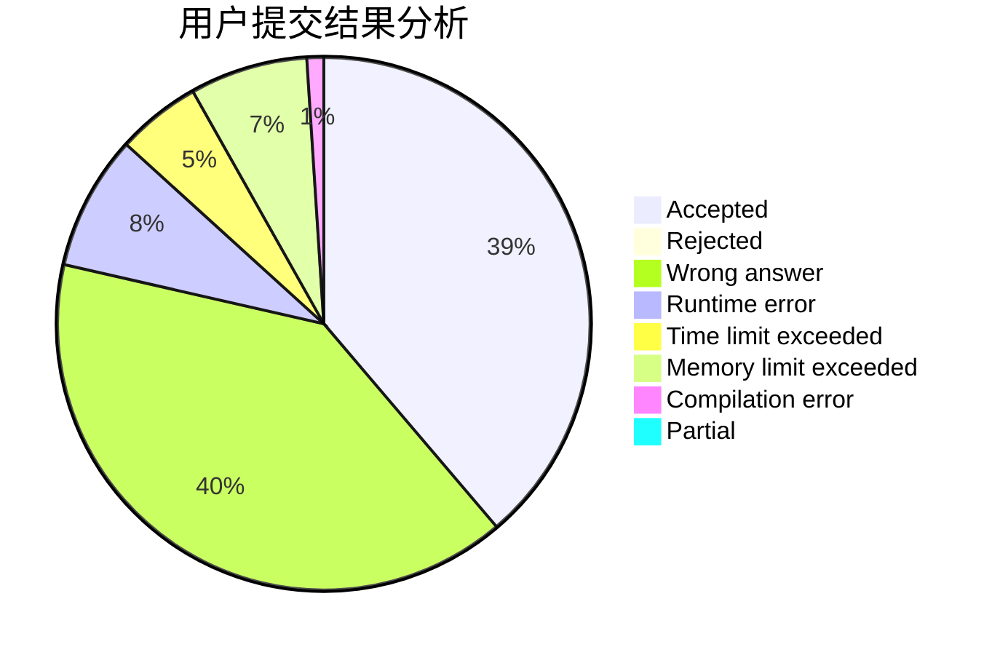
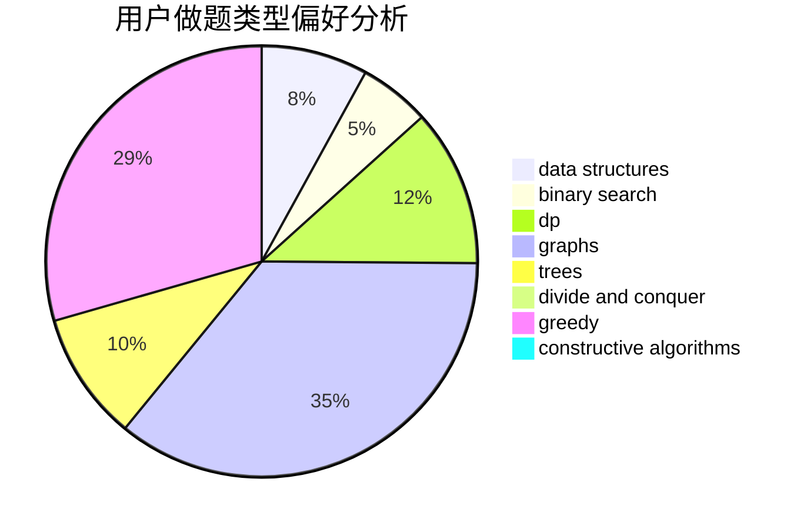
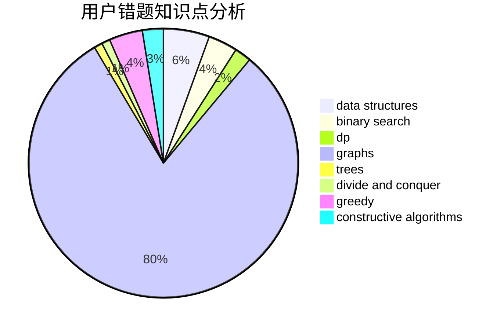

# Jori

<!-- tabs:start -->

#### **用户提交结果分析**

#### **用户做题类型偏好分析**

#### **用户错题知识点分析**

<!-- tabs:end -->
# 推荐题目
[67A](https://codeforces.com/contest/67/problem/A)		dp,
                        graphs,
                        greedy,
                        implementation		  
[1099F](https://codeforces.com/contest/1099/problem/F)		binary search,
                        data structures,
                        dfs and similar,
                        dp,
                        games,
                        trees		  
[1375I](https://codeforces.com/contest/1375/problem/I)		geometry,
                        math,
                        matrices,
                        number theory		  
[725B](https://codeforces.com/contest/725/problem/B)		implementation,
                        math		  
[631D](https://codeforces.com/contest/631/problem/D)		data structures,
                        hashing,
                        implementation,
                        string suffix structures,
                        strings		  
[1129B](https://codeforces.com/contest/1129/problem/B)		constructive algorithms		  
[544C](https://codeforces.com/contest/544/problem/C)		dsu,graphs,sortings,trees		  
[1138E](https://codeforces.com/contest/1138/problem/E)		dsu,graphs,sortings,trees		  
[1307A](https://codeforces.com/contest/1307/problem/A)		greedy,
                        implementation		  
[916C](https://codeforces.com/contest/916/problem/C)		constructive algorithms,
                        graphs,
                        shortest paths		  
