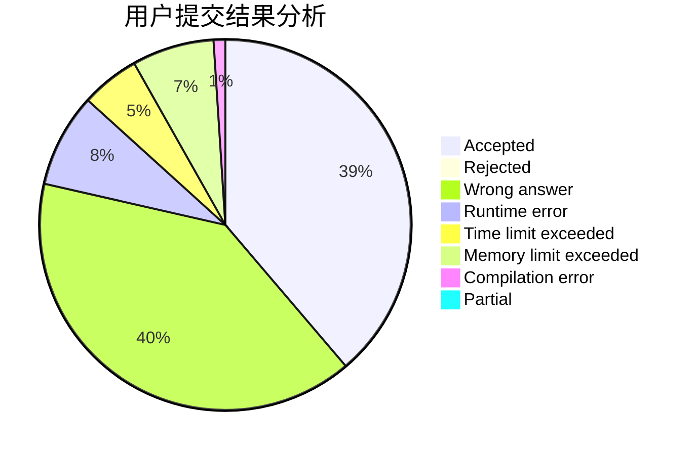
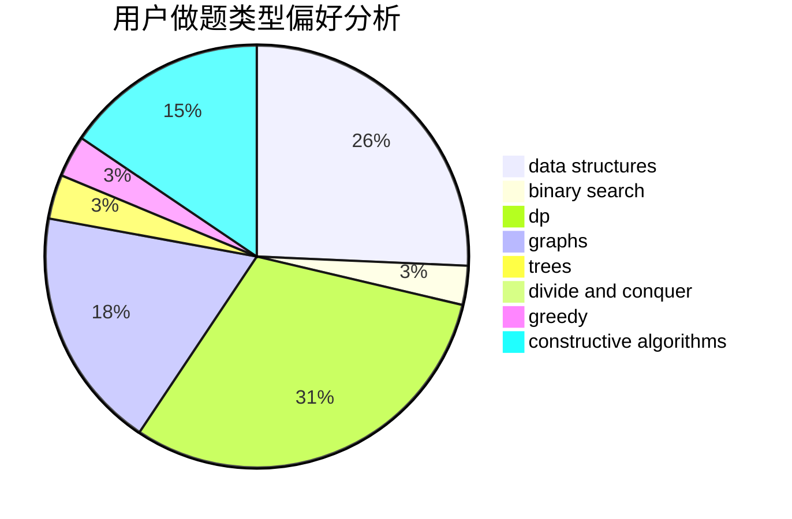
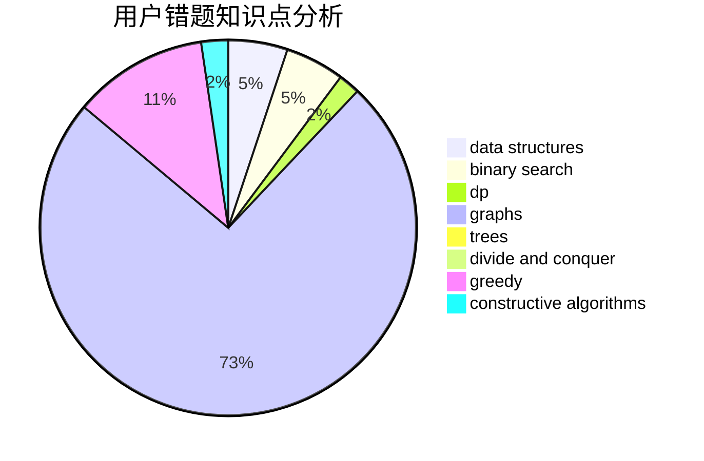

# Jori

<!-- tabs:start -->

#### **用户提交结果分析**

#### **用户做题类型偏好分析**

#### **用户错题知识点分析**

<!-- tabs:end -->
# 推荐题目
[659F](https://codeforces.com/contest/659/problem/F)		dfs and similar,
                        dsu,
                        graphs,
                        greedy,
                        sortings		  
[1099C](https://codeforces.com/contest/1099/problem/C)		constructive algorithms,
                        implementation		  
[1369A](https://codeforces.com/contest/1369/problem/A)		geometry,
                        math		  
[706E](https://codeforces.com/contest/706/problem/E)		data structures,
                        implementation		  
[612B](https://codeforces.com/contest/612/problem/B)		implementation,
                        math		  
[1119F](https://codeforces.com/contest/1119/problem/F)		data structures,
                        dp,
                        trees		  
[518F](https://codeforces.com/contest/518/problem/F)		binary search,
                        brute force,
                        combinatorics,
                        dp,
                        implementation		  
[1136C](https://codeforces.com/contest/1136/problem/C)		constructive algorithms,
                        sortings		  
[1299E](https://codeforces.com/contest/1299/problem/E)		interactive,
                        math		  
[8E](https://codeforces.com/contest/8/problem/E)		dp,
                        graphs		  
