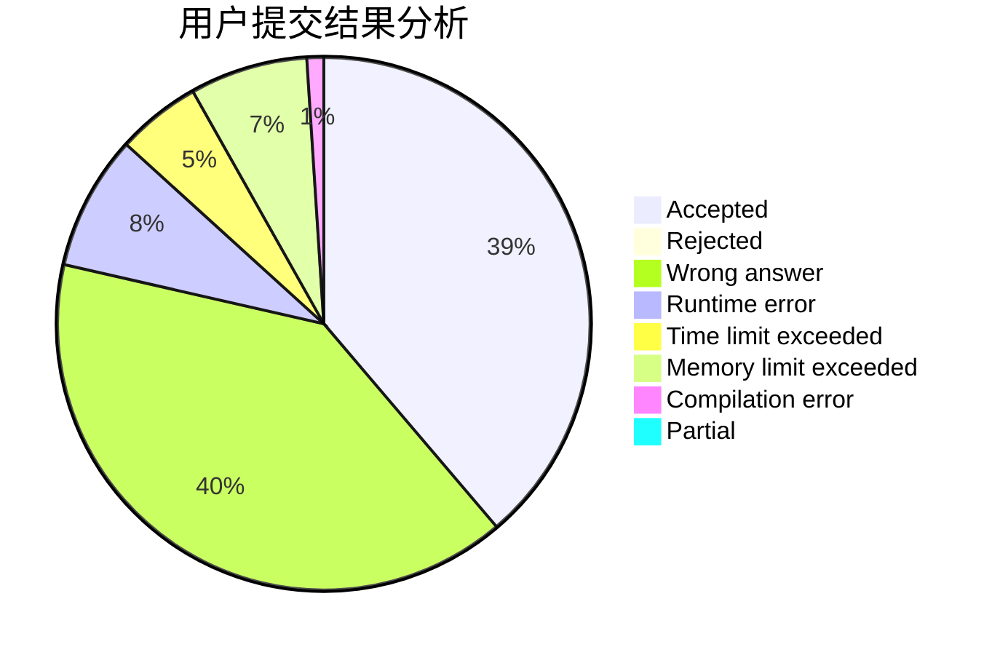
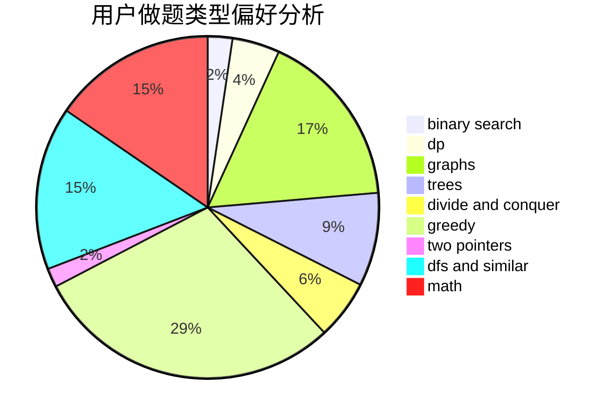

# Jori

<!-- tabs:start -->

#### **用户提交结果分析**

#### **用户做题类型偏好分析**

<!-- tabs:end -->
# 推荐题目
[67A](https://codeforces.com/contest/67/problem/A)
[1099F](https://codeforces.com/contest/1099/problem/F)
[1375I](https://codeforces.com/contest/1375/problem/I)
[725B](https://codeforces.com/contest/725/problem/B)
[631D](https://codeforces.com/contest/631/problem/D)
[1129B](https://codeforces.com/contest/1129/problem/B)
[544C](https://codeforces.com/contest/544/problem/C)
[1138E](https://codeforces.com/contest/1138/problem/E)
[1307A](https://codeforces.com/contest/1307/problem/A)
[916C](https://codeforces.com/contest/916/problem/C)
