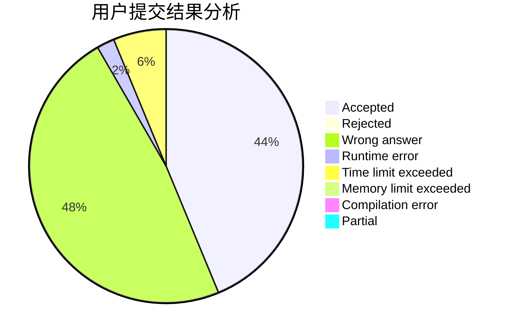
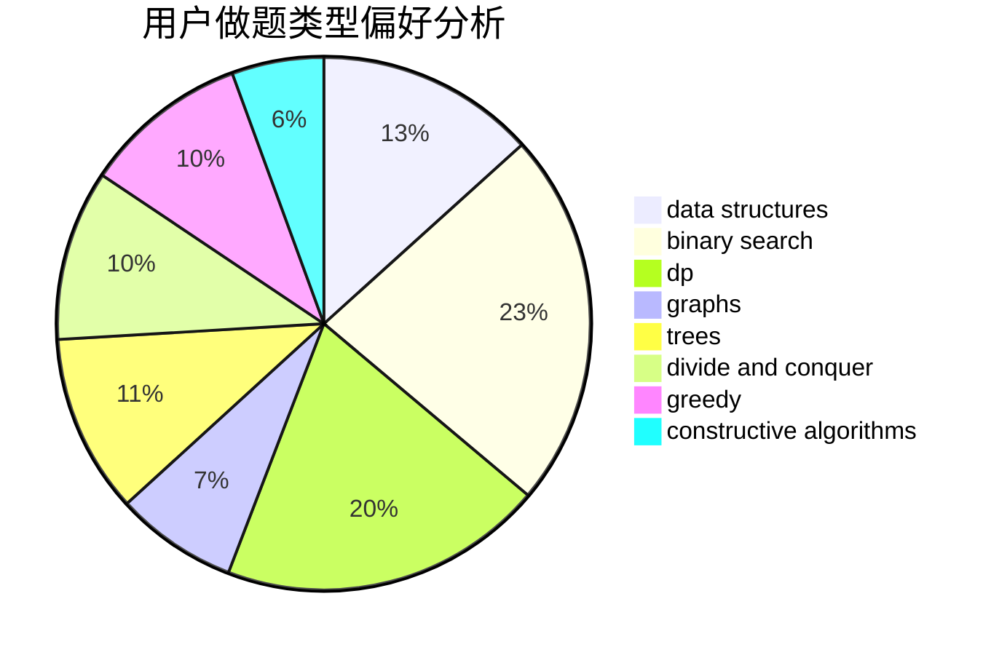
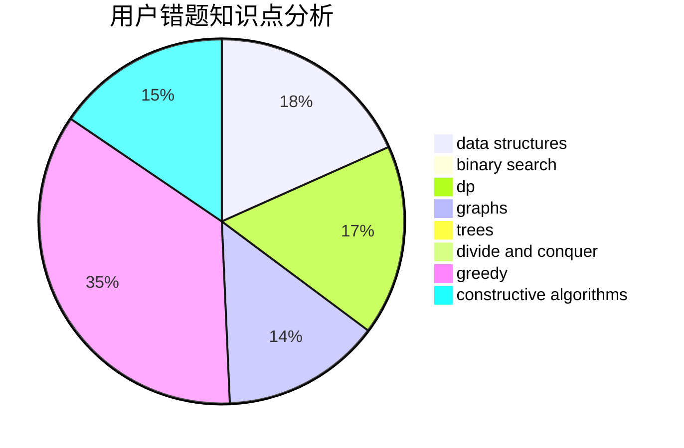

# Josh_josh

<!-- tabs:start -->

#### **用户提交结果分析**

#### **用户做题类型偏好分析**

#### **用户错题知识点分析**

<!-- tabs:end -->
# 推荐题目
[560E](https://codeforces.com/contest/560/problem/E)		dsu,graphs,sortings,trees		  
[1290A](https://codeforces.com/contest/1290/problem/A)		brute force,
                        data structures,
                        implementation		  
[1162C](https://codeforces.com/contest/1162/problem/C)		dsu,graphs,sortings,trees		  
[576A](https://codeforces.com/contest/576/problem/A)		math,
                        number theory		  
[39E](https://codeforces.com/contest/39/problem/E)		dp,
                        games		  
[1093G](https://codeforces.com/contest/1093/problem/G)		bitmasks,
                        data structures		  
[710C](https://codeforces.com/contest/710/problem/C)		constructive algorithms,
                        math		  
[13042](https://codeforces.com/contest/1304/problem/2)		dsu,graphs,sortings,trees		  
[626F](https://codeforces.com/contest/626/problem/F)		dp		  
[1027G](https://codeforces.com/contest/1027/problem/G)		bitmasks,
                        math,
                        number theory		  
