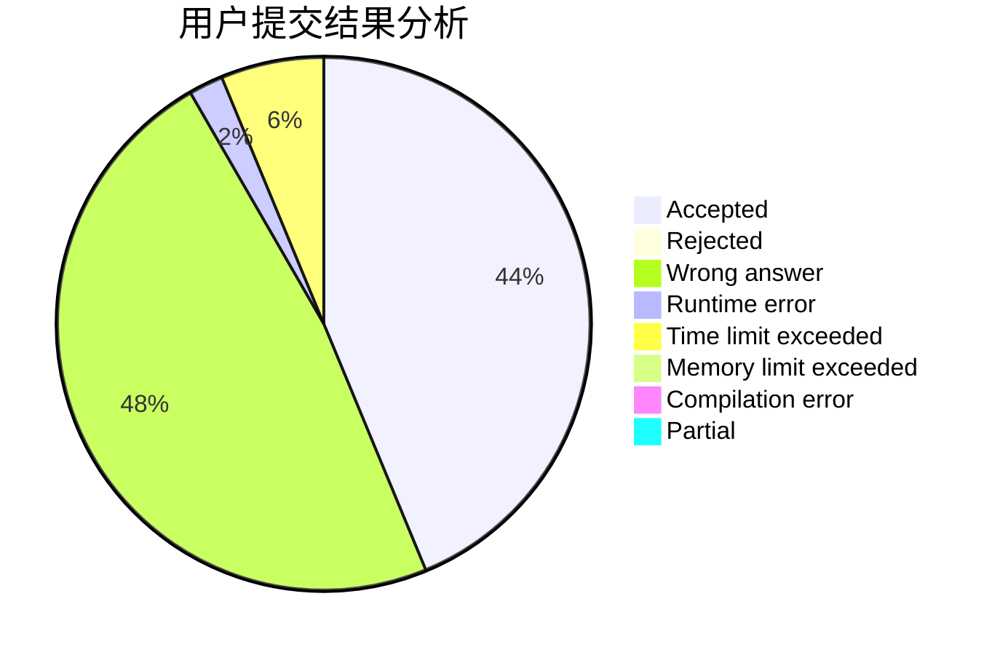
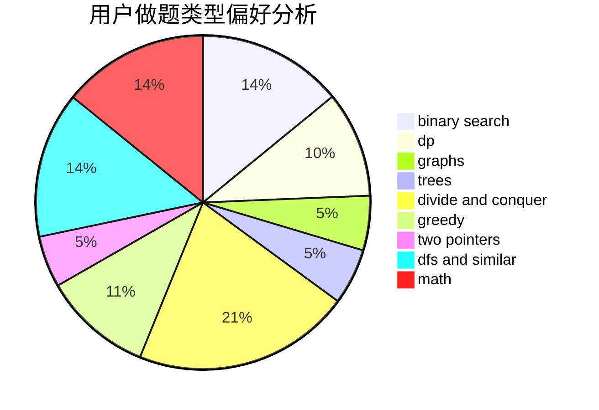

# Josh_josh

<!-- tabs:start -->

#### **用户提交结果分析**

#### **用户做题类型偏好分析**

<!-- tabs:end -->
# 推荐题目
[560E](https://codeforces.com/contest/560/problem/E)
[1290A](https://codeforces.com/contest/1290/problem/A)
[1162C](https://codeforces.com/contest/1162/problem/C)
[576A](https://codeforces.com/contest/576/problem/A)
[39E](https://codeforces.com/contest/39/problem/E)
[1093G](https://codeforces.com/contest/1093/problem/G)
[710C](https://codeforces.com/contest/710/problem/C)
[13042](https://codeforces.com/contest/1304/problem/2)
[626F](https://codeforces.com/contest/626/problem/F)
[1027G](https://codeforces.com/contest/1027/problem/G)
