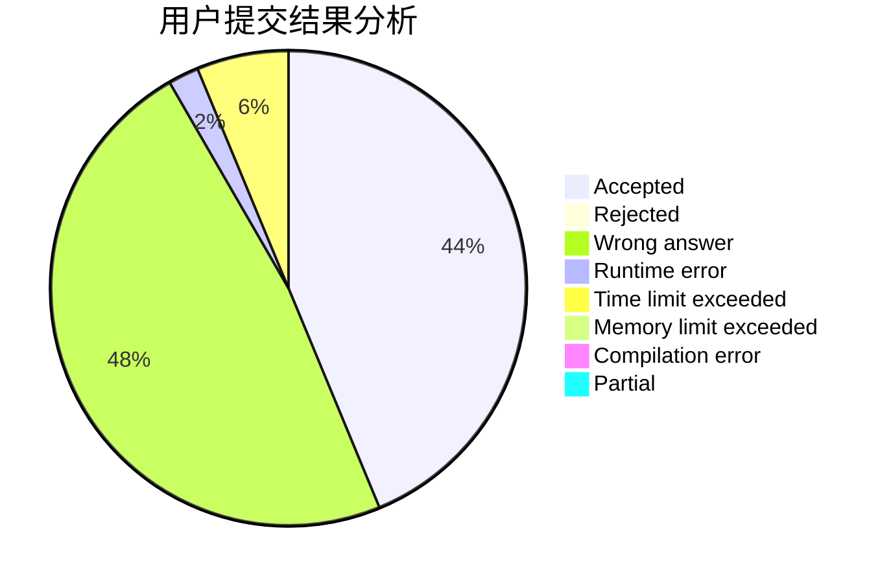
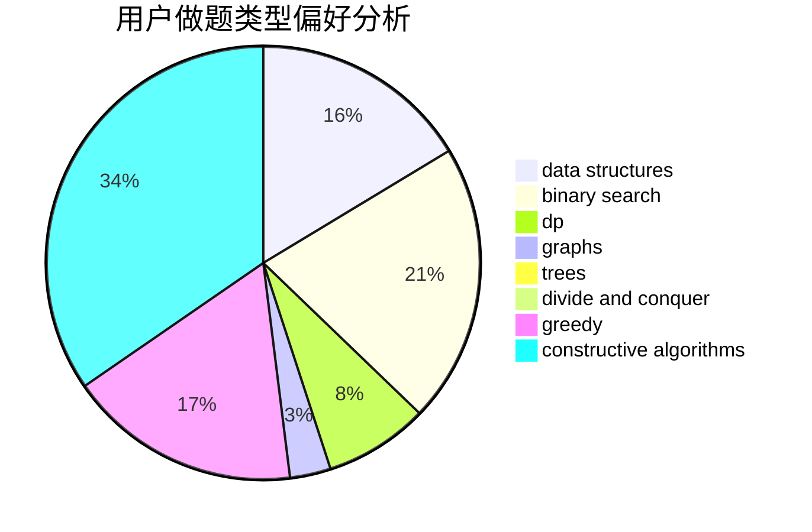
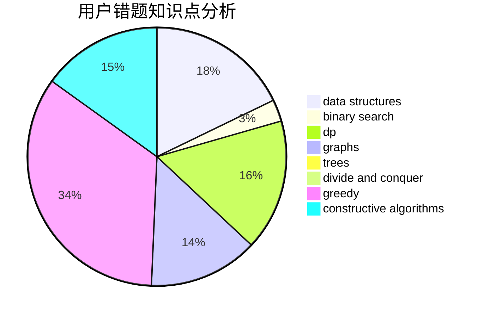

# Josh_josh

<!-- tabs:start -->

#### **用户提交结果分析**

#### **用户做题类型偏好分析**

#### **用户错题知识点分析**

<!-- tabs:end -->
# 推荐题目
[53E](https://codeforces.com/contest/53/problem/E)		bitmasks,
                        dp		  
[1283A](https://codeforces.com/contest/1283/problem/A)		math		  
[1159D](https://codeforces.com/contest/1159/problem/D)		dsu,graphs,sortings,trees		  
[551A](https://codeforces.com/contest/551/problem/A)		brute force,
                        implementation,
                        sortings		  
[369C](https://codeforces.com/contest/369/problem/C)		dfs and similar,
                        graphs,
                        trees		  
[1093D](https://codeforces.com/contest/1093/problem/D)		dfs and similar,
                        graphs		  
[690A2](https://codeforces.com/contest/690A/problem/2)		nan		  
[1296F](https://codeforces.com/contest/1296/problem/F)		constructive algorithms,
                        dfs and similar,
                        greedy,
                        sortings,
                        trees		  
[607E](https://codeforces.com/contest/607/problem/E)		binary search,
                        geometry		  
[1027D](https://codeforces.com/contest/1027/problem/D)		dfs and similar,
                        graphs		  
