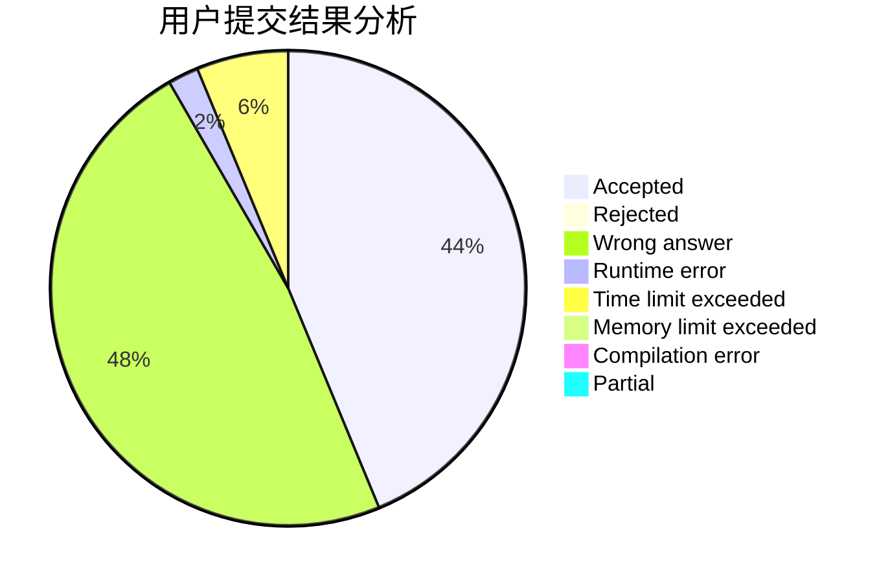
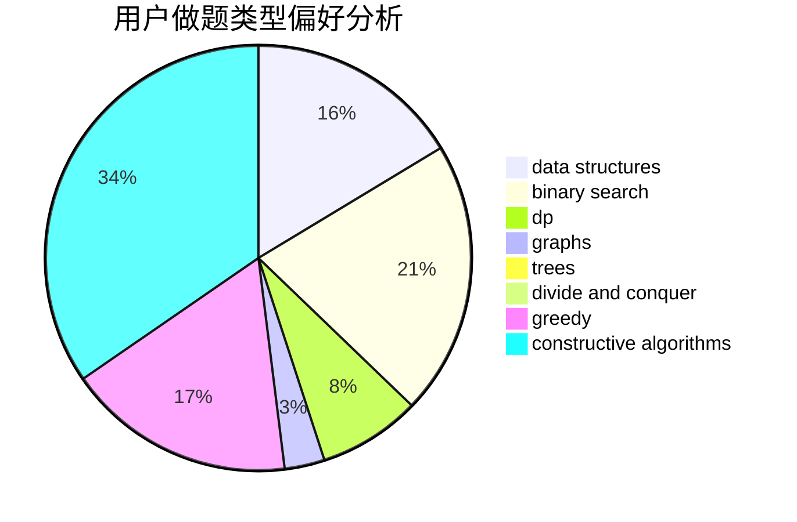
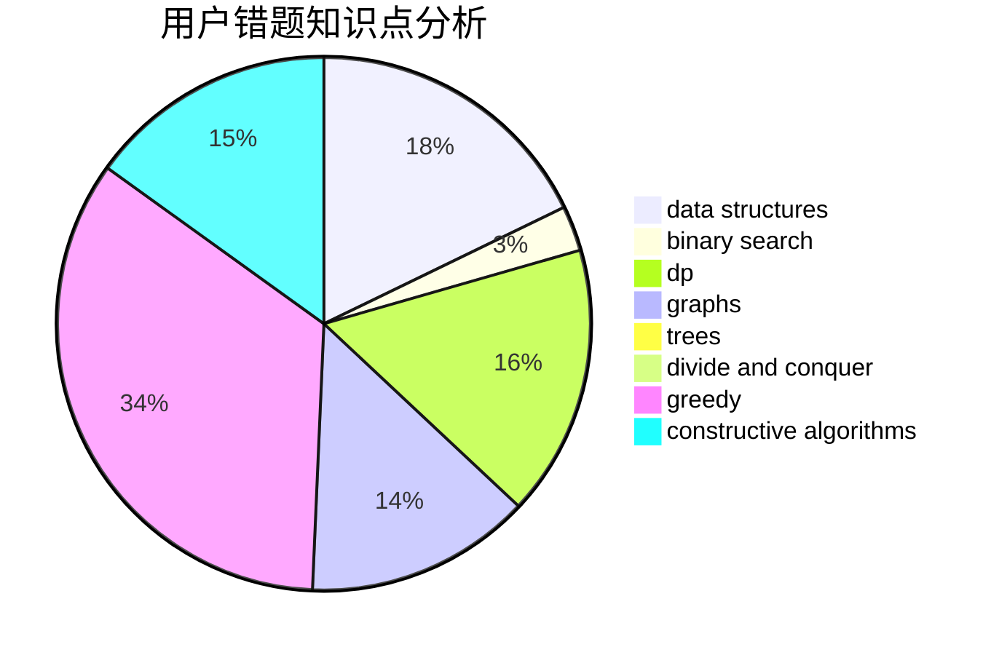

# Josh_josh
<!-- tabs:start -->
#### **用户提交结果分析**

#### **用户做题类型偏好分析**

#### **用户错题知识点分析**

<!-- tabs:end -->
# 推荐题目
[Fill The Bag](http://codeforces.com/problemset/problem/1303/D)		bitmasks,
                        greedy		  
[Minutes Before the New Year](http://codeforces.com/problemset/problem/1283/A)		math		  
[Tree Diameter](http://codeforces.com/problemset/problem/1146/C)		bitmasks,
                        graphs,
                        interactive		  
[Dead Ends](http://codeforces.com/problemset/problem/53/E)		bitmasks,
                        dp		  
[Collective Mindsets (medium)](http://codeforces.com/problemset/problem/690/A2)		nan		  
[Useful Edges](http://codeforces.com/problemset/problem/1482/F)		graphs,
                        shortest paths		  
[Valera and Elections](http://codeforces.com/problemset/problem/369/C)		dfs and similar,
                        graphs,
                        trees		  
[Berland Beauty](http://codeforces.com/problemset/problem/1296/F)		constructive algorithms,
                        dfs and similar,
                        greedy,
                        sortings,
                        trees		  
[Flag of Berland](http://codeforces.com/problemset/problem/837/B)		brute force,
                        implementation		  
[Cross Sum](http://codeforces.com/problemset/problem/607/E)		binary search,
                        geometry		  
<!-- tabs:start -->
#### **data structures**
[Fill The Bag](https://codeforces.com/contest/318/problem/D)		2-sat,
                        data structures,
                        trees		  
[Minutes Before the New Year](http://codeforces.com/problemset/problem/452/F)		data structures,
                        divide and conquer,
                        hashing		  
[Tree Diameter](http://codeforces.com/problemset/problem/1426/D)		constructive algorithms,
                        data structures,
                        greedy,
                        sortings		  
[Dead Ends](http://codeforces.com/problemset/problem/1485/F)		combinatorics,
                        data structures,
                        dp,
                        sortings		  
[Collective Mindsets (medium)](http://codeforces.com/problemset/problem/1430/E)		data structures,
                        greedy,
                        strings		  
[Useful Edges](http://codeforces.com/problemset/problem/1492/C)		binary search,
                        data structures,
                        dp,
                        greedy,
                        two pointers		  
[Valera and Elections](http://codeforces.com/problemset/problem/1490/G)		binary search,
                        data structures,
                        math		  
[Berland Beauty](http://codeforces.com/problemset/problem/1479/D)		binary search,
                        bitmasks,
                        brute force,
                        data structures,
                        probabilities,
                        trees		  
[Flag of Berland](http://codeforces.com/problemset/problem/1497/A)		brute force,
                        data structures,
                        greedy,
                        sortings		  
[Cross Sum](http://codeforces.com/problemset/problem/1491/C)		brute force,
                        data structures,
                        dp,
                        greedy,
                        implementation		  
#### **binary search**
[Fill The Bag](http://codeforces.com/problemset/problem/607/E)		binary search,
                        geometry		  
[Minutes Before the New Year](http://codeforces.com/problemset/problem/230/B)		binary search,
                        implementation,
                        math,
                        number theory		  
[Tree Diameter](http://codeforces.com/problemset/problem/1201/C)		binary search,
                        greedy,
                        math,
                        sortings		  
[Dead Ends](http://codeforces.com/problemset/problem/1492/C)		binary search,
                        data structures,
                        dp,
                        greedy,
                        two pointers		  
[Collective Mindsets (medium)](http://codeforces.com/problemset/problem/1463/D)		binary search,
                        constructive algorithms,
                        greedy,
                        two pointers		  
[Useful Edges](http://codeforces.com/problemset/problem/1490/G)		binary search,
                        data structures,
                        math		  
[Valera and Elections](http://codeforces.com/problemset/problem/1479/D)		binary search,
                        bitmasks,
                        brute force,
                        data structures,
                        probabilities,
                        trees		  
[Berland Beauty](http://codeforces.com/problemset/problem/1436/E)		binary search,
                        data structures,
                        two pointers		  
[Flag of Berland](http://codeforces.com/problemset/problem/1461/D)		binary search,
                        brute force,
                        data structures,
                        divide and conquer,
                        implementation,
                        sortings		  
[Cross Sum](http://codeforces.com/problemset/problem/1493/C)		binary search,
                        brute force,
                        constructive algorithms,
                        greedy,
                        strings		  
#### **dp**
[Fill The Bag](http://codeforces.com/problemset/problem/53/E)		bitmasks,
                        dp		  
[Minutes Before the New Year](https://codeforces.com/contest/667/problem/C)		dp,
                        implementation,
                        strings		  
[Tree Diameter](http://codeforces.com/problemset/problem/1485/F)		combinatorics,
                        data structures,
                        dp,
                        sortings		  
[Dead Ends](http://codeforces.com/problemset/problem/510/D)		bitmasks,
                        brute force,
                        dp,
                        math		  
[Collective Mindsets (medium)](http://codeforces.com/problemset/problem/932/G)		dp,
                        string suffix structures,
                        strings		  
[Useful Edges](http://codeforces.com/problemset/problem/1316/E)		bitmasks,
                        dp,
                        greedy,
                        sortings		  
[Valera and Elections](http://codeforces.com/problemset/problem/1492/C)		binary search,
                        data structures,
                        dp,
                        greedy,
                        two pointers		  
[Berland Beauty](https://codeforces.com/contest/1457/problem/C)		brute force,
                        dp,
                        implementation		  
[Flag of Berland](http://codeforces.com/problemset/problem/1491/C)		brute force,
                        data structures,
                        dp,
                        greedy,
                        implementation		  
[Cross Sum](http://codeforces.com/problemset/problem/1437/C)		dp,
                        flows,
                        graph matchings,
                        greedy,
                        math,
                        sortings		  
#### **graph**
[Fill The Bag](http://codeforces.com/problemset/problem/1146/C)		bitmasks,
                        graphs,
                        interactive		  
[Minutes Before the New Year](http://codeforces.com/problemset/problem/1482/F)		graphs,
                        shortest paths		  
[Tree Diameter](http://codeforces.com/problemset/problem/369/C)		dfs and similar,
                        graphs,
                        trees		  
[Dead Ends](http://codeforces.com/problemset/problem/1027/D)		dfs and similar,
                        graphs		  
[Collective Mindsets (medium)](http://codeforces.com/problemset/problem/1093/D)		dfs and similar,
                        graphs		  
[Useful Edges](http://codeforces.com/problemset/problem/557/D)		combinatorics,
                        dfs and similar,
                        graphs,
                        math		  
[Valera and Elections](http://codeforces.com/problemset/problem/1105/D)		dfs and similar,
                        graphs,
                        implementation,
                        shortest paths		  
[Berland Beauty](http://codeforces.com/problemset/problem/1487/C)		brute force,
                        constructive algorithms,
                        dfs and similar,
                        graphs,
                        greedy,
                        implementation,
                        math		  
[Flag of Berland](http://codeforces.com/problemset/problem/1437/C)		dp,
                        flows,
                        graph matchings,
                        greedy,
                        math,
                        sortings		  
[Cross Sum](http://codeforces.com/problemset/problem/1470/D)		constructive algorithms,
                        dfs and similar,
                        graph matchings,
                        graphs,
                        greedy		  
#### **trees**
[Fill The Bag](http://codeforces.com/problemset/problem/369/C)		dfs and similar,
                        graphs,
                        trees		  
[Minutes Before the New Year](http://codeforces.com/problemset/problem/1296/F)		constructive algorithms,
                        dfs and similar,
                        greedy,
                        sortings,
                        trees		  
[Tree Diameter](https://codeforces.com/contest/318/problem/D)		2-sat,
                        data structures,
                        trees		  
[Dead Ends](http://codeforces.com/problemset/problem/1479/D)		binary search,
                        bitmasks,
                        brute force,
                        data structures,
                        probabilities,
                        trees		  
[Collective Mindsets (medium)](http://codeforces.com/problemset/problem/1511/C)		brute force,
                        data structures,
                        implementation,
                        trees		  
[Useful Edges](http://codeforces.com/problemset/problem/1499/F)		combinatorics,
                        dfs and similar,
                        dp,
                        trees		  
[Valera and Elections](http://codeforces.com/problemset/problem/1491/E)		brute force,
                        dfs and similar,
                        divide and conquer,
                        number theory,
                        trees		  
[Berland Beauty](http://codeforces.com/problemset/problem/1466/D)		data structures,
                        greedy,
                        sortings,
                        trees		  
[Flag of Berland](http://codeforces.com/problemset/problem/1495/D)		combinatorics,
                        dfs and similar,
                        graphs,
                        math,
                        shortest paths,
                        trees		  
[Cross Sum](http://codeforces.com/problemset/problem/1303/G)		data structures,
                        divide and conquer,
                        geometry,
                        trees		  
#### **divide and conquer**
[Fill The Bag](http://codeforces.com/problemset/problem/452/F)		data structures,
                        divide and conquer,
                        hashing		  
[Minutes Before the New Year](http://codeforces.com/problemset/problem/1461/D)		binary search,
                        brute force,
                        data structures,
                        divide and conquer,
                        implementation,
                        sortings		  
[Tree Diameter](http://codeforces.com/problemset/problem/1466/G)		combinatorics,
                        divide and conquer,
                        hashing,
                        math,
                        string suffix structures,
                        strings		  
[Dead Ends](http://codeforces.com/problemset/problem/1490/D)		dfs and similar,
                        divide and conquer,
                        implementation		  
[Collective Mindsets (medium)](https://codeforces.com/contest/1483/problem/C)		data structures,
                        divide and conquer,
                        dp		  
[Useful Edges](http://codeforces.com/problemset/problem/1491/E)		brute force,
                        dfs and similar,
                        divide and conquer,
                        number theory,
                        trees		  
[Valera and Elections](http://codeforces.com/problemset/problem/1303/G)		data structures,
                        divide and conquer,
                        geometry,
                        trees		  
[Berland Beauty](http://codeforces.com/problemset/problem/1494/D)		constructive algorithms,
                        data structures,
                        dfs and similar,
                        divide and conquer,
                        dsu,
                        greedy,
                        sortings,
                        trees		  
[Flag of Berland](http://codeforces.com/problemset/problem/1482/E)		data structures,
                        divide and conquer,
                        dp		  
[Cross Sum](http://codeforces.com/problemset/problem/566/C)		dfs and similar,
                        divide and conquer,
                        trees		  
#### **greedy**
[Fill The Bag](http://codeforces.com/problemset/problem/1303/D)		bitmasks,
                        greedy		  
[Minutes Before the New Year](http://codeforces.com/problemset/problem/1296/F)		constructive algorithms,
                        dfs and similar,
                        greedy,
                        sortings,
                        trees		  
[Tree Diameter](http://codeforces.com/problemset/problem/1371/C)		greedy,
                        implementation,
                        math		  
[Dead Ends](http://codeforces.com/problemset/problem/1426/D)		constructive algorithms,
                        data structures,
                        greedy,
                        sortings		  
[Collective Mindsets (medium)](http://codeforces.com/problemset/problem/1425/E)		greedy,
                        implementation		  
[Useful Edges](http://codeforces.com/problemset/problem/1316/E)		bitmasks,
                        dp,
                        greedy,
                        sortings		  
[Valera and Elections](http://codeforces.com/problemset/problem/1430/E)		data structures,
                        greedy,
                        strings		  
[Berland Beauty](http://codeforces.com/problemset/problem/1201/C)		binary search,
                        greedy,
                        math,
                        sortings		  
[Flag of Berland](http://codeforces.com/problemset/problem/1492/C)		binary search,
                        data structures,
                        dp,
                        greedy,
                        two pointers		  
[Cross Sum](https://codeforces.com/contest/1496/problem/C)		geometry,
                        greedy,
                        math,
                        sortings		  
#### **constructive algorithms**
[Fill The Bag](http://codeforces.com/problemset/problem/1296/F)		constructive algorithms,
                        dfs and similar,
                        greedy,
                        sortings,
                        trees		  
[Minutes Before the New Year](https://codeforces.com/contest/1159/problem/D)		constructive algorithms,
                        math,
                        strings		  
[Tree Diameter](http://codeforces.com/problemset/problem/1426/D)		constructive algorithms,
                        data structures,
                        greedy,
                        sortings		  
[Dead Ends](http://codeforces.com/problemset/problem/1327/C)		constructive algorithms,
                        implementation		  
[Collective Mindsets (medium)](http://codeforces.com/problemset/problem/1395/B)		constructive algorithms		  
[Useful Edges](http://codeforces.com/problemset/problem/1493/A)		constructive algorithms,
                        greedy		  
[Valera and Elections](http://codeforces.com/problemset/problem/1463/D)		binary search,
                        constructive algorithms,
                        greedy,
                        two pointers		  
[Berland Beauty](https://codeforces.com/contest/1456/problem/B)		bitmasks,
                        brute force,
                        constructive algorithms		  
[Flag of Berland](http://codeforces.com/problemset/problem/1492/D)		bitmasks,
                        constructive algorithms,
                        greedy,
                        math		  
[Cross Sum](https://codeforces.com/contest/1504/problem/D)		constructive algorithms,
                        games,
                        interactive		  
#### **sortings**
[Fill The Bag](http://codeforces.com/problemset/problem/1296/F)		constructive algorithms,
                        dfs and similar,
                        greedy,
                        sortings,
                        trees		  
[Minutes Before the New Year](http://codeforces.com/problemset/problem/551/A)		brute force,
                        implementation,
                        sortings		  
[Tree Diameter](http://codeforces.com/problemset/problem/1426/D)		constructive algorithms,
                        data structures,
                        greedy,
                        sortings		  
[Dead Ends](http://codeforces.com/problemset/problem/1485/F)		combinatorics,
                        data structures,
                        dp,
                        sortings		  
[Collective Mindsets (medium)](http://codeforces.com/problemset/problem/1297/B)		*special problem,
                        implementation,
                        sortings		  
[Useful Edges](http://codeforces.com/problemset/problem/1316/E)		bitmasks,
                        dp,
                        greedy,
                        sortings		  
[Valera and Elections](http://codeforces.com/problemset/problem/1201/C)		binary search,
                        greedy,
                        math,
                        sortings		  
[Berland Beauty](https://codeforces.com/contest/1496/problem/C)		geometry,
                        greedy,
                        math,
                        sortings		  
[Flag of Berland](http://codeforces.com/problemset/problem/1495/A)		geometry,
                        greedy,
                        math,
                        sortings		  
[Cross Sum](http://codeforces.com/problemset/problem/1497/A)		brute force,
                        data structures,
                        greedy,
                        sortings		  
<!-- tabs:end -->
