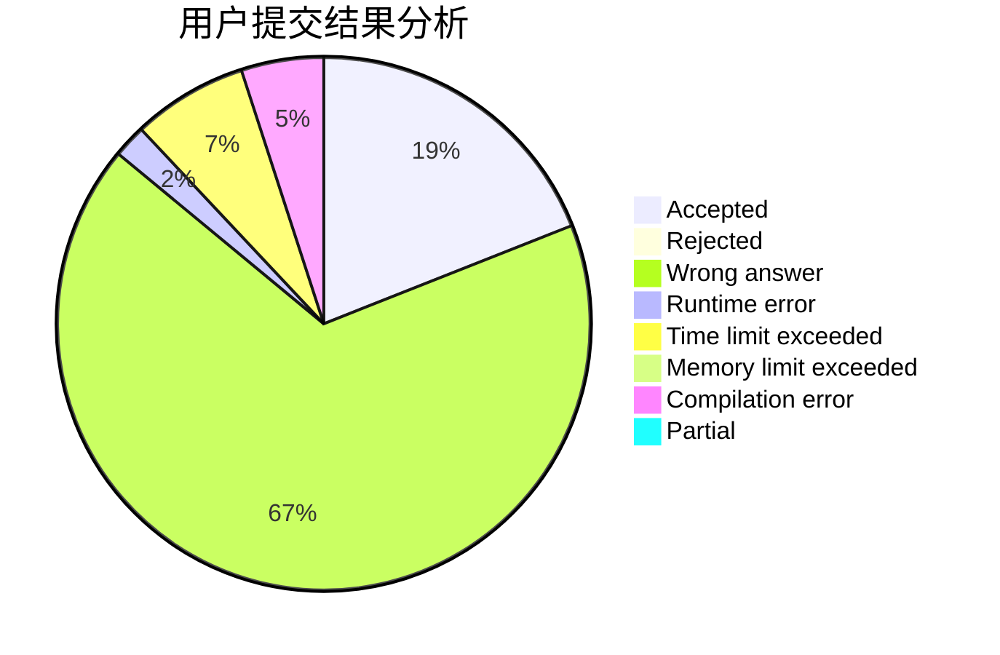
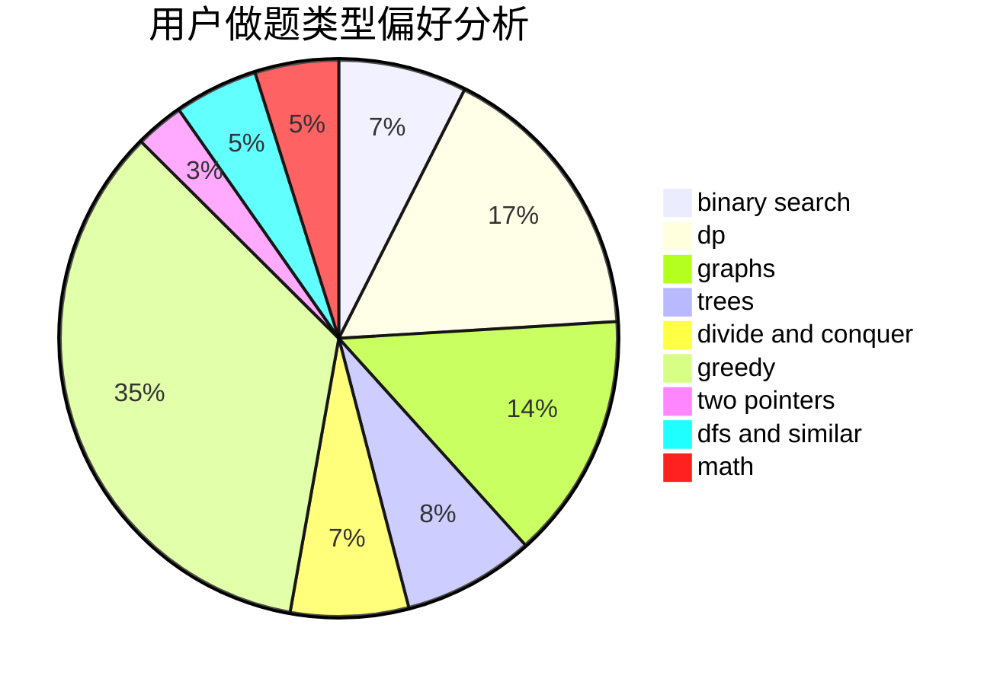

# 31901179

<!-- tabs:start -->

#### **用户提交结果分析**

#### **用户做题类型偏好分析**

<!-- tabs:end -->
# 推荐题目
[1365F](https://codeforces.com/contest/1365/problem/F)
[1358B](https://codeforces.com/contest/1358/problem/B)
[1369B](https://codeforces.com/contest/1369/problem/B)
[1267I](https://codeforces.com/contest/1267/problem/I)
[13681](https://codeforces.com/contest/1368/problem/1)
[1070H](https://codeforces.com/contest/1070/problem/H)
[1182F](https://codeforces.com/contest/1182/problem/F)
[1366F](https://codeforces.com/contest/1366/problem/F)
[1365A](https://codeforces.com/contest/1365/problem/A)
[1341E](https://codeforces.com/contest/1341/problem/E)
