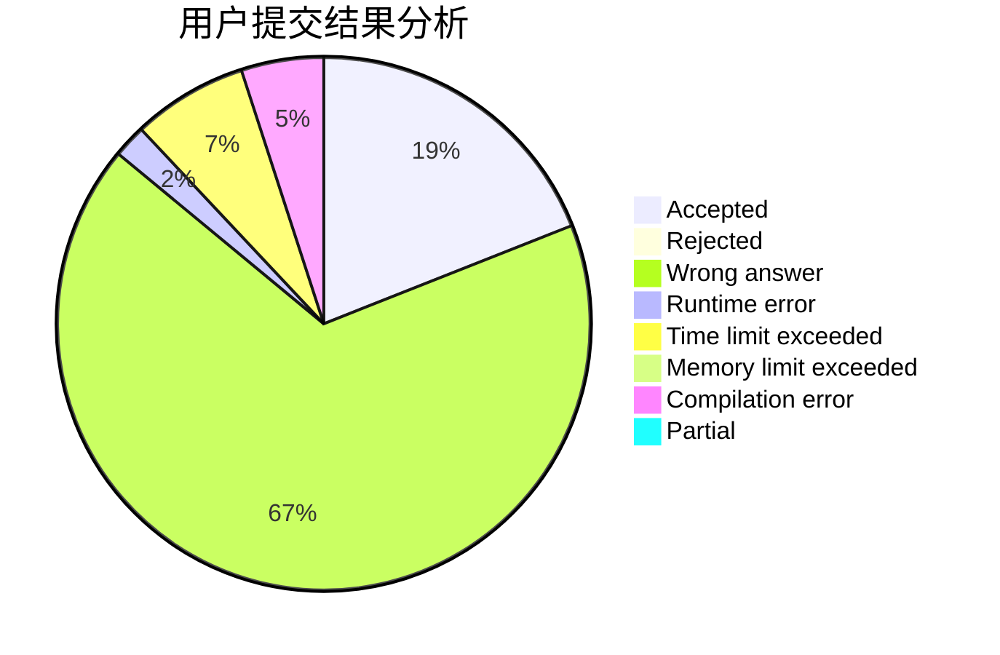
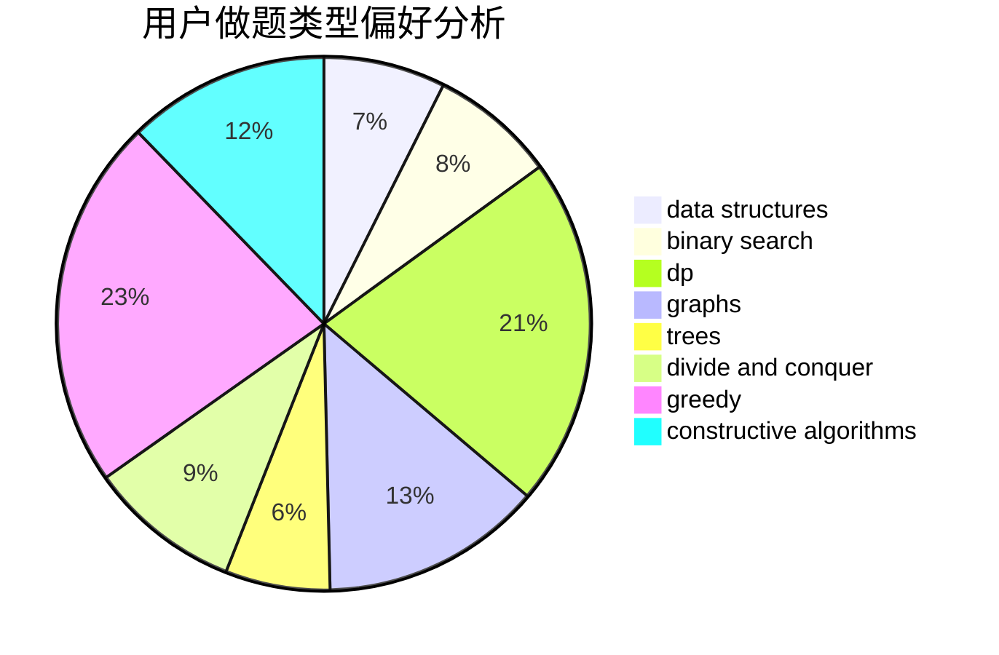

# 31901179

<!-- tabs:start -->

#### **用户提交结果分析**

#### **用户做题类型偏好分析**

#### **用户错题知识点分析**

<!-- tabs:end -->
# 推荐题目
[1365F](https://codeforces.com/contest/1365/problem/F)		constructive algorithms,
                        implementation,
                        sortings		  
[1358B](https://codeforces.com/contest/1358/problem/B)		greedy,
                        sortings		  
[1369B](https://codeforces.com/contest/1369/problem/B)		greedy,
                        implementation,
                        strings		  
[1267I](https://codeforces.com/contest/1267/problem/I)		brute force,
                        constructive algorithms,
                        implementation,
                        interactive,
                        sortings		  
[13681](https://codeforces.com/contest/1368/problem/1)		dsu,graphs,sortings,trees		  
[1070H](https://codeforces.com/contest/1070/problem/H)		brute force,
                        implementation		  
[1182F](https://codeforces.com/contest/1182/problem/F)		binary search,
                        data structures,
                        number theory		  
[1366F](https://codeforces.com/contest/1366/problem/F)		binary search,
                        dp,
                        geometry,
                        graphs		  
[1365A](https://codeforces.com/contest/1365/problem/A)		games,
                        greedy,
                        implementation		  
[1341E](https://codeforces.com/contest/1341/problem/E)		dsu,graphs,sortings,trees		  
