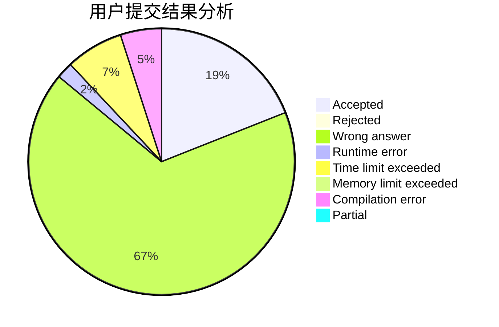
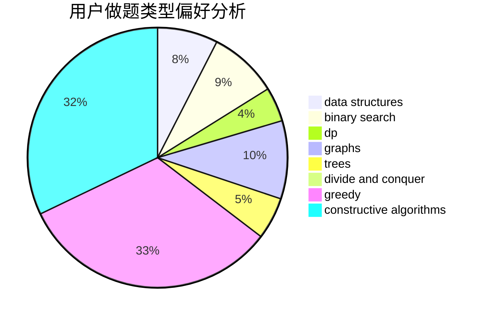

# 31901179

<!-- tabs:start -->

#### **用户提交结果分析**

#### **用户做题类型偏好分析**

#### **用户错题知识点分析**

<!-- tabs:end -->
# 推荐题目
[1357D4](https://codeforces.com/contest/1357D/problem/4)		nan		  
[1351A](https://codeforces.com/contest/1351/problem/A)		implementation		  
[1361B](https://codeforces.com/contest/1361/problem/B)		greedy,
                        implementation,
                        math,
                        sortings		  
[1262A](https://codeforces.com/contest/1262/problem/A)		dsu,graphs,sortings,trees		  
[135B](https://codeforces.com/contest/135/problem/B)		brute force,
                        geometry,
                        math		  
[1070E](https://codeforces.com/contest/1070/problem/E)		binary search,
                        data structures		  
[117D](https://codeforces.com/contest/117/problem/D)		divide and conquer,
                        math		  
[1358D](https://codeforces.com/contest/1358/problem/D)		binary search,
                        brute force,
                        greedy,
                        implementation,
                        two pointers		  
[1357C1](https://codeforces.com/contest/1357C/problem/1)		nan		  
[1334F](https://codeforces.com/contest/1334/problem/F)		binary search,
                        data structures,
                        dp,
                        greedy		  
