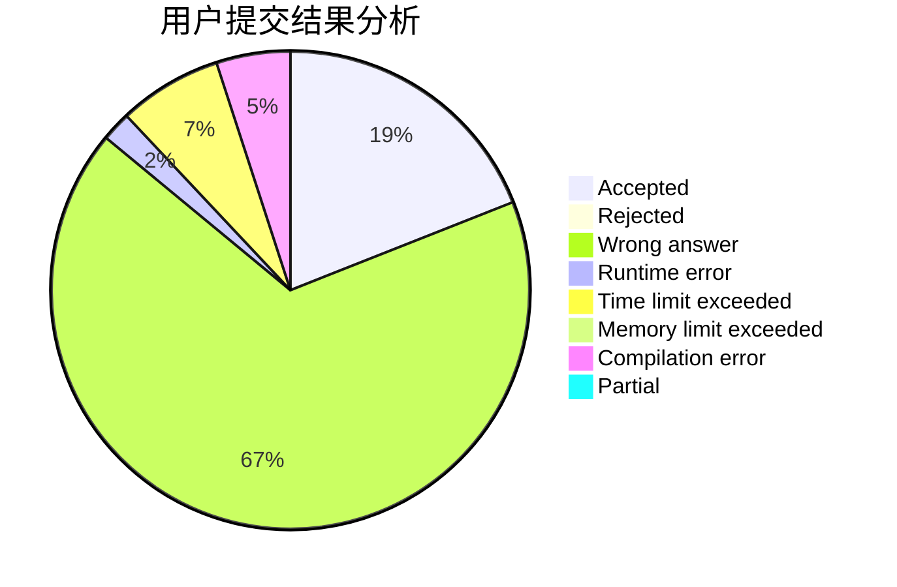
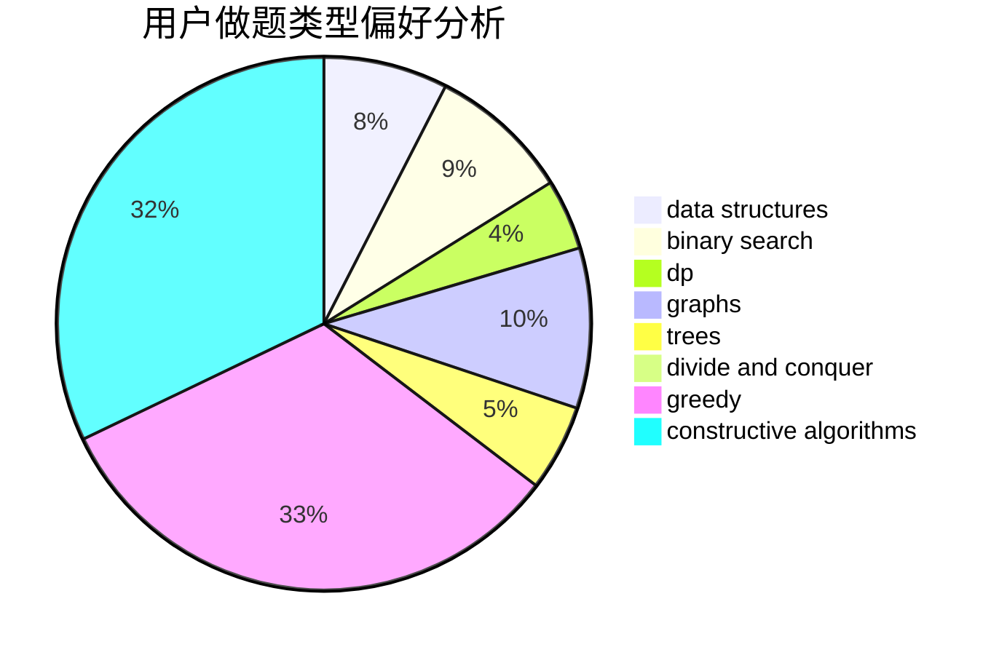

# 31901179
<!-- tabs:start -->
#### **用户提交结果分析**

#### **用户做题类型偏好分析**

#### **用户错题知识点分析**

<!-- tabs:end -->
# 推荐题目
[A+B (Trial Problem)](http://codeforces.com/problemset/problem/1351/A)		implementation		  
[Johnny and Grandmaster](http://codeforces.com/problemset/problem/1361/B)		greedy,
                        implementation,
                        math,
                        sortings		  
[Buns](http://codeforces.com/problemset/problem/106/C)		dp		  
[Johnny and Contribution](http://codeforces.com/problemset/problem/1361/A)		constructive algorithms,
                        graphs,
                        greedy,
                        sortings		  
[Quantum Classification - Dataset 3](http://codeforces.com/problemset/problem/1357/D1)		nan		  
[Minimax Problem](http://codeforces.com/problemset/problem/1288/D)		binary search,
                        bitmasks,
                        dp		  
[Maria Breaks the Self-isolation](http://codeforces.com/problemset/problem/1358/B)		greedy,
                        sortings		  
[Prepare superposition of basis states with the same parity](http://codeforces.com/problemset/problem/1357/C2)		nan		  
[Root of quantum Fourier transform](http://codeforces.com/problemset/problem/1357/E2)		nan		  
[Math Problem](https://codeforces.com/contest/1262/problem/A)		math		  
<!-- tabs:start -->
#### **data structures**
[Getting Deals Done](http://codeforces.com/problemset/problem/1070/E)		binary search,
                        data structures		  
[RC Kaboom Show](http://codeforces.com/problemset/problem/1359/F)		binary search,
                        brute force,
                        data structures,
                        geometry,
                        math		  
[Balanced Distribution](http://codeforces.com/problemset/problem/1237/G)		data structures,
                        dp,
                        greedy		  
[Strange Function](http://codeforces.com/problemset/problem/1334/F)		binary search,
                        data structures,
                        dp,
                        greedy		  
[Yet Another Yet Another Task](http://codeforces.com/problemset/problem/1359/D)		data structures,
                        dp,
                        implementation,
                        two pointers		  
[Recommendations](https://codeforces.com/contest/1315/problem/D)		data structures,
                        greedy,
                        sortings		  
[Balanced Tunnel](http://codeforces.com/problemset/problem/1237/B)		data structures,
                        sortings,
                        two pointers		  
[Dreamoon Likes Strings](http://codeforces.com/problemset/problem/1329/D)		constructive algorithms,
                        data structures		  
[Are You Fired?](http://codeforces.com/problemset/problem/1358/E)		constructive algorithms,
                        data structures,
                        greedy,
                        implementation		  
[Maximum width](http://codeforces.com/problemset/problem/1492/C)		binary search,
                        data structures,
                        dp,
                        greedy,
                        two pointers		  
#### **binary search**
[Minimax Problem](http://codeforces.com/problemset/problem/1288/D)		binary search,
                        bitmasks,
                        dp		  
[Getting Deals Done](http://codeforces.com/problemset/problem/1070/E)		binary search,
                        data structures		  
[RC Kaboom Show](http://codeforces.com/problemset/problem/1359/F)		binary search,
                        brute force,
                        data structures,
                        geometry,
                        math		  
[Strange Function](http://codeforces.com/problemset/problem/1334/F)		binary search,
                        data structures,
                        dp,
                        greedy		  
[The Best Vacation](http://codeforces.com/problemset/problem/1358/D)		binary search,
                        brute force,
                        greedy,
                        implementation,
                        two pointers		  
[Tasty Cookie](http://codeforces.com/problemset/problem/1358/F)		binary search,
                        constructive algorithms,
                        greedy,
                        implementation		  
[Planning The Expedition](http://codeforces.com/problemset/problem/1011/B)		binary search,
                        brute force,
                        implementation		  
[Binary Median](http://codeforces.com/problemset/problem/1360/H)		binary search,
                        bitmasks,
                        brute force,
                        constructive algorithms		  
[Johnny and Megan's Necklace](http://codeforces.com/problemset/problem/1361/C)		binary search,
                        bitmasks,
                        constructive algorithms,
                        dfs and similar,
                        dsu,
                        graphs		  
[Mixing Water](http://codeforces.com/problemset/problem/1359/C)		binary search,
                        math		  
#### **dp**
[Buns](http://codeforces.com/problemset/problem/106/C)		dp		  
[Minimax Problem](http://codeforces.com/problemset/problem/1288/D)		binary search,
                        bitmasks,
                        dp		  
[Balanced Distribution](http://codeforces.com/problemset/problem/1237/G)		data structures,
                        dp,
                        greedy		  
[Strange Function](http://codeforces.com/problemset/problem/1334/F)		binary search,
                        data structures,
                        dp,
                        greedy		  
[Turtle](http://codeforces.com/problemset/problem/1239/E)		dp,
                        implementation		  
[Yet Another Yet Another Task](http://codeforces.com/problemset/problem/1359/D)		data structures,
                        dp,
                        implementation,
                        two pointers		  
[Yet Another Problem On a Subsequence](http://codeforces.com/problemset/problem/1000/D)		combinatorics,
                        dp		  
[New Theatre Square](http://codeforces.com/problemset/problem/1359/B)		brute force,
                        dp,
                        greedy,
                        implementation,
                        two pointers		  
[Wrong Answer on test 233 (Easy Version)](http://codeforces.com/problemset/problem/1227/F1)		dp		  
[Spy-string](http://codeforces.com/problemset/problem/1360/F)		bitmasks,
                        brute force,
                        constructive algorithms,
                        dp,
                        hashing,
                        strings		  
#### **graph**
[Johnny and Contribution](http://codeforces.com/problemset/problem/1361/A)		constructive algorithms,
                        graphs,
                        greedy,
                        sortings		  
[Anadi and Domino](https://codeforces.com/contest/1230/problem/C)		brute force,
                        graphs		  
[King Escape](http://codeforces.com/problemset/problem/1033/A)		dfs and similar,
                        graphs,
                        implementation		  
[Edgy Trees](http://codeforces.com/problemset/problem/1139/C)		dfs and similar,
                        dsu,
                        graphs,
                        math,
                        trees		  
[Polygon](http://codeforces.com/problemset/problem/1360/E)		dp,
                        graphs,
                        implementation,
                        shortest paths		  
[Nastya and Scoreboard](http://codeforces.com/problemset/problem/1340/B)		bitmasks,
                        dp,
                        graphs,
                        greedy		  
[Similar Pairs](http://codeforces.com/problemset/problem/1360/C)		constructive algorithms,
                        graph matchings,
                        greedy,
                        sortings		  
[Johnny and Megan's Necklace](http://codeforces.com/problemset/problem/1361/C)		binary search,
                        bitmasks,
                        constructive algorithms,
                        dfs and similar,
                        dsu,
                        graphs		  
[Minimum Ties](http://codeforces.com/problemset/problem/1487/C)		brute force,
                        constructive algorithms,
                        dfs and similar,
                        graphs,
                        greedy,
                        implementation,
                        math		  
[Chef Monocarp](http://codeforces.com/problemset/problem/1437/C)		dp,
                        flows,
                        graph matchings,
                        greedy,
                        math,
                        sortings		  
#### **trees**
[Johnny and James](http://codeforces.com/problemset/problem/1361/D)		greedy,
                        implementation,
                        math,
                        trees		  
[Edgy Trees](http://codeforces.com/problemset/problem/1139/C)		dfs and similar,
                        dsu,
                        graphs,
                        math,
                        trees		  
[Linova and Kingdom](https://codeforces.com/contest/1337/problem/C)		dfs and similar,
                        dp,
                        greedy,
                        sortings,
                        trees		  
[Odd Mineral Resource](http://codeforces.com/problemset/problem/1479/D)		binary search,
                        bitmasks,
                        brute force,
                        data structures,
                        probabilities,
                        trees		  
[Yet Another Card Deck](http://codeforces.com/problemset/problem/1511/C)		brute force,
                        data structures,
                        implementation,
                        trees		  
[Diameter Cuts](http://codeforces.com/problemset/problem/1499/F)		combinatorics,
                        dfs and similar,
                        dp,
                        trees		  
[Fib-tree](http://codeforces.com/problemset/problem/1491/E)		brute force,
                        dfs and similar,
                        divide and conquer,
                        number theory,
                        trees		  
[13th Labour of Heracles](http://codeforces.com/problemset/problem/1466/D)		data structures,
                        greedy,
                        sortings,
                        trees		  
[BFS Trees](http://codeforces.com/problemset/problem/1495/D)		combinatorics,
                        dfs and similar,
                        graphs,
                        math,
                        shortest paths,
                        trees		  
[Sum of Prefix Sums](http://codeforces.com/problemset/problem/1303/G)		data structures,
                        divide and conquer,
                        geometry,
                        trees		  
#### **divide and conquer**
[Not Quick Transformation](http://codeforces.com/problemset/problem/117/D)		divide and conquer,
                        math		  
[Divide and Summarize](http://codeforces.com/problemset/problem/1461/D)		binary search,
                        brute force,
                        data structures,
                        divide and conquer,
                        implementation,
                        sortings		  
[Song of the Sirens](http://codeforces.com/problemset/problem/1466/G)		combinatorics,
                        divide and conquer,
                        hashing,
                        math,
                        string suffix structures,
                        strings		  
[Permutation Transformation](http://codeforces.com/problemset/problem/1490/D)		dfs and similar,
                        divide and conquer,
                        implementation		  
[Skyline Photo](https://codeforces.com/contest/1483/problem/C)		data structures,
                        divide and conquer,
                        dp		  
[Fib-tree](http://codeforces.com/problemset/problem/1491/E)		brute force,
                        dfs and similar,
                        divide and conquer,
                        number theory,
                        trees		  
[Sum of Prefix Sums](http://codeforces.com/problemset/problem/1303/G)		data structures,
                        divide and conquer,
                        geometry,
                        trees		  
[Dogeforces](http://codeforces.com/problemset/problem/1494/D)		constructive algorithms,
                        data structures,
                        dfs and similar,
                        divide and conquer,
                        dsu,
                        greedy,
                        sortings,
                        trees		  
[Skyline Photo](http://codeforces.com/problemset/problem/1482/E)		data structures,
                        divide and conquer,
                        dp		  
[Logistical Questions](http://codeforces.com/problemset/problem/566/C)		dfs and similar,
                        divide and conquer,
                        trees		  
#### **greedy**
[Johnny and Grandmaster](http://codeforces.com/problemset/problem/1361/B)		greedy,
                        implementation,
                        math,
                        sortings		  
[Johnny and Contribution](http://codeforces.com/problemset/problem/1361/A)		constructive algorithms,
                        graphs,
                        greedy,
                        sortings		  
[Maria Breaks the Self-isolation](http://codeforces.com/problemset/problem/1358/B)		greedy,
                        sortings		  
[Balanced Distribution](http://codeforces.com/problemset/problem/1237/G)		data structures,
                        dp,
                        greedy		  
[Strange Function](http://codeforces.com/problemset/problem/1334/F)		binary search,
                        data structures,
                        dp,
                        greedy		  
[The Best Vacation](http://codeforces.com/problemset/problem/1358/D)		binary search,
                        brute force,
                        greedy,
                        implementation,
                        two pointers		  
[Tasty Cookie](http://codeforces.com/problemset/problem/1358/F)		binary search,
                        constructive algorithms,
                        greedy,
                        implementation		  
[Recommendations](https://codeforces.com/contest/1315/problem/D)		data structures,
                        greedy,
                        sortings		  
[Honest Coach](http://codeforces.com/problemset/problem/1360/B)		greedy,
                        sortings		  
[Johnny and James](http://codeforces.com/problemset/problem/1361/D)		greedy,
                        implementation,
                        math,
                        trees		  
#### **constructive algorithms**
[Johnny and Contribution](http://codeforces.com/problemset/problem/1361/A)		constructive algorithms,
                        graphs,
                        greedy,
                        sortings		  
[Tasty Cookie](http://codeforces.com/problemset/problem/1358/F)		binary search,
                        constructive algorithms,
                        greedy,
                        implementation		  
[A/B Matrix](http://codeforces.com/problemset/problem/1360/G)		constructive algorithms,
                        greedy,
                        math		  
[Spy-string](http://codeforces.com/problemset/problem/1360/F)		bitmasks,
                        brute force,
                        constructive algorithms,
                        dp,
                        hashing,
                        strings		  
[Binary Median](http://codeforces.com/problemset/problem/1360/H)		binary search,
                        bitmasks,
                        brute force,
                        constructive algorithms		  
[Similar Pairs](http://codeforces.com/problemset/problem/1360/C)		constructive algorithms,
                        graph matchings,
                        greedy,
                        sortings		  
[Johnny and Megan's Necklace](http://codeforces.com/problemset/problem/1361/C)		binary search,
                        bitmasks,
                        constructive algorithms,
                        dfs and similar,
                        dsu,
                        graphs		  
[Packets](http://codeforces.com/problemset/problem/1037/A)		constructive algorithms,
                        greedy,
                        math		  
[Dreamoon Likes Strings](http://codeforces.com/problemset/problem/1329/D)		constructive algorithms,
                        data structures		  
[Are You Fired?](http://codeforces.com/problemset/problem/1358/E)		constructive algorithms,
                        data structures,
                        greedy,
                        implementation		  
#### **sortings**
[Johnny and Grandmaster](http://codeforces.com/problemset/problem/1361/B)		greedy,
                        implementation,
                        math,
                        sortings		  
[Johnny and Contribution](http://codeforces.com/problemset/problem/1361/A)		constructive algorithms,
                        graphs,
                        greedy,
                        sortings		  
[Maria Breaks the Self-isolation](http://codeforces.com/problemset/problem/1358/B)		greedy,
                        sortings		  
[Recommendations](https://codeforces.com/contest/1315/problem/D)		data structures,
                        greedy,
                        sortings		  
[Honest Coach](http://codeforces.com/problemset/problem/1360/B)		greedy,
                        sortings		  
[Linova and Kingdom](https://codeforces.com/contest/1337/problem/C)		dfs and similar,
                        dp,
                        greedy,
                        sortings,
                        trees		  
[Balanced Tunnel](http://codeforces.com/problemset/problem/1237/B)		data structures,
                        sortings,
                        two pointers		  
[Similar Pairs](http://codeforces.com/problemset/problem/1360/C)		constructive algorithms,
                        graph matchings,
                        greedy,
                        sortings		  
[Diamond Miner](https://codeforces.com/contest/1496/problem/C)		geometry,
                        greedy,
                        math,
                        sortings		  
[Diamond Miner](http://codeforces.com/problemset/problem/1495/A)		geometry,
                        greedy,
                        math,
                        sortings		  
<!-- tabs:end -->
