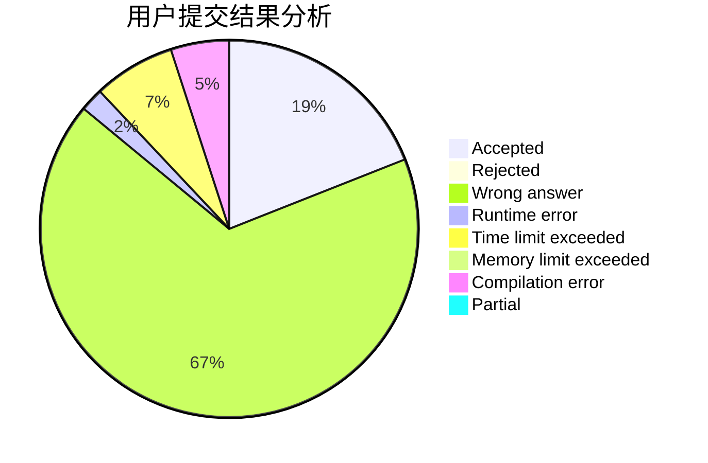
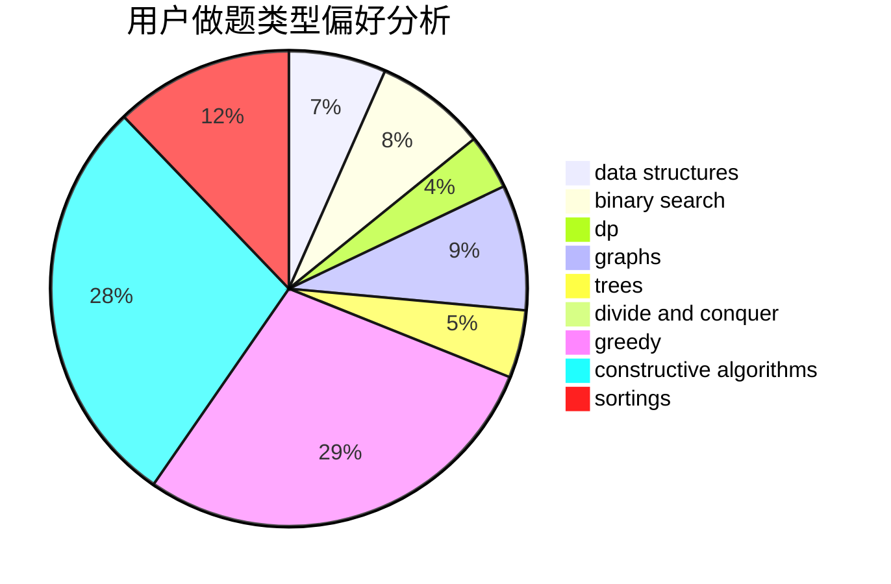

# 31901179
<!-- tabs:start -->
#### **用户提交结果分析**

#### **用户做题类型偏好分析**

#### **用户错题知识点分析**

<!-- tabs:end -->
# 推荐题目
[1351A](http://codeforces.com/problemset/problem/1351/A)		implementation		  
[1361B](http://codeforces.com/problemset/problem/1361/B)		greedy,
                        implementation,
                        math,
                        sortings		  
[106C](http://codeforces.com/problemset/problem/106/C)		dp		  
[1361A](http://codeforces.com/problemset/problem/1361/A)		constructive algorithms,
                        graphs,
                        greedy,
                        sortings		  
[1357D1](http://codeforces.com/problemset/problem/1357/D1)		nan		  
[1288D](http://codeforces.com/problemset/problem/1288/D)		binary search,
                        bitmasks,
                        dp		  
[1358B](http://codeforces.com/problemset/problem/1358/B)		greedy,
                        sortings		  
[1357C2](http://codeforces.com/problemset/problem/1357/C2)		nan		  
[1357E2](http://codeforces.com/problemset/problem/1357/E2)		nan		  
[1262A](https://codeforces.com/contest/1262/problem/A)		math		  
<!-- tabs:start -->
#### **data structures**
[1070E](http://codeforces.com/problemset/problem/1070/E)		binary search,
                        data structures		  
[1359F](http://codeforces.com/problemset/problem/1359/F)		binary search,
                        brute force,
                        data structures,
                        geometry,
                        math		  
[1237G](http://codeforces.com/problemset/problem/1237/G)		data structures,
                        dp,
                        greedy		  
[1334F](http://codeforces.com/problemset/problem/1334/F)		binary search,
                        data structures,
                        dp,
                        greedy		  
[1359D](http://codeforces.com/problemset/problem/1359/D)		data structures,
                        dp,
                        implementation,
                        two pointers		  
[1315D](https://codeforces.com/contest/1315/problem/D)		data structures,
                        greedy,
                        sortings		  
[1237B](http://codeforces.com/problemset/problem/1237/B)		data structures,
                        sortings,
                        two pointers		  
[1329D](http://codeforces.com/problemset/problem/1329/D)		constructive algorithms,
                        data structures		  
[1358E](http://codeforces.com/problemset/problem/1358/E)		constructive algorithms,
                        data structures,
                        greedy,
                        implementation		  
[1492C](http://codeforces.com/problemset/problem/1492/C)		binary search,
                        data structures,
                        dp,
                        greedy,
                        two pointers		  
#### **binary search**
[1288D](http://codeforces.com/problemset/problem/1288/D)		binary search,
                        bitmasks,
                        dp		  
[1070E](http://codeforces.com/problemset/problem/1070/E)		binary search,
                        data structures		  
[1359F](http://codeforces.com/problemset/problem/1359/F)		binary search,
                        brute force,
                        data structures,
                        geometry,
                        math		  
[1334F](http://codeforces.com/problemset/problem/1334/F)		binary search,
                        data structures,
                        dp,
                        greedy		  
[1358D](http://codeforces.com/problemset/problem/1358/D)		binary search,
                        brute force,
                        greedy,
                        implementation,
                        two pointers		  
[1358F](http://codeforces.com/problemset/problem/1358/F)		binary search,
                        constructive algorithms,
                        greedy,
                        implementation		  
[1011B](http://codeforces.com/problemset/problem/1011/B)		binary search,
                        brute force,
                        implementation		  
[1360H](http://codeforces.com/problemset/problem/1360/H)		binary search,
                        bitmasks,
                        brute force,
                        constructive algorithms		  
[1361C](http://codeforces.com/problemset/problem/1361/C)		binary search,
                        bitmasks,
                        constructive algorithms,
                        dfs and similar,
                        dsu,
                        graphs		  
[1359C](http://codeforces.com/problemset/problem/1359/C)		binary search,
                        math		  
#### **dp**
[106C](http://codeforces.com/problemset/problem/106/C)		dp		  
[1288D](http://codeforces.com/problemset/problem/1288/D)		binary search,
                        bitmasks,
                        dp		  
[1237G](http://codeforces.com/problemset/problem/1237/G)		data structures,
                        dp,
                        greedy		  
[1334F](http://codeforces.com/problemset/problem/1334/F)		binary search,
                        data structures,
                        dp,
                        greedy		  
[1239E](http://codeforces.com/problemset/problem/1239/E)		dp,
                        implementation		  
[1359D](http://codeforces.com/problemset/problem/1359/D)		data structures,
                        dp,
                        implementation,
                        two pointers		  
[1000D](http://codeforces.com/problemset/problem/1000/D)		combinatorics,
                        dp		  
[1359B](http://codeforces.com/problemset/problem/1359/B)		brute force,
                        dp,
                        greedy,
                        implementation,
                        two pointers		  
[1227F1](http://codeforces.com/problemset/problem/1227/F1)		dp		  
[1360F](http://codeforces.com/problemset/problem/1360/F)		bitmasks,
                        brute force,
                        constructive algorithms,
                        dp,
                        hashing,
                        strings		  
#### **graph**
[1361A](http://codeforces.com/problemset/problem/1361/A)		constructive algorithms,
                        graphs,
                        greedy,
                        sortings		  
[1230C](https://codeforces.com/contest/1230/problem/C)		brute force,
                        graphs		  
[1033A](http://codeforces.com/problemset/problem/1033/A)		dfs and similar,
                        graphs,
                        implementation		  
[1139C](http://codeforces.com/problemset/problem/1139/C)		dfs and similar,
                        dsu,
                        graphs,
                        math,
                        trees		  
[1360E](http://codeforces.com/problemset/problem/1360/E)		dp,
                        graphs,
                        implementation,
                        shortest paths		  
[1340B](http://codeforces.com/problemset/problem/1340/B)		bitmasks,
                        dp,
                        graphs,
                        greedy		  
[1360C](http://codeforces.com/problemset/problem/1360/C)		constructive algorithms,
                        graph matchings,
                        greedy,
                        sortings		  
[1361C](http://codeforces.com/problemset/problem/1361/C)		binary search,
                        bitmasks,
                        constructive algorithms,
                        dfs and similar,
                        dsu,
                        graphs		  
[1487C](http://codeforces.com/problemset/problem/1487/C)		brute force,
                        constructive algorithms,
                        dfs and similar,
                        graphs,
                        greedy,
                        implementation,
                        math		  
[1437C](http://codeforces.com/problemset/problem/1437/C)		dp,
                        flows,
                        graph matchings,
                        greedy,
                        math,
                        sortings		  
#### **trees**
[1361D](http://codeforces.com/problemset/problem/1361/D)		greedy,
                        implementation,
                        math,
                        trees		  
[1139C](http://codeforces.com/problemset/problem/1139/C)		dfs and similar,
                        dsu,
                        graphs,
                        math,
                        trees		  
[1337C](https://codeforces.com/contest/1337/problem/C)		dfs and similar,
                        dp,
                        greedy,
                        sortings,
                        trees		  
[1479D](http://codeforces.com/problemset/problem/1479/D)		binary search,
                        bitmasks,
                        brute force,
                        data structures,
                        probabilities,
                        trees		  
[1511C](http://codeforces.com/problemset/problem/1511/C)		brute force,
                        data structures,
                        implementation,
                        trees		  
[1499F](http://codeforces.com/problemset/problem/1499/F)		combinatorics,
                        dfs and similar,
                        dp,
                        trees		  
[1491E](http://codeforces.com/problemset/problem/1491/E)		brute force,
                        dfs and similar,
                        divide and conquer,
                        number theory,
                        trees		  
[1466D](http://codeforces.com/problemset/problem/1466/D)		data structures,
                        greedy,
                        sortings,
                        trees		  
[1495D](http://codeforces.com/problemset/problem/1495/D)		combinatorics,
                        dfs and similar,
                        graphs,
                        math,
                        shortest paths,
                        trees		  
[1303G](http://codeforces.com/problemset/problem/1303/G)		data structures,
                        divide and conquer,
                        geometry,
                        trees		  
#### **divide and conquer**
[117D](http://codeforces.com/problemset/problem/117/D)		divide and conquer,
                        math		  
[1461D](http://codeforces.com/problemset/problem/1461/D)		binary search,
                        brute force,
                        data structures,
                        divide and conquer,
                        implementation,
                        sortings		  
[1466G](http://codeforces.com/problemset/problem/1466/G)		combinatorics,
                        divide and conquer,
                        hashing,
                        math,
                        string suffix structures,
                        strings		  
[1490D](http://codeforces.com/problemset/problem/1490/D)		dfs and similar,
                        divide and conquer,
                        implementation		  
[1483C](https://codeforces.com/contest/1483/problem/C)		data structures,
                        divide and conquer,
                        dp		  
[1491E](http://codeforces.com/problemset/problem/1491/E)		brute force,
                        dfs and similar,
                        divide and conquer,
                        number theory,
                        trees		  
[1303G](http://codeforces.com/problemset/problem/1303/G)		data structures,
                        divide and conquer,
                        geometry,
                        trees		  
[1494D](http://codeforces.com/problemset/problem/1494/D)		constructive algorithms,
                        data structures,
                        dfs and similar,
                        divide and conquer,
                        dsu,
                        greedy,
                        sortings,
                        trees		  
[1482E](http://codeforces.com/problemset/problem/1482/E)		data structures,
                        divide and conquer,
                        dp		  
[566C](http://codeforces.com/problemset/problem/566/C)		dfs and similar,
                        divide and conquer,
                        trees		  
#### **greedy**
[1361B](http://codeforces.com/problemset/problem/1361/B)		greedy,
                        implementation,
                        math,
                        sortings		  
[1361A](http://codeforces.com/problemset/problem/1361/A)		constructive algorithms,
                        graphs,
                        greedy,
                        sortings		  
[1358B](http://codeforces.com/problemset/problem/1358/B)		greedy,
                        sortings		  
[1237G](http://codeforces.com/problemset/problem/1237/G)		data structures,
                        dp,
                        greedy		  
[1334F](http://codeforces.com/problemset/problem/1334/F)		binary search,
                        data structures,
                        dp,
                        greedy		  
[1358D](http://codeforces.com/problemset/problem/1358/D)		binary search,
                        brute force,
                        greedy,
                        implementation,
                        two pointers		  
[1358F](http://codeforces.com/problemset/problem/1358/F)		binary search,
                        constructive algorithms,
                        greedy,
                        implementation		  
[1315D](https://codeforces.com/contest/1315/problem/D)		data structures,
                        greedy,
                        sortings		  
[1360B](http://codeforces.com/problemset/problem/1360/B)		greedy,
                        sortings		  
[1361D](http://codeforces.com/problemset/problem/1361/D)		greedy,
                        implementation,
                        math,
                        trees		  
#### **constructive algorithms**
[1361A](http://codeforces.com/problemset/problem/1361/A)		constructive algorithms,
                        graphs,
                        greedy,
                        sortings		  
[1358F](http://codeforces.com/problemset/problem/1358/F)		binary search,
                        constructive algorithms,
                        greedy,
                        implementation		  
[1360G](http://codeforces.com/problemset/problem/1360/G)		constructive algorithms,
                        greedy,
                        math		  
[1360F](http://codeforces.com/problemset/problem/1360/F)		bitmasks,
                        brute force,
                        constructive algorithms,
                        dp,
                        hashing,
                        strings		  
[1360H](http://codeforces.com/problemset/problem/1360/H)		binary search,
                        bitmasks,
                        brute force,
                        constructive algorithms		  
[1360C](http://codeforces.com/problemset/problem/1360/C)		constructive algorithms,
                        graph matchings,
                        greedy,
                        sortings		  
[1361C](http://codeforces.com/problemset/problem/1361/C)		binary search,
                        bitmasks,
                        constructive algorithms,
                        dfs and similar,
                        dsu,
                        graphs		  
[1037A](http://codeforces.com/problemset/problem/1037/A)		constructive algorithms,
                        greedy,
                        math		  
[1329D](http://codeforces.com/problemset/problem/1329/D)		constructive algorithms,
                        data structures		  
[1358E](http://codeforces.com/problemset/problem/1358/E)		constructive algorithms,
                        data structures,
                        greedy,
                        implementation		  
#### **sortings**
[1361B](http://codeforces.com/problemset/problem/1361/B)		greedy,
                        implementation,
                        math,
                        sortings		  
[1361A](http://codeforces.com/problemset/problem/1361/A)		constructive algorithms,
                        graphs,
                        greedy,
                        sortings		  
[1358B](http://codeforces.com/problemset/problem/1358/B)		greedy,
                        sortings		  
[1315D](https://codeforces.com/contest/1315/problem/D)		data structures,
                        greedy,
                        sortings		  
[1360B](http://codeforces.com/problemset/problem/1360/B)		greedy,
                        sortings		  
[1337C](https://codeforces.com/contest/1337/problem/C)		dfs and similar,
                        dp,
                        greedy,
                        sortings,
                        trees		  
[1237B](http://codeforces.com/problemset/problem/1237/B)		data structures,
                        sortings,
                        two pointers		  
[1360C](http://codeforces.com/problemset/problem/1360/C)		constructive algorithms,
                        graph matchings,
                        greedy,
                        sortings		  
[1496C](https://codeforces.com/contest/1496/problem/C)		geometry,
                        greedy,
                        math,
                        sortings		  
[1495A](http://codeforces.com/problemset/problem/1495/A)		geometry,
                        greedy,
                        math,
                        sortings		  
<!-- tabs:end -->
