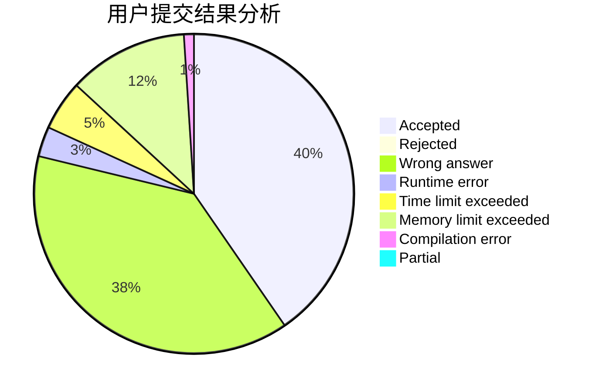
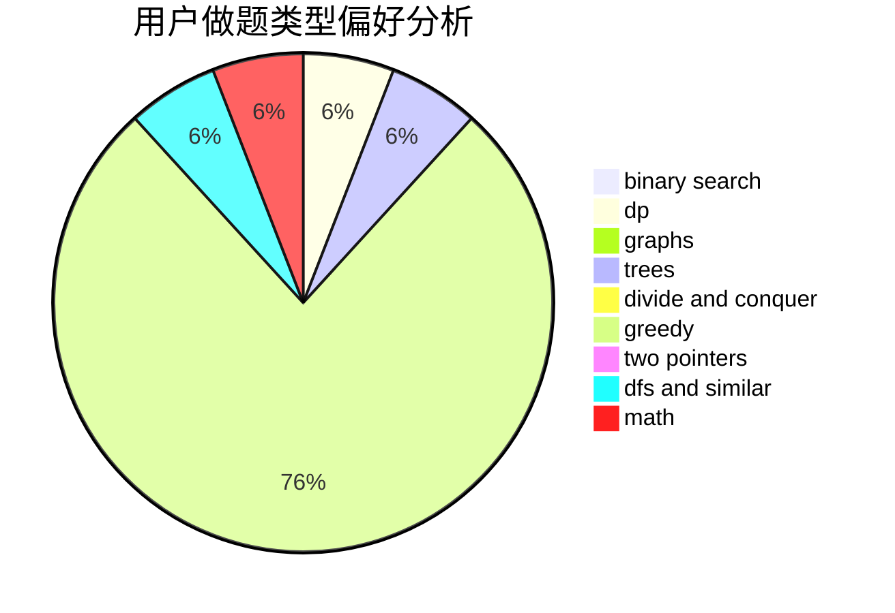

# Joysh

<!-- tabs:start -->

#### **用户提交结果分析**

#### **用户做题类型偏好分析**

<!-- tabs:end -->
# 推荐题目
[356A](https://codeforces.com/contest/356/problem/A)
[877C](https://codeforces.com/contest/877/problem/C)
[1271F](https://codeforces.com/contest/1271/problem/F)
[11302](https://codeforces.com/contest/1130/problem/2)
[515D](https://codeforces.com/contest/515/problem/D)
[199D](https://codeforces.com/contest/199/problem/D)
[799A](https://codeforces.com/contest/799/problem/A)
[1490C](https://codeforces.com/contest/1490/problem/C)
[1497B](https://codeforces.com/contest/1497/problem/B)
[1491C](https://codeforces.com/contest/1491/problem/C)
