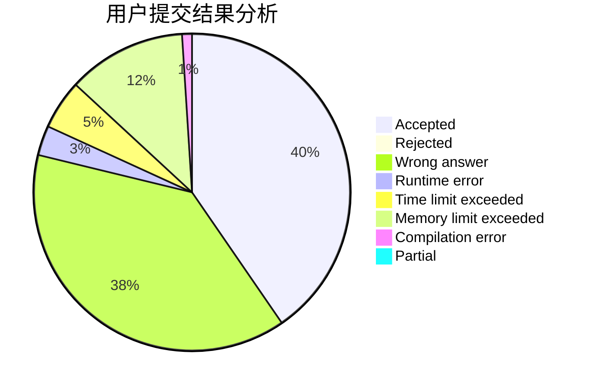
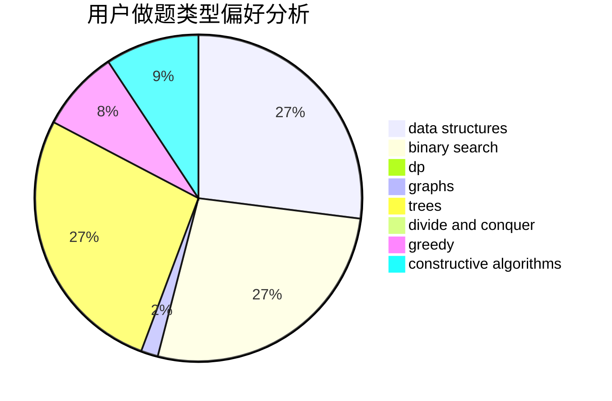
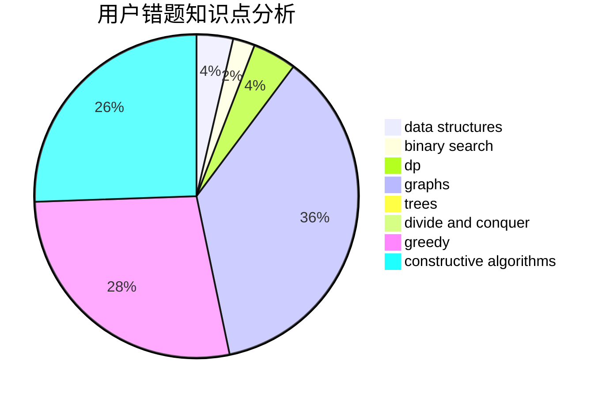

# Joysh

<!-- tabs:start -->

#### **用户提交结果分析**

#### **用户做题类型偏好分析**

#### **用户错题知识点分析**

<!-- tabs:end -->
# 推荐题目
[325E](https://codeforces.com/contest/325/problem/E)		combinatorics,
                        dfs and similar,
                        dsu,
                        graphs,
                        greedy		  
[859F](https://codeforces.com/contest/859/problem/F)		greedy		  
[1266E](https://codeforces.com/contest/1266/problem/E)		data structures,
                        greedy,
                        implementation		  
[1120F](https://codeforces.com/contest/1120/problem/F)		data structures,
                        dp,
                        greedy		  
[496A](https://codeforces.com/contest/496/problem/A)		brute force,
                        implementation,
                        math		  
[171F](https://codeforces.com/contest/171/problem/F)		*special problem,
                        brute force,
                        implementation,
                        number theory		  
[780C](https://codeforces.com/contest/780/problem/C)		dfs and similar,
                        graphs,
                        greedy,
                        trees		  
[1482E](https://codeforces.com/contest/1482/problem/E)		data structures,
                        divide and conquer,
                        dp		  
[1489D](https://codeforces.com/contest/1489/problem/D)		dsu,graphs,sortings,trees		  
[1483E](https://codeforces.com/contest/1483/problem/E)		dsu,graphs,sortings,trees		  
