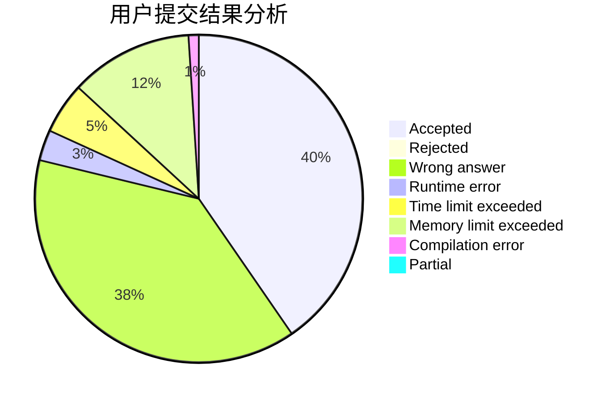
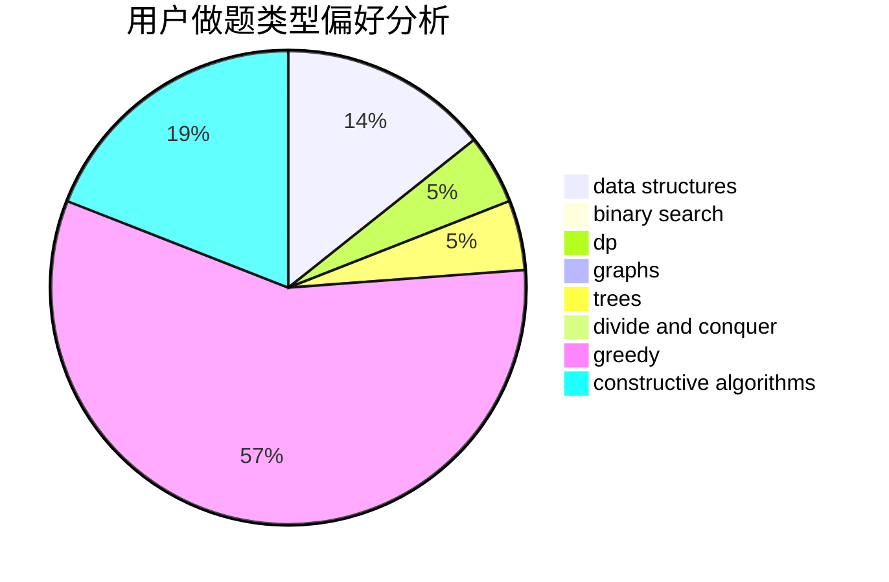
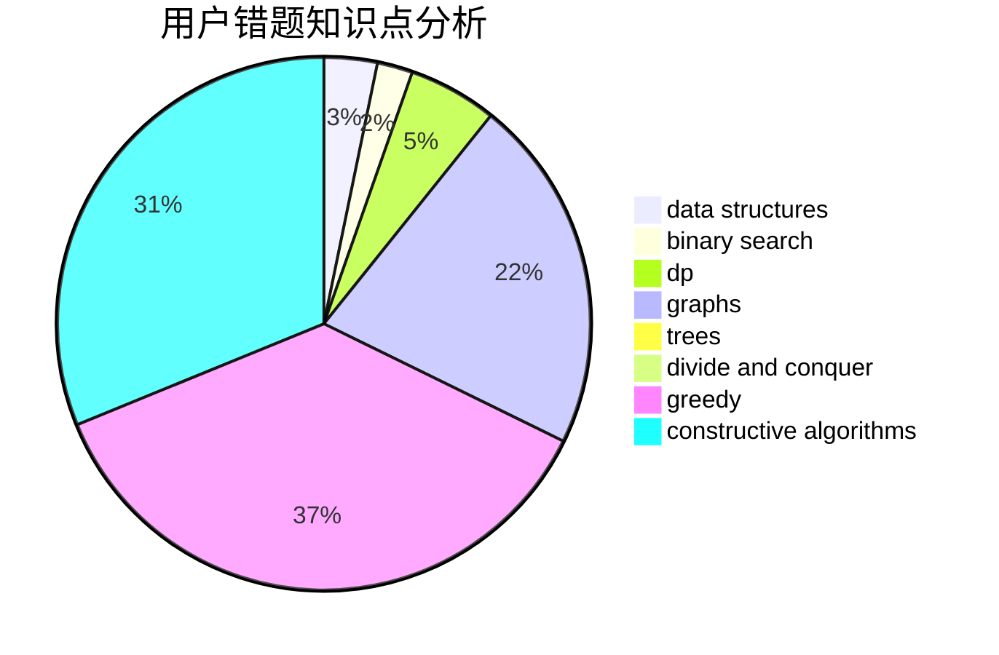

# Joysh

<!-- tabs:start -->

#### **用户提交结果分析**

#### **用户做题类型偏好分析**

#### **用户错题知识点分析**

<!-- tabs:end -->
# 推荐题目
[356A](https://codeforces.com/contest/356/problem/A)		data structures,
                        dsu		  
[877C](https://codeforces.com/contest/877/problem/C)		constructive algorithms		  
[1271F](https://codeforces.com/contest/1271/problem/F)		brute force		  
[11302](https://codeforces.com/contest/1130/problem/2)		dsu,graphs,sortings,trees		  
[515D](https://codeforces.com/contest/515/problem/D)		constructive algorithms,
                        greedy		  
[199D](https://codeforces.com/contest/199/problem/D)		dsu,graphs,sortings,trees		  
[799A](https://codeforces.com/contest/799/problem/A)		brute force,
                        implementation		  
[1490C](https://codeforces.com/contest/1490/problem/C)		binary search,
                        brute force,
                        brute force,
                        math		  
[1497B](https://codeforces.com/contest/1497/problem/B)		constructive algorithms,
                        greedy,
                        math		  
[1491C](https://codeforces.com/contest/1491/problem/C)		brute force,
                        data structures,
                        dp,
                        greedy,
                        implementation		  
