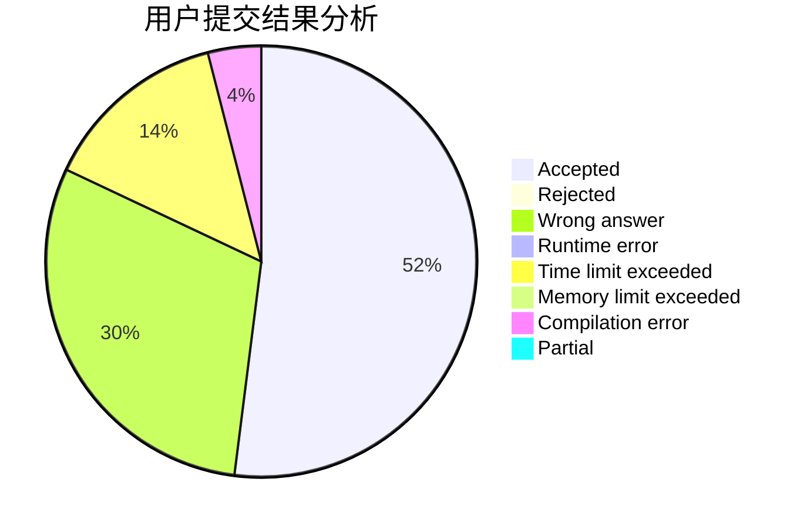
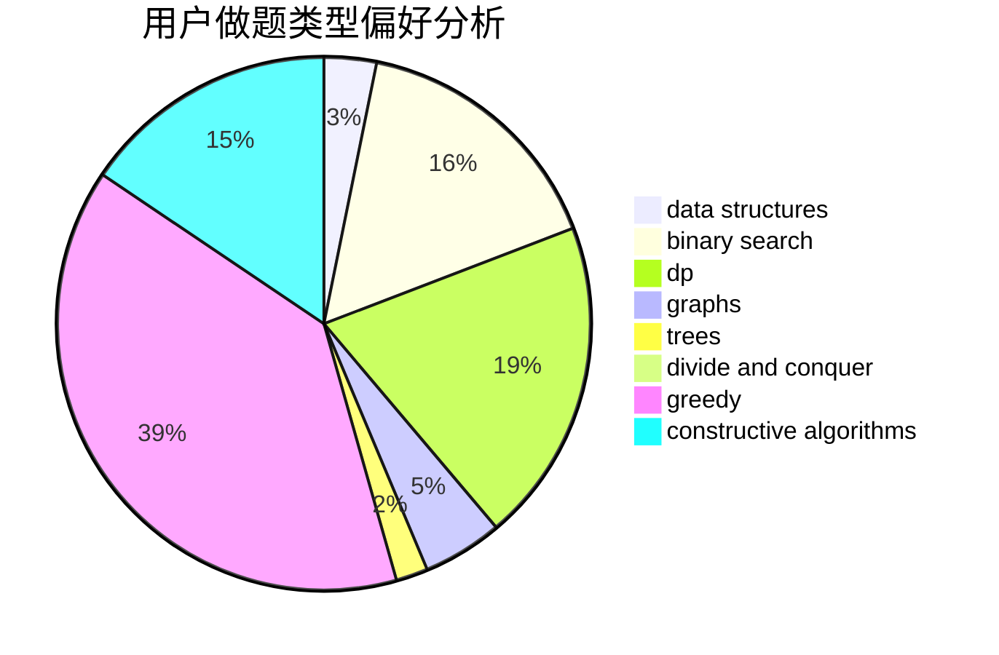
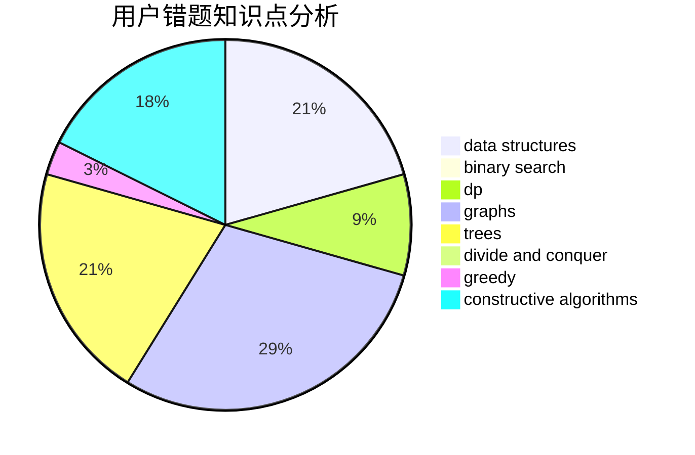

# Jozky

<!-- tabs:start -->

#### **用户提交结果分析**

#### **用户做题类型偏好分析**

#### **用户错题知识点分析**

<!-- tabs:end -->
# 推荐题目
[1506C](https://codeforces.com/contest/1506/problem/C)		brute force,
                        implementation,
                        strings		  
[681A](https://codeforces.com/contest/681/problem/A)		implementation		  
[293A](https://codeforces.com/contest/293/problem/A)		games,
                        greedy		  
[1257E](https://codeforces.com/contest/1257/problem/E)		data structures,
                        dp,
                        greedy		  
[243D](https://codeforces.com/contest/243/problem/D)		data structures,
                        dp,
                        geometry,
                        two pointers		  
[762A](https://codeforces.com/contest/762/problem/A)		math,
                        number theory		  
[954C](https://codeforces.com/contest/954/problem/C)		implementation		  
[1073G](https://codeforces.com/contest/1073/problem/G)		data structures,
                        string suffix structures		  
[474C](https://codeforces.com/contest/474/problem/C)		brute force,
                        geometry		  
[1145B](https://codeforces.com/contest/1145/problem/B)		brute force		  
