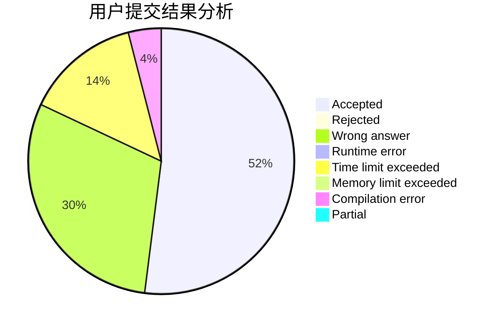
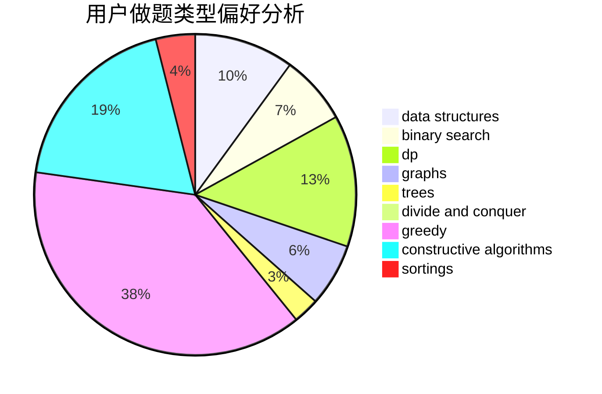
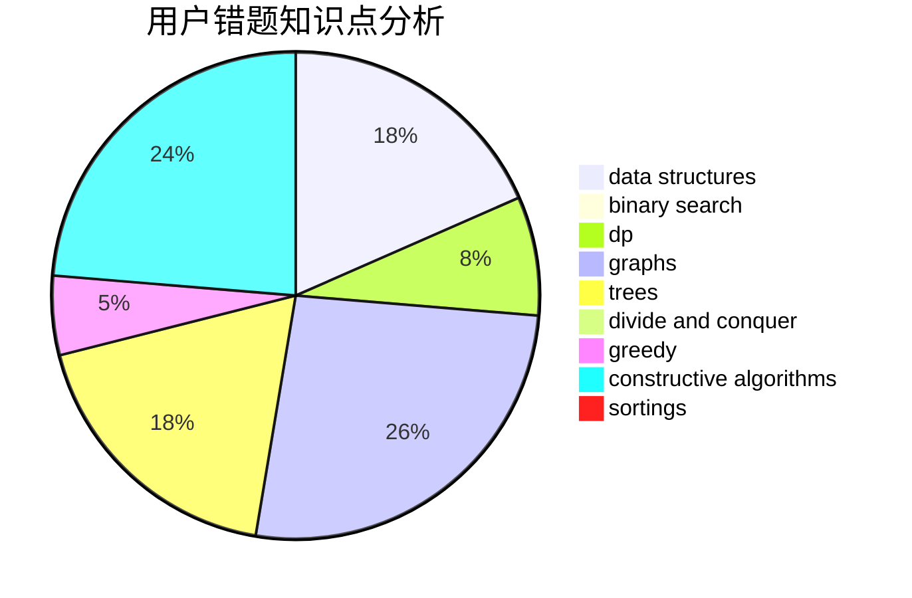

# Jozky
<!-- tabs:start -->
#### **用户提交结果分析**

#### **用户做题类型偏好分析**

#### **用户错题知识点分析**

<!-- tabs:end -->
# 推荐题目
[1497E1](http://codeforces.com/problemset/problem/1497/E1)		data structures,
                        dp,
                        greedy,
                        math,
                        number theory,
                        two pointers		  
[1252D](http://codeforces.com/problemset/problem/1252/D)		data structures,
                        dp,
                        strings,
                        trees		  
[660C](http://codeforces.com/problemset/problem/660/C)		binary search,
                        dp,
                        two pointers		  
[225D](http://codeforces.com/problemset/problem/225/D)		bitmasks,
                        dfs and similar,
                        graphs,
                        implementation		  
[725A](http://codeforces.com/problemset/problem/725/A)		implementation		  
[741A](http://codeforces.com/problemset/problem/741/A)		dfs and similar,
                        math		  
[1070B](http://codeforces.com/problemset/problem/1070/B)		data structures,
                        greedy		  
[279A](http://codeforces.com/problemset/problem/279/A)		brute force,
                        geometry,
                        implementation		  
[932C](http://codeforces.com/problemset/problem/932/C)		brute force,
                        constructive algorithms		  
[791B](https://codeforces.com/contest/791/problem/B)		dfs and similar,
                        dsu,
                        graphs		  
<!-- tabs:start -->
#### **data structures**
[1497E1](http://codeforces.com/problemset/problem/1497/E1)		data structures,
                        dp,
                        greedy,
                        math,
                        number theory,
                        two pointers		  
[1252D](http://codeforces.com/problemset/problem/1252/D)		data structures,
                        dp,
                        strings,
                        trees		  
[1070B](http://codeforces.com/problemset/problem/1070/B)		data structures,
                        greedy		  
[932B](http://codeforces.com/problemset/problem/932/B)		binary search,
                        data structures,
                        dfs and similar		  
[1073D](http://codeforces.com/problemset/problem/1073/D)		binary search,
                        brute force,
                        data structures,
                        greedy		  
[651C](https://codeforces.com/contest/651/problem/C)		data structures,
                        geometry,
                        math		  
[1307D](http://codeforces.com/problemset/problem/1307/D)		binary search,
                        data structures,
                        dfs and similar,
                        graphs,
                        greedy,
                        shortest paths,
                        sortings		  
[1251E2](http://codeforces.com/problemset/problem/1251/E2)		binary search,
                        data structures,
                        greedy		  
[342E](http://codeforces.com/problemset/problem/342/E)		data structures,
                        divide and conquer,
                        trees		  
[671E](http://codeforces.com/problemset/problem/671/E)		data structures,
                        greedy		  
#### **binary search**
[660C](http://codeforces.com/problemset/problem/660/C)		binary search,
                        dp,
                        two pointers		  
[205C](https://codeforces.com/contest/205/problem/C)		binary search,
                        combinatorics,
                        dp		  
[932B](http://codeforces.com/problemset/problem/932/B)		binary search,
                        data structures,
                        dfs and similar		  
[1073D](http://codeforces.com/problemset/problem/1073/D)		binary search,
                        brute force,
                        data structures,
                        greedy		  
[1077D](http://codeforces.com/problemset/problem/1077/D)		binary search,
                        sortings		  
[1307D](http://codeforces.com/problemset/problem/1307/D)		binary search,
                        data structures,
                        dfs and similar,
                        graphs,
                        greedy,
                        shortest paths,
                        sortings		  
[1251E2](http://codeforces.com/problemset/problem/1251/E2)		binary search,
                        data structures,
                        greedy		  
[1486C1](http://codeforces.com/problemset/problem/1486/C1)		binary search,
                        interactive		  
[1492C](http://codeforces.com/problemset/problem/1492/C)		binary search,
                        data structures,
                        dp,
                        greedy,
                        two pointers		  
[1463D](http://codeforces.com/problemset/problem/1463/D)		binary search,
                        constructive algorithms,
                        greedy,
                        two pointers		  
#### **dp**
[1497E1](http://codeforces.com/problemset/problem/1497/E1)		data structures,
                        dp,
                        greedy,
                        math,
                        number theory,
                        two pointers		  
[1252D](http://codeforces.com/problemset/problem/1252/D)		data structures,
                        dp,
                        strings,
                        trees		  
[660C](http://codeforces.com/problemset/problem/660/C)		binary search,
                        dp,
                        two pointers		  
[205C](https://codeforces.com/contest/205/problem/C)		binary search,
                        combinatorics,
                        dp		  
[158E](http://codeforces.com/problemset/problem/158/E)		*special problem,
                        dp,
                        sortings		  
[764C](https://codeforces.com/contest/764/problem/C)		dfs and similar,
                        dp,
                        dsu,
                        graphs,
                        implementation,
                        trees		  
[1175E](http://codeforces.com/problemset/problem/1175/E)		data structures,
                        dfs and similar,
                        divide and conquer,
                        dp,
                        greedy,
                        implementation,
                        trees		  
[568B](http://codeforces.com/problemset/problem/568/B)		combinatorics,
                        dp,
                        math		  
[704B](http://codeforces.com/problemset/problem/704/B)		dp,
                        graphs,
                        greedy		  
[933A](http://codeforces.com/problemset/problem/933/A)		dp		  
#### **graph**
[225D](http://codeforces.com/problemset/problem/225/D)		bitmasks,
                        dfs and similar,
                        graphs,
                        implementation		  
[791B](https://codeforces.com/contest/791/problem/B)		dfs and similar,
                        dsu,
                        graphs		  
[241E](http://codeforces.com/problemset/problem/241/E)		graphs,
                        shortest paths		  
[546E](http://codeforces.com/problemset/problem/546/E)		flows,
                        graphs,
                        math		  
[1307D](http://codeforces.com/problemset/problem/1307/D)		binary search,
                        data structures,
                        dfs and similar,
                        graphs,
                        greedy,
                        shortest paths,
                        sortings		  
[700C](http://codeforces.com/problemset/problem/700/C)		dfs and similar,
                        graphs		  
[764C](https://codeforces.com/contest/764/problem/C)		dfs and similar,
                        dp,
                        dsu,
                        graphs,
                        implementation,
                        trees		  
[704B](http://codeforces.com/problemset/problem/704/B)		dp,
                        graphs,
                        greedy		  
[1487C](http://codeforces.com/problemset/problem/1487/C)		brute force,
                        constructive algorithms,
                        dfs and similar,
                        graphs,
                        greedy,
                        implementation,
                        math		  
[1437C](http://codeforces.com/problemset/problem/1437/C)		dp,
                        flows,
                        graph matchings,
                        greedy,
                        math,
                        sortings		  
#### **trees**
[1252D](http://codeforces.com/problemset/problem/1252/D)		data structures,
                        dp,
                        strings,
                        trees		  
[277E](http://codeforces.com/problemset/problem/277/E)		flows,
                        trees		  
[342E](http://codeforces.com/problemset/problem/342/E)		data structures,
                        divide and conquer,
                        trees		  
[764C](https://codeforces.com/contest/764/problem/C)		dfs and similar,
                        dp,
                        dsu,
                        graphs,
                        implementation,
                        trees		  
[1175E](http://codeforces.com/problemset/problem/1175/E)		data structures,
                        dfs and similar,
                        divide and conquer,
                        dp,
                        greedy,
                        implementation,
                        trees		  
[1479D](http://codeforces.com/problemset/problem/1479/D)		binary search,
                        bitmasks,
                        brute force,
                        data structures,
                        probabilities,
                        trees		  
[1511C](http://codeforces.com/problemset/problem/1511/C)		brute force,
                        data structures,
                        implementation,
                        trees		  
[1499F](http://codeforces.com/problemset/problem/1499/F)		combinatorics,
                        dfs and similar,
                        dp,
                        trees		  
[1491E](http://codeforces.com/problemset/problem/1491/E)		brute force,
                        dfs and similar,
                        divide and conquer,
                        number theory,
                        trees		  
[1466D](http://codeforces.com/problemset/problem/1466/D)		data structures,
                        greedy,
                        sortings,
                        trees		  
#### **divide and conquer**
[342E](http://codeforces.com/problemset/problem/342/E)		data structures,
                        divide and conquer,
                        trees		  
[1175E](http://codeforces.com/problemset/problem/1175/E)		data structures,
                        dfs and similar,
                        divide and conquer,
                        dp,
                        greedy,
                        implementation,
                        trees		  
[1461D](http://codeforces.com/problemset/problem/1461/D)		binary search,
                        brute force,
                        data structures,
                        divide and conquer,
                        implementation,
                        sortings		  
[1466G](http://codeforces.com/problemset/problem/1466/G)		combinatorics,
                        divide and conquer,
                        hashing,
                        math,
                        string suffix structures,
                        strings		  
[1490D](http://codeforces.com/problemset/problem/1490/D)		dfs and similar,
                        divide and conquer,
                        implementation		  
[1483C](https://codeforces.com/contest/1483/problem/C)		data structures,
                        divide and conquer,
                        dp		  
[1491E](http://codeforces.com/problemset/problem/1491/E)		brute force,
                        dfs and similar,
                        divide and conquer,
                        number theory,
                        trees		  
[1303G](http://codeforces.com/problemset/problem/1303/G)		data structures,
                        divide and conquer,
                        geometry,
                        trees		  
[1494D](http://codeforces.com/problemset/problem/1494/D)		constructive algorithms,
                        data structures,
                        dfs and similar,
                        divide and conquer,
                        dsu,
                        greedy,
                        sortings,
                        trees		  
[1482E](http://codeforces.com/problemset/problem/1482/E)		data structures,
                        divide and conquer,
                        dp		  
#### **greedy**
[1497E1](http://codeforces.com/problemset/problem/1497/E1)		data structures,
                        dp,
                        greedy,
                        math,
                        number theory,
                        two pointers		  
[1070B](http://codeforces.com/problemset/problem/1070/B)		data structures,
                        greedy		  
[743A](http://codeforces.com/problemset/problem/743/A)		constructive algorithms,
                        greedy,
                        implementation		  
[1249C1](http://codeforces.com/problemset/problem/1249/C1)		brute force,
                        greedy,
                        implementation		  
[379C](http://codeforces.com/problemset/problem/379/C)		greedy,
                        sortings		  
[1073D](http://codeforces.com/problemset/problem/1073/D)		binary search,
                        brute force,
                        data structures,
                        greedy		  
[1307D](http://codeforces.com/problemset/problem/1307/D)		binary search,
                        data structures,
                        dfs and similar,
                        graphs,
                        greedy,
                        shortest paths,
                        sortings		  
[1251E2](http://codeforces.com/problemset/problem/1251/E2)		binary search,
                        data structures,
                        greedy		  
[1195A](http://codeforces.com/problemset/problem/1195/A)		greedy,
                        math		  
[1249D1](http://codeforces.com/problemset/problem/1249/D1)		greedy		  
#### **constructive algorithms**
[932C](http://codeforces.com/problemset/problem/932/C)		brute force,
                        constructive algorithms		  
[743A](http://codeforces.com/problemset/problem/743/A)		constructive algorithms,
                        greedy,
                        implementation		  
[1196A](http://codeforces.com/problemset/problem/1196/A)		brute force,
                        constructive algorithms,
                        math		  
[1329A](http://codeforces.com/problemset/problem/1329/A)		constructive algorithms,
                        greedy,
                        implementation,
                        math		  
[1097E](http://codeforces.com/problemset/problem/1097/E)		constructive algorithms,
                        greedy		  
[1450F](http://codeforces.com/problemset/problem/1450/F)		constructive algorithms,
                        greedy		  
[1493A](http://codeforces.com/problemset/problem/1493/A)		constructive algorithms,
                        greedy		  
[1463D](http://codeforces.com/problemset/problem/1463/D)		binary search,
                        constructive algorithms,
                        greedy,
                        two pointers		  
[1456B](https://codeforces.com/contest/1456/problem/B)		bitmasks,
                        brute force,
                        constructive algorithms		  
[1492D](http://codeforces.com/problemset/problem/1492/D)		bitmasks,
                        constructive algorithms,
                        greedy,
                        math		  
#### **sortings**
[845A](http://codeforces.com/problemset/problem/845/A)		implementation,
                        sortings		  
[12B](http://codeforces.com/problemset/problem/12/B)		implementation,
                        sortings		  
[379C](http://codeforces.com/problemset/problem/379/C)		greedy,
                        sortings		  
[1077D](http://codeforces.com/problemset/problem/1077/D)		binary search,
                        sortings		  
[1307D](http://codeforces.com/problemset/problem/1307/D)		binary search,
                        data structures,
                        dfs and similar,
                        graphs,
                        greedy,
                        shortest paths,
                        sortings		  
[158E](http://codeforces.com/problemset/problem/158/E)		*special problem,
                        dp,
                        sortings		  
[841C](https://codeforces.com/contest/841/problem/C)		combinatorics,
                        greedy,
                        math,
                        number theory,
                        sortings		  
[1396D](http://codeforces.com/problemset/problem/1396/D)		data structures,
                        sortings,
                        two pointers		  
[1496C](https://codeforces.com/contest/1496/problem/C)		geometry,
                        greedy,
                        math,
                        sortings		  
[1495A](http://codeforces.com/problemset/problem/1495/A)		geometry,
                        greedy,
                        math,
                        sortings		  
<!-- tabs:end -->
