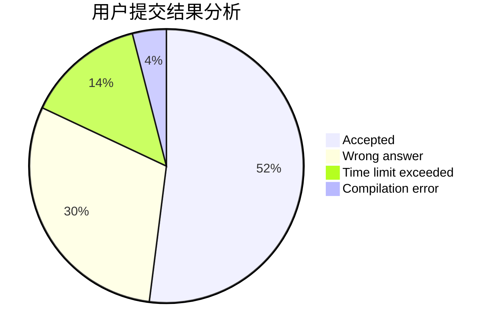
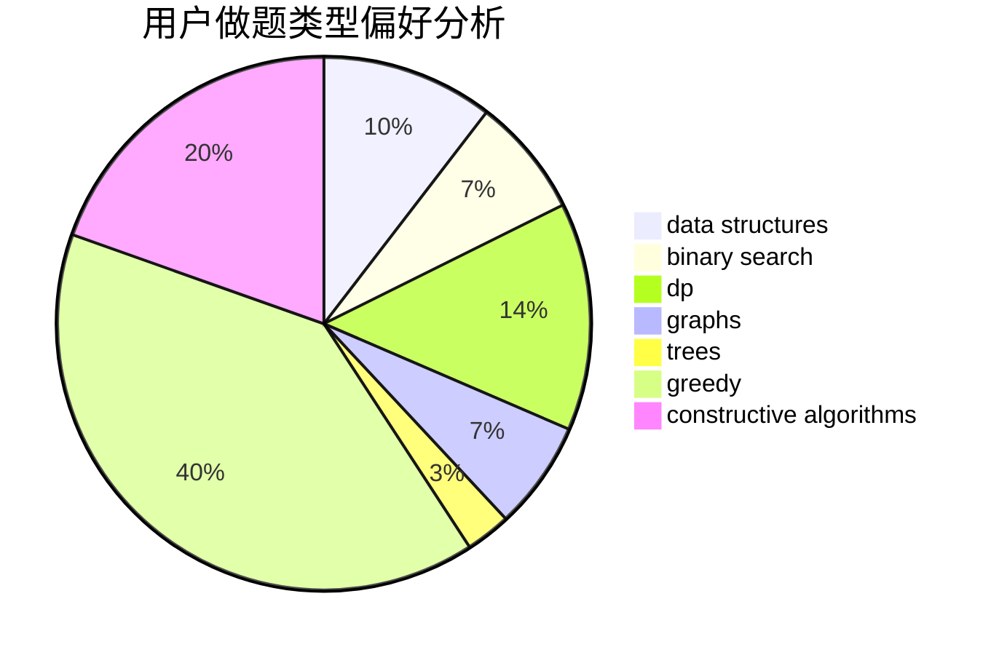
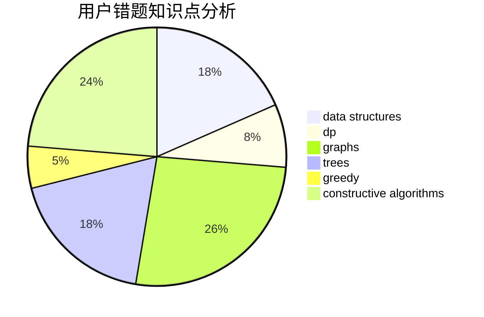

# Jozky
<!-- tabs:start -->
#### **用户提交结果分析**

#### **用户做题类型偏好分析**

#### **用户错题知识点分析**

<!-- tabs:end -->
# 推荐题目
[Square-free division (easy version)](http://codeforces.com/problemset/problem/1497/E1)		data structures,
                        dp,
                        greedy,
                        math,
                        number theory,
                        two pointers		  
[Find String in a Grid](http://codeforces.com/problemset/problem/1252/D)		data structures,
                        dp,
                        strings,
                        trees		  
[Hard Process](http://codeforces.com/problemset/problem/660/C)		binary search,
                        dp,
                        two pointers		  
[Snake](http://codeforces.com/problemset/problem/225/D)		bitmasks,
                        dfs and similar,
                        graphs,
                        implementation		  
[Jumping Ball](http://codeforces.com/problemset/problem/725/A)		implementation		  
[Arpa's loud Owf and Mehrdad's evil plan](http://codeforces.com/problemset/problem/741/A)		dfs and similar,
                        math		  
[Berkomnadzor](http://codeforces.com/problemset/problem/1070/B)		data structures,
                        greedy		  
[Point on Spiral](http://codeforces.com/problemset/problem/279/A)		brute force,
                        geometry,
                        implementation		  
[Permutation Cycle](http://codeforces.com/problemset/problem/932/C)		brute force,
                        constructive algorithms		  
[Bear and Friendship Condition](https://codeforces.com/contest/791/problem/B)		dfs and similar,
                        dsu,
                        graphs		  
<!-- tabs:start -->
#### **data structures**
[Square-free division (easy version)](http://codeforces.com/problemset/problem/1497/E1)		data structures,
                        dp,
                        greedy,
                        math,
                        number theory,
                        two pointers		  
[Find String in a Grid](http://codeforces.com/problemset/problem/1252/D)		data structures,
                        dp,
                        strings,
                        trees		  
[Berkomnadzor](http://codeforces.com/problemset/problem/1070/B)		data structures,
                        greedy		  
[Recursive Queries](http://codeforces.com/problemset/problem/932/B)		binary search,
                        data structures,
                        dfs and similar		  
[Berland Fair](http://codeforces.com/problemset/problem/1073/D)		binary search,
                        brute force,
                        data structures,
                        greedy		  
[Watchmen](https://codeforces.com/contest/651/problem/C)		data structures,
                        geometry,
                        math		  
[Cow and Fields](http://codeforces.com/problemset/problem/1307/D)		binary search,
                        data structures,
                        dfs and similar,
                        graphs,
                        greedy,
                        shortest paths,
                        sortings		  
[Voting (Hard Version)](http://codeforces.com/problemset/problem/1251/E2)		binary search,
                        data structures,
                        greedy		  
[Xenia and Tree](http://codeforces.com/problemset/problem/342/E)		data structures,
                        divide and conquer,
                        trees		  
[Organizing a Race](http://codeforces.com/problemset/problem/671/E)		data structures,
                        greedy		  
#### **binary search**
[Hard Process](http://codeforces.com/problemset/problem/660/C)		binary search,
                        dp,
                        two pointers		  
[Little Elephant and Interval](https://codeforces.com/contest/205/problem/C)		binary search,
                        combinatorics,
                        dp		  
[Recursive Queries](http://codeforces.com/problemset/problem/932/B)		binary search,
                        data structures,
                        dfs and similar		  
[Berland Fair](http://codeforces.com/problemset/problem/1073/D)		binary search,
                        brute force,
                        data structures,
                        greedy		  
[Cutting Out](http://codeforces.com/problemset/problem/1077/D)		binary search,
                        sortings		  
[Cow and Fields](http://codeforces.com/problemset/problem/1307/D)		binary search,
                        data structures,
                        dfs and similar,
                        graphs,
                        greedy,
                        shortest paths,
                        sortings		  
[Voting (Hard Version)](http://codeforces.com/problemset/problem/1251/E2)		binary search,
                        data structures,
                        greedy		  
[Guessing the Greatest (easy version)](http://codeforces.com/problemset/problem/1486/C1)		binary search,
                        interactive		  
[Maximum width](http://codeforces.com/problemset/problem/1492/C)		binary search,
                        data structures,
                        dp,
                        greedy,
                        two pointers		  
[Pairs](http://codeforces.com/problemset/problem/1463/D)		binary search,
                        constructive algorithms,
                        greedy,
                        two pointers		  
#### **dp**
[Square-free division (easy version)](http://codeforces.com/problemset/problem/1497/E1)		data structures,
                        dp,
                        greedy,
                        math,
                        number theory,
                        two pointers		  
[Find String in a Grid](http://codeforces.com/problemset/problem/1252/D)		data structures,
                        dp,
                        strings,
                        trees		  
[Hard Process](http://codeforces.com/problemset/problem/660/C)		binary search,
                        dp,
                        two pointers		  
[Little Elephant and Interval](https://codeforces.com/contest/205/problem/C)		binary search,
                        combinatorics,
                        dp		  
[Phone Talks](http://codeforces.com/problemset/problem/158/E)		*special problem,
                        dp,
                        sortings		  
[Timofey and a tree](https://codeforces.com/contest/764/problem/C)		dfs and similar,
                        dp,
                        dsu,
                        graphs,
                        implementation,
                        trees		  
[Minimal Segment Cover](http://codeforces.com/problemset/problem/1175/E)		data structures,
                        dfs and similar,
                        divide and conquer,
                        dp,
                        greedy,
                        implementation,
                        trees		  
[Symmetric and Transitive](http://codeforces.com/problemset/problem/568/B)		combinatorics,
                        dp,
                        math		  
[Ant Man](http://codeforces.com/problemset/problem/704/B)		dp,
                        graphs,
                        greedy		  
[A Twisty Movement](http://codeforces.com/problemset/problem/933/A)		dp		  
#### **graph**
[Snake](http://codeforces.com/problemset/problem/225/D)		bitmasks,
                        dfs and similar,
                        graphs,
                        implementation		  
[Bear and Friendship Condition](https://codeforces.com/contest/791/problem/B)		dfs and similar,
                        dsu,
                        graphs		  
[Flights](http://codeforces.com/problemset/problem/241/E)		graphs,
                        shortest paths		  
[Soldier and Traveling](http://codeforces.com/problemset/problem/546/E)		flows,
                        graphs,
                        math		  
[Cow and Fields](http://codeforces.com/problemset/problem/1307/D)		binary search,
                        data structures,
                        dfs and similar,
                        graphs,
                        greedy,
                        shortest paths,
                        sortings		  
[Break Up](http://codeforces.com/problemset/problem/700/C)		dfs and similar,
                        graphs		  
[Timofey and a tree](https://codeforces.com/contest/764/problem/C)		dfs and similar,
                        dp,
                        dsu,
                        graphs,
                        implementation,
                        trees		  
[Ant Man](http://codeforces.com/problemset/problem/704/B)		dp,
                        graphs,
                        greedy		  
[Minimum Ties](http://codeforces.com/problemset/problem/1487/C)		brute force,
                        constructive algorithms,
                        dfs and similar,
                        graphs,
                        greedy,
                        implementation,
                        math		  
[Chef Monocarp](http://codeforces.com/problemset/problem/1437/C)		dp,
                        flows,
                        graph matchings,
                        greedy,
                        math,
                        sortings		  
#### **trees**
[Find String in a Grid](http://codeforces.com/problemset/problem/1252/D)		data structures,
                        dp,
                        strings,
                        trees		  
[Binary Tree on Plane](http://codeforces.com/problemset/problem/277/E)		flows,
                        trees		  
[Xenia and Tree](http://codeforces.com/problemset/problem/342/E)		data structures,
                        divide and conquer,
                        trees		  
[Timofey and a tree](https://codeforces.com/contest/764/problem/C)		dfs and similar,
                        dp,
                        dsu,
                        graphs,
                        implementation,
                        trees		  
[Minimal Segment Cover](http://codeforces.com/problemset/problem/1175/E)		data structures,
                        dfs and similar,
                        divide and conquer,
                        dp,
                        greedy,
                        implementation,
                        trees		  
[Odd Mineral Resource](http://codeforces.com/problemset/problem/1479/D)		binary search,
                        bitmasks,
                        brute force,
                        data structures,
                        probabilities,
                        trees		  
[Yet Another Card Deck](http://codeforces.com/problemset/problem/1511/C)		brute force,
                        data structures,
                        implementation,
                        trees		  
[Diameter Cuts](http://codeforces.com/problemset/problem/1499/F)		combinatorics,
                        dfs and similar,
                        dp,
                        trees		  
[Fib-tree](http://codeforces.com/problemset/problem/1491/E)		brute force,
                        dfs and similar,
                        divide and conquer,
                        number theory,
                        trees		  
[13th Labour of Heracles](http://codeforces.com/problemset/problem/1466/D)		data structures,
                        greedy,
                        sortings,
                        trees		  
#### **divide and conquer**
[Xenia and Tree](http://codeforces.com/problemset/problem/342/E)		data structures,
                        divide and conquer,
                        trees		  
[Minimal Segment Cover](http://codeforces.com/problemset/problem/1175/E)		data structures,
                        dfs and similar,
                        divide and conquer,
                        dp,
                        greedy,
                        implementation,
                        trees		  
[Divide and Summarize](http://codeforces.com/problemset/problem/1461/D)		binary search,
                        brute force,
                        data structures,
                        divide and conquer,
                        implementation,
                        sortings		  
[Song of the Sirens](http://codeforces.com/problemset/problem/1466/G)		combinatorics,
                        divide and conquer,
                        hashing,
                        math,
                        string suffix structures,
                        strings		  
[Permutation Transformation](http://codeforces.com/problemset/problem/1490/D)		dfs and similar,
                        divide and conquer,
                        implementation		  
[Skyline Photo](https://codeforces.com/contest/1483/problem/C)		data structures,
                        divide and conquer,
                        dp		  
[Fib-tree](http://codeforces.com/problemset/problem/1491/E)		brute force,
                        dfs and similar,
                        divide and conquer,
                        number theory,
                        trees		  
[Sum of Prefix Sums](http://codeforces.com/problemset/problem/1303/G)		data structures,
                        divide and conquer,
                        geometry,
                        trees		  
[Dogeforces](http://codeforces.com/problemset/problem/1494/D)		constructive algorithms,
                        data structures,
                        dfs and similar,
                        divide and conquer,
                        dsu,
                        greedy,
                        sortings,
                        trees		  
[Logistical Questions](http://codeforces.com/problemset/problem/566/C)		dfs and similar,
                        divide and conquer,
                        trees		  
#### **greedy**
[Square-free division (easy version)](http://codeforces.com/problemset/problem/1497/E1)		data structures,
                        dp,
                        greedy,
                        math,
                        number theory,
                        two pointers		  
[Berkomnadzor](http://codeforces.com/problemset/problem/1070/B)		data structures,
                        greedy		  
[Vladik and flights](http://codeforces.com/problemset/problem/743/A)		constructive algorithms,
                        greedy,
                        implementation		  
[Good Numbers (easy version)](http://codeforces.com/problemset/problem/1249/C1)		brute force,
                        greedy,
                        implementation		  
[New Year Ratings Change](http://codeforces.com/problemset/problem/379/C)		greedy,
                        sortings		  
[Berland Fair](http://codeforces.com/problemset/problem/1073/D)		binary search,
                        brute force,
                        data structures,
                        greedy		  
[Cow and Fields](http://codeforces.com/problemset/problem/1307/D)		binary search,
                        data structures,
                        dfs and similar,
                        graphs,
                        greedy,
                        shortest paths,
                        sortings		  
[Voting (Hard Version)](http://codeforces.com/problemset/problem/1251/E2)		binary search,
                        data structures,
                        greedy		  
[Drinks Choosing](http://codeforces.com/problemset/problem/1195/A)		greedy,
                        math		  
[Too Many Segments (easy version)](http://codeforces.com/problemset/problem/1249/D1)		greedy		  
#### **constructive algorithms**
[Permutation Cycle](http://codeforces.com/problemset/problem/932/C)		brute force,
                        constructive algorithms		  
[Vladik and flights](http://codeforces.com/problemset/problem/743/A)		constructive algorithms,
                        greedy,
                        implementation		  
[Three Piles of Candies](http://codeforces.com/problemset/problem/1196/A)		brute force,
                        constructive algorithms,
                        math		  
[Dreamoon Likes Coloring](http://codeforces.com/problemset/problem/1329/A)		constructive algorithms,
                        greedy,
                        implementation,
                        math		  
[Egor and an RPG game](http://codeforces.com/problemset/problem/1097/E)		constructive algorithms,
                        greedy		  
[The Struggling Contestant](http://codeforces.com/problemset/problem/1450/F)		constructive algorithms,
                        greedy		  
[Anti-knapsack](http://codeforces.com/problemset/problem/1493/A)		constructive algorithms,
                        greedy		  
[Pairs](http://codeforces.com/problemset/problem/1463/D)		binary search,
                        constructive algorithms,
                        greedy,
                        two pointers		  
[XOR-gun](https://codeforces.com/contest/1456/problem/B)		bitmasks,
                        brute force,
                        constructive algorithms		  
[Genius's Gambit](http://codeforces.com/problemset/problem/1492/D)		bitmasks,
                        constructive algorithms,
                        greedy,
                        math		  
#### **sortings**
[Chess Tourney](http://codeforces.com/problemset/problem/845/A)		implementation,
                        sortings		  
[Correct Solution?](http://codeforces.com/problemset/problem/12/B)		implementation,
                        sortings		  
[New Year Ratings Change](http://codeforces.com/problemset/problem/379/C)		greedy,
                        sortings		  
[Cutting Out](http://codeforces.com/problemset/problem/1077/D)		binary search,
                        sortings		  
[Cow and Fields](http://codeforces.com/problemset/problem/1307/D)		binary search,
                        data structures,
                        dfs and similar,
                        graphs,
                        greedy,
                        shortest paths,
                        sortings		  
[Phone Talks](http://codeforces.com/problemset/problem/158/E)		*special problem,
                        dp,
                        sortings		  
[Leha and Function](https://codeforces.com/contest/841/problem/C)		combinatorics,
                        greedy,
                        math,
                        number theory,
                        sortings		  
[Rainbow Rectangles](http://codeforces.com/problemset/problem/1396/D)		data structures,
                        sortings,
                        two pointers		  
[Diamond Miner](https://codeforces.com/contest/1496/problem/C)		geometry,
                        greedy,
                        math,
                        sortings		  
[Meximization](http://codeforces.com/problemset/problem/1497/A)		brute force,
                        data structures,
                        greedy,
                        sortings		  
<!-- tabs:end -->
