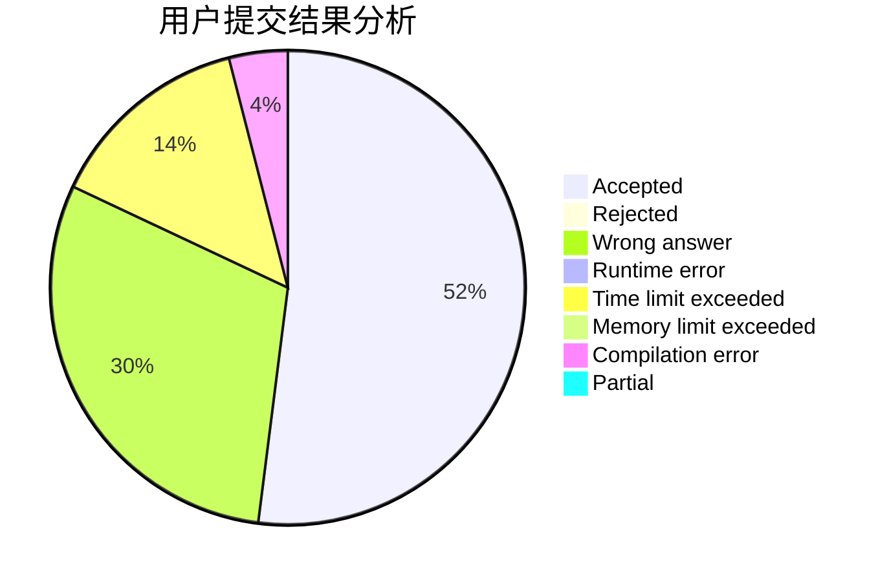
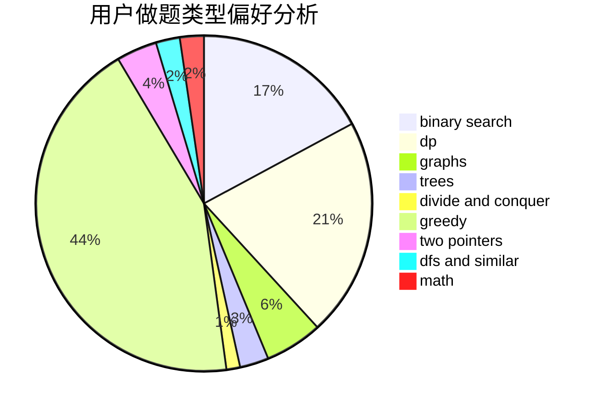

# Jozky

<!-- tabs:start -->

#### **用户提交结果分析**

#### **用户做题类型偏好分析**

<!-- tabs:end -->
# 推荐题目
[1506C](https://codeforces.com/contest/1506/problem/C)
[681A](https://codeforces.com/contest/681/problem/A)
[293A](https://codeforces.com/contest/293/problem/A)
[1257E](https://codeforces.com/contest/1257/problem/E)
[243D](https://codeforces.com/contest/243/problem/D)
[762A](https://codeforces.com/contest/762/problem/A)
[954C](https://codeforces.com/contest/954/problem/C)
[1073G](https://codeforces.com/contest/1073/problem/G)
[474C](https://codeforces.com/contest/474/problem/C)
[1145B](https://codeforces.com/contest/1145/problem/B)
