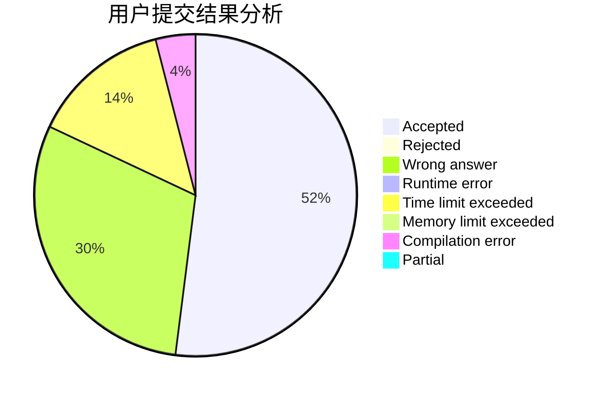
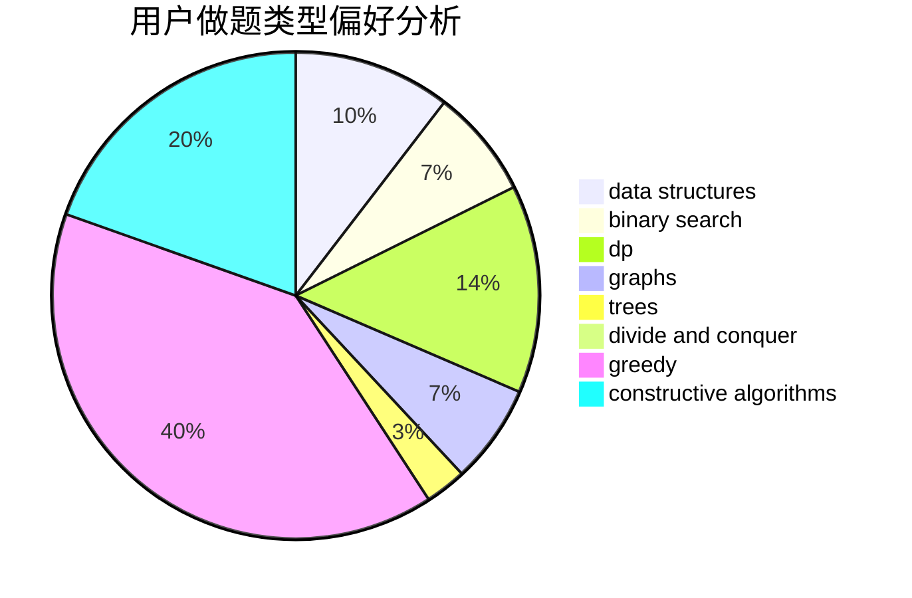
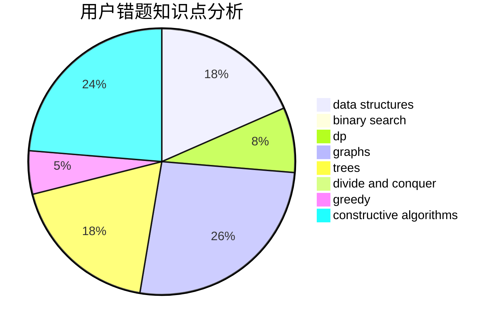

# Jozky

<!-- tabs:start -->

#### **用户提交结果分析**

#### **用户做题类型偏好分析**

#### **用户错题知识点分析**

<!-- tabs:end -->
# 推荐题目
[1497E1](https://codeforces.com/contest/1497E/problem/1)		data structures,
                        dp,
                        greedy,
                        math,
                        number theory,
                        two pointers		  
[660C](https://codeforces.com/contest/660/problem/C)		binary search,
                        dp,
                        two pointers		  
[277E](https://codeforces.com/contest/277/problem/E)		flows,
                        trees		  
[1252D](https://codeforces.com/contest/1252/problem/D)		data structures,
                        dp,
                        strings,
                        trees		  
[225D](https://codeforces.com/contest/225/problem/D)		bitmasks,
                        dfs and similar,
                        graphs,
                        implementation		  
[741A](https://codeforces.com/contest/741/problem/A)		dfs and similar,
                        math		  
[932C](https://codeforces.com/contest/932/problem/C)		brute force,
                        constructive algorithms		  
[1073D](https://codeforces.com/contest/1073/problem/D)		binary search,
                        brute force,
                        data structures,
                        greedy		  
[452C](https://codeforces.com/contest/452/problem/C)		combinatorics,
                        math,
                        probabilities		  
[1143B](https://codeforces.com/contest/1143/problem/B)		brute force,
                        math,
                        number theory		  
