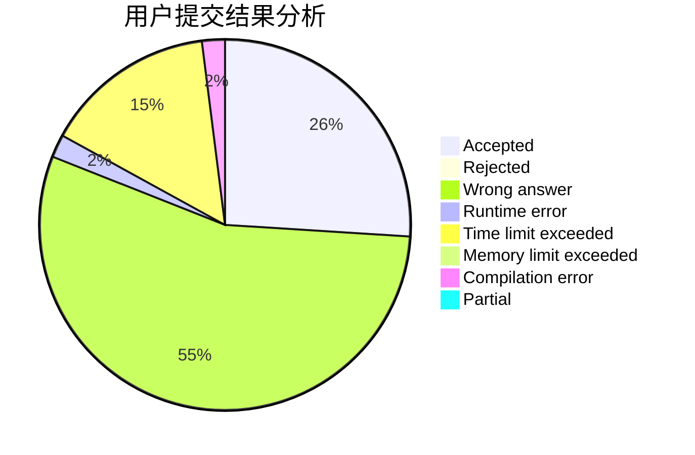
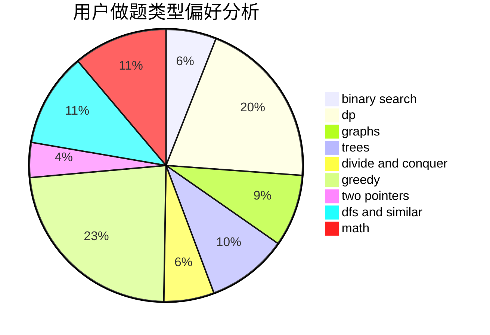

# Jr1Preg

<!-- tabs:start -->

#### **用户提交结果分析**

#### **用户做题类型偏好分析**

<!-- tabs:end -->
# 推荐题目
[198B](https://codeforces.com/contest/198/problem/B)
[286D](https://codeforces.com/contest/286/problem/D)
[1147A](https://codeforces.com/contest/1147/problem/A)
[1140D](https://codeforces.com/contest/1140/problem/D)
[448D](https://codeforces.com/contest/448/problem/D)
[675D](https://codeforces.com/contest/675/problem/D)
[394C](https://codeforces.com/contest/394/problem/C)
[246B](https://codeforces.com/contest/246/problem/B)
[955B](https://codeforces.com/contest/955/problem/B)
[1033A](https://codeforces.com/contest/1033/problem/A)
