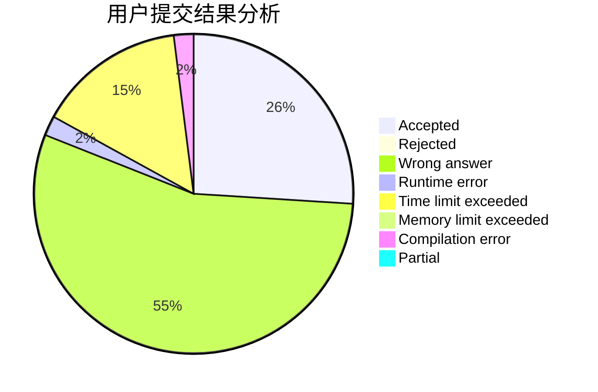
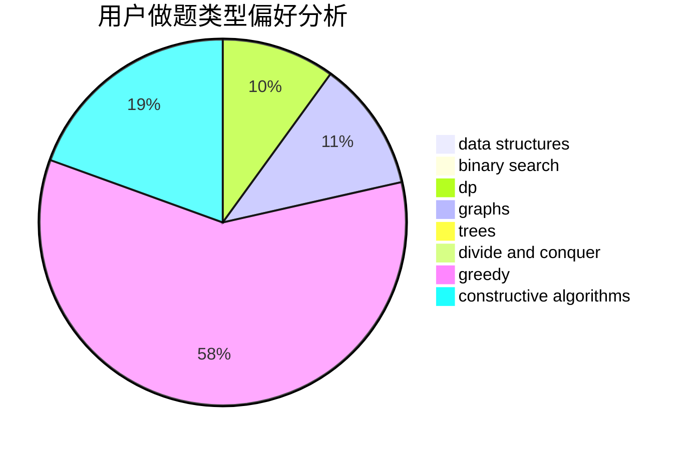
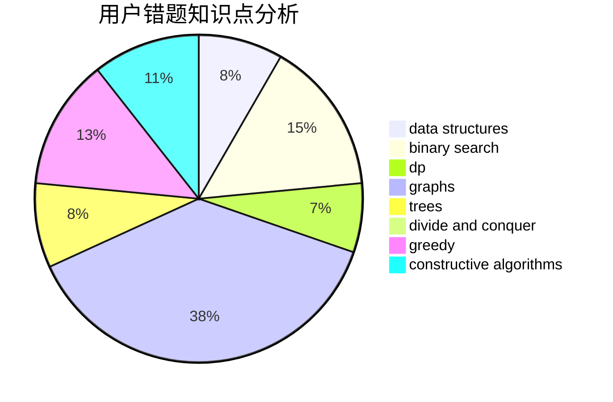

# Jr1Preg
<!-- tabs:start -->
#### **用户提交结果分析**

#### **用户做题类型偏好分析**

#### **用户错题知识点分析**

<!-- tabs:end -->
# 推荐题目
[Tickets](http://codeforces.com/problemset/problem/26/D)		combinatorics,
                        math,
                        probabilities		  
[Little Artem and Random Variable](https://codeforces.com/contest/668/problem/C)		dp,
                        implementation,
                        math,
                        probabilities		  
[Two Merged Sequences](http://codeforces.com/problemset/problem/1144/G)		dp,
                        greedy		  
[Star](http://codeforces.com/problemset/problem/171/B)		*special problem,
                        combinatorics		  
[Sereja and Table](http://codeforces.com/problemset/problem/425/B)		bitmasks,
                        greedy		  
[Where do I Turn?](http://codeforces.com/problemset/problem/227/A)		geometry		  
[Cooperative Game](https://codeforces.com/contest/1138/problem/F)		constructive algorithms,
                        interactive,
                        number theory		  
[Copying Homework](http://codeforces.com/problemset/problem/1252/A)		nan		  
[A Determined Cleanup](http://codeforces.com/problemset/problem/933/B)		math		  
[Tree Queries](http://codeforces.com/problemset/problem/1328/E)		dfs and similar,
                        graphs,
                        trees		  
<!-- tabs:start -->
#### **data structures**
[Tickets](https://codeforces.com/contest/651/problem/C)		data structures,
                        geometry,
                        math		  
[Little Artem and Random Variable](http://codeforces.com/problemset/problem/930/C)		data structures,
                        dp		  
[Two Merged Sequences](http://codeforces.com/problemset/problem/368/B)		data structures,
                        dp		  
[Star](http://codeforces.com/problemset/problem/1348/F)		data structures,
                        dfs and similar,
                        graphs,
                        greedy		  
[Sereja and Table](http://codeforces.com/problemset/problem/1299/C)		data structures,
                        geometry,
                        greedy		  
[Where do I Turn?](http://codeforces.com/problemset/problem/1492/C)		binary search,
                        data structures,
                        dp,
                        greedy,
                        two pointers		  
[Cooperative Game](http://codeforces.com/problemset/problem/1490/G)		binary search,
                        data structures,
                        math		  
[Copying Homework](http://codeforces.com/problemset/problem/1479/D)		binary search,
                        bitmasks,
                        brute force,
                        data structures,
                        probabilities,
                        trees		  
[A Determined Cleanup](http://codeforces.com/problemset/problem/1497/A)		brute force,
                        data structures,
                        greedy,
                        sortings		  
[Tree Queries](http://codeforces.com/problemset/problem/1491/C)		brute force,
                        data structures,
                        dp,
                        greedy,
                        implementation		  
#### **binary search**
[Tickets](https://codeforces.com/contest/651/problem/D)		binary search,
                        brute force,
                        dp,
                        two pointers		  
[Little Artem and Random Variable](http://codeforces.com/problemset/problem/1492/C)		binary search,
                        data structures,
                        dp,
                        greedy,
                        two pointers		  
[Two Merged Sequences](http://codeforces.com/problemset/problem/1463/D)		binary search,
                        constructive algorithms,
                        greedy,
                        two pointers		  
[Star](http://codeforces.com/problemset/problem/1490/G)		binary search,
                        data structures,
                        math		  
[Sereja and Table](http://codeforces.com/problemset/problem/1479/D)		binary search,
                        bitmasks,
                        brute force,
                        data structures,
                        probabilities,
                        trees		  
[Where do I Turn?](http://codeforces.com/problemset/problem/1436/E)		binary search,
                        data structures,
                        two pointers		  
[Cooperative Game](http://codeforces.com/problemset/problem/1461/D)		binary search,
                        brute force,
                        data structures,
                        divide and conquer,
                        implementation,
                        sortings		  
[Copying Homework](http://codeforces.com/problemset/problem/1493/C)		binary search,
                        brute force,
                        constructive algorithms,
                        greedy,
                        strings		  
[A Determined Cleanup](http://codeforces.com/problemset/problem/1487/D)		binary search,
                        brute force,
                        math,
                        number theory		  
[Tree Queries](http://codeforces.com/problemset/problem/1486/B)		binary search,
                        geometry,
                        shortest paths,
                        sortings		  
#### **dp**
[Tickets](https://codeforces.com/contest/668/problem/C)		dp,
                        implementation,
                        math,
                        probabilities		  
[Little Artem and Random Variable](http://codeforces.com/problemset/problem/1144/G)		dp,
                        greedy		  
[Two Merged Sequences](https://codeforces.com/contest/1262/problem/F1)		dp		  
[Star](https://codeforces.com/contest/651/problem/D)		binary search,
                        brute force,
                        dp,
                        two pointers		  
[Sereja and Table](http://codeforces.com/problemset/problem/930/C)		data structures,
                        dp		  
[Where do I Turn?](http://codeforces.com/problemset/problem/366/C)		dp		  
[Cooperative Game](http://codeforces.com/problemset/problem/11/D)		bitmasks,
                        dp,
                        graphs		  
[Copying Homework](http://codeforces.com/problemset/problem/368/B)		data structures,
                        dp		  
[A Determined Cleanup](http://codeforces.com/problemset/problem/659/G)		combinatorics,
                        dp,
                        number theory		  
[Tree Queries](http://codeforces.com/problemset/problem/909/E)		dfs and similar,
                        dp,
                        graphs,
                        greedy		  
#### **graph**
[Tickets](http://codeforces.com/problemset/problem/1328/E)		dfs and similar,
                        graphs,
                        trees		  
[Little Artem and Random Variable](http://codeforces.com/problemset/problem/11/D)		bitmasks,
                        dp,
                        graphs		  
[Two Merged Sequences](http://codeforces.com/problemset/problem/933/C)		geometry,
                        graphs		  
[Star](http://codeforces.com/problemset/problem/1348/F)		data structures,
                        dfs and similar,
                        graphs,
                        greedy		  
[Sereja and Table](http://codeforces.com/problemset/problem/909/E)		dfs and similar,
                        dp,
                        graphs,
                        greedy		  
[Where do I Turn?](http://codeforces.com/problemset/problem/1487/C)		brute force,
                        constructive algorithms,
                        dfs and similar,
                        graphs,
                        greedy,
                        implementation,
                        math		  
[Cooperative Game](http://codeforces.com/problemset/problem/1437/C)		dp,
                        flows,
                        graph matchings,
                        greedy,
                        math,
                        sortings		  
[Copying Homework](http://codeforces.com/problemset/problem/1470/D)		constructive algorithms,
                        dfs and similar,
                        graph matchings,
                        graphs,
                        greedy		  
[A Determined Cleanup](http://codeforces.com/problemset/problem/1476/C)		dp,
                        graphs,
                        greedy		  
[Tree Queries](http://codeforces.com/problemset/problem/1304/D)		constructive algorithms,
                        graphs,
                        greedy,
                        two pointers		  
#### **trees**
[Tickets](http://codeforces.com/problemset/problem/1328/E)		dfs and similar,
                        graphs,
                        trees		  
[Little Artem and Random Variable](http://codeforces.com/problemset/problem/280/C)		implementation,
                        math,
                        probabilities,
                        trees		  
[Two Merged Sequences](http://codeforces.com/problemset/problem/1479/D)		binary search,
                        bitmasks,
                        brute force,
                        data structures,
                        probabilities,
                        trees		  
[Star](http://codeforces.com/problemset/problem/1511/C)		brute force,
                        data structures,
                        implementation,
                        trees		  
[Sereja and Table](http://codeforces.com/problemset/problem/1499/F)		combinatorics,
                        dfs and similar,
                        dp,
                        trees		  
[Where do I Turn?](http://codeforces.com/problemset/problem/1491/E)		brute force,
                        dfs and similar,
                        divide and conquer,
                        number theory,
                        trees		  
[Cooperative Game](http://codeforces.com/problemset/problem/1466/D)		data structures,
                        greedy,
                        sortings,
                        trees		  
[Copying Homework](http://codeforces.com/problemset/problem/1495/D)		combinatorics,
                        dfs and similar,
                        graphs,
                        math,
                        shortest paths,
                        trees		  
[A Determined Cleanup](http://codeforces.com/problemset/problem/1303/G)		data structures,
                        divide and conquer,
                        geometry,
                        trees		  
[Tree Queries](http://codeforces.com/problemset/problem/1454/E)		combinatorics,
                        dfs and similar,
                        graphs,
                        trees		  
#### **divide and conquer**
[Tickets](http://codeforces.com/problemset/problem/1461/D)		binary search,
                        brute force,
                        data structures,
                        divide and conquer,
                        implementation,
                        sortings		  
[Little Artem and Random Variable](http://codeforces.com/problemset/problem/1466/G)		combinatorics,
                        divide and conquer,
                        hashing,
                        math,
                        string suffix structures,
                        strings		  
[Two Merged Sequences](http://codeforces.com/problemset/problem/1490/D)		dfs and similar,
                        divide and conquer,
                        implementation		  
[Star](https://codeforces.com/contest/1483/problem/C)		data structures,
                        divide and conquer,
                        dp		  
[Sereja and Table](http://codeforces.com/problemset/problem/1491/E)		brute force,
                        dfs and similar,
                        divide and conquer,
                        number theory,
                        trees		  
[Where do I Turn?](http://codeforces.com/problemset/problem/1303/G)		data structures,
                        divide and conquer,
                        geometry,
                        trees		  
[Cooperative Game](http://codeforces.com/problemset/problem/1494/D)		constructive algorithms,
                        data structures,
                        dfs and similar,
                        divide and conquer,
                        dsu,
                        greedy,
                        sortings,
                        trees		  
[Copying Homework](http://codeforces.com/problemset/problem/1482/E)		data structures,
                        divide and conquer,
                        dp		  
[A Determined Cleanup](http://codeforces.com/problemset/problem/566/C)		dfs and similar,
                        divide and conquer,
                        trees		  
[Tree Queries](http://codeforces.com/problemset/problem/1428/F)		binary search,
                        data structures,
                        divide and conquer,
                        dp,
                        two pointers		  
#### **greedy**
[Tickets](http://codeforces.com/problemset/problem/1144/G)		dp,
                        greedy		  
[Little Artem and Random Variable](http://codeforces.com/problemset/problem/425/B)		bitmasks,
                        greedy		  
[Two Merged Sequences](http://codeforces.com/problemset/problem/1348/F)		data structures,
                        dfs and similar,
                        graphs,
                        greedy		  
[Star](http://codeforces.com/problemset/problem/437/B)		bitmasks,
                        greedy,
                        implementation,
                        sortings		  
[Sereja and Table](http://codeforces.com/problemset/problem/909/E)		dfs and similar,
                        dp,
                        graphs,
                        greedy		  
[Where do I Turn?](http://codeforces.com/problemset/problem/1299/C)		data structures,
                        geometry,
                        greedy		  
[Cooperative Game](http://codeforces.com/problemset/problem/1481/C)		brute force,
                        constructive algorithms,
                        greedy		  
[Copying Homework](http://codeforces.com/problemset/problem/1254/B2)		constructive algorithms,
                        greedy,
                        math,
                        number theory,
                        ternary search,
                        two pointers		  
[A Determined Cleanup](http://codeforces.com/problemset/problem/1417/A)		greedy,
                        math		  
[Tree Queries](http://codeforces.com/problemset/problem/1492/C)		binary search,
                        data structures,
                        dp,
                        greedy,
                        two pointers		  
#### **constructive algorithms**
[Tickets](https://codeforces.com/contest/1138/problem/F)		constructive algorithms,
                        interactive,
                        number theory		  
[Little Artem and Random Variable](http://codeforces.com/problemset/problem/353/D)		constructive algorithms,
                        dp		  
[Two Merged Sequences](http://codeforces.com/problemset/problem/1481/C)		brute force,
                        constructive algorithms,
                        greedy		  
[Star](http://codeforces.com/problemset/problem/1254/B2)		constructive algorithms,
                        greedy,
                        math,
                        number theory,
                        ternary search,
                        two pointers		  
[Sereja and Table](http://codeforces.com/problemset/problem/1493/A)		constructive algorithms,
                        greedy		  
[Where do I Turn?](http://codeforces.com/problemset/problem/1463/D)		binary search,
                        constructive algorithms,
                        greedy,
                        two pointers		  
[Cooperative Game](https://codeforces.com/contest/1456/problem/B)		bitmasks,
                        brute force,
                        constructive algorithms		  
[Copying Homework](http://codeforces.com/problemset/problem/1492/D)		bitmasks,
                        constructive algorithms,
                        greedy,
                        math		  
[A Determined Cleanup](https://codeforces.com/contest/1504/problem/D)		constructive algorithms,
                        games,
                        interactive		  
[Tree Queries](https://codeforces.com/contest/1483/problem/A)		brute force,
                        constructive algorithms,
                        greedy,
                        implementation		  
#### **sortings**
[Tickets](http://codeforces.com/problemset/problem/807/A)		implementation,
                        sortings		  
[Little Artem and Random Variable](http://codeforces.com/problemset/problem/437/B)		bitmasks,
                        greedy,
                        implementation,
                        sortings		  
[Two Merged Sequences](https://codeforces.com/contest/1496/problem/C)		geometry,
                        greedy,
                        math,
                        sortings		  
[Star](http://codeforces.com/problemset/problem/1495/A)		geometry,
                        greedy,
                        math,
                        sortings		  
[Sereja and Table](http://codeforces.com/problemset/problem/1497/A)		brute force,
                        data structures,
                        greedy,
                        sortings		  
[Where do I Turn?](http://codeforces.com/problemset/problem/1427/A)		math,
                        sortings		  
[Cooperative Game](http://codeforces.com/problemset/problem/1461/D)		binary search,
                        brute force,
                        data structures,
                        divide and conquer,
                        implementation,
                        sortings		  
[Copying Homework](http://codeforces.com/problemset/problem/1437/C)		dp,
                        flows,
                        graph matchings,
                        greedy,
                        math,
                        sortings		  
[A Determined Cleanup](http://codeforces.com/problemset/problem/1473/A)		greedy,
                        implementation,
                        math,
                        sortings		  
[Tree Queries](http://codeforces.com/problemset/problem/1486/B)		binary search,
                        geometry,
                        shortest paths,
                        sortings		  
<!-- tabs:end -->
