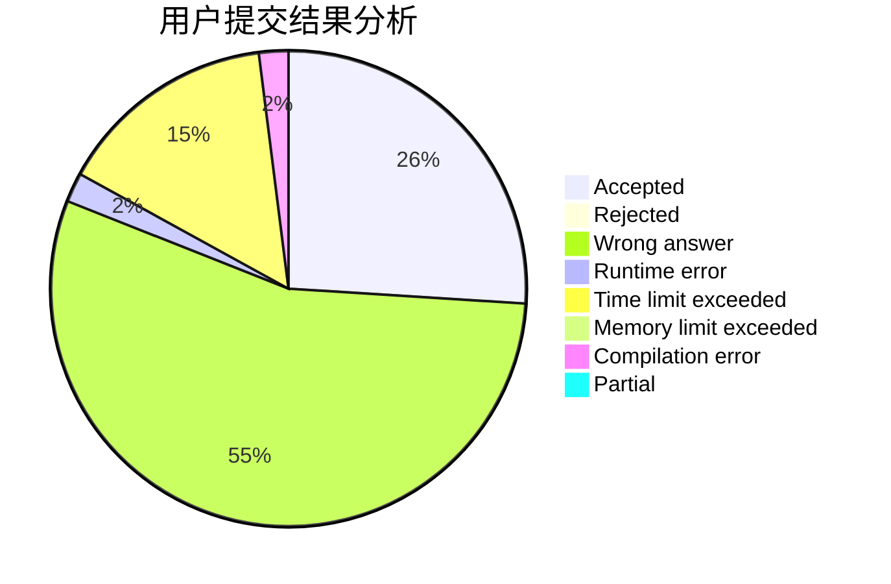
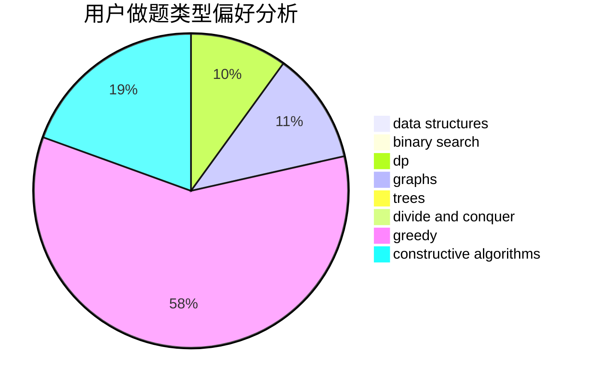
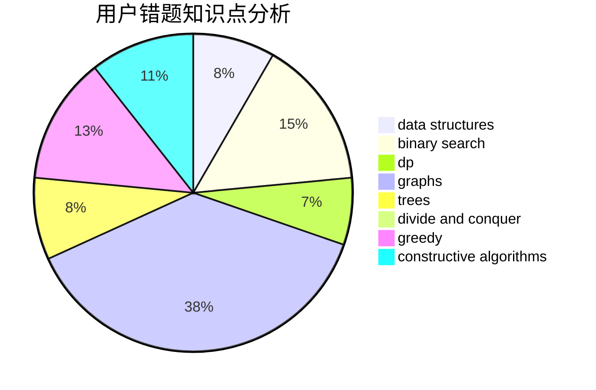

# Jr1Preg

<!-- tabs:start -->

#### **用户提交结果分析**

#### **用户做题类型偏好分析**

#### **用户错题知识点分析**

<!-- tabs:end -->
# 推荐题目
[171B](https://codeforces.com/contest/171/problem/B)		*special problem,
                        combinatorics		  
[26D](https://codeforces.com/contest/26/problem/D)		combinatorics,
                        math,
                        probabilities		  
[1144G](https://codeforces.com/contest/1144/problem/G)		dp,
                        greedy		  
[1138F](https://codeforces.com/contest/1138/problem/F)		dsu,graphs,sortings,trees		  
[425B](https://codeforces.com/contest/425/problem/B)		bitmasks,
                        greedy		  
[651D](https://codeforces.com/contest/651/problem/D)		dsu,graphs,sortings,trees		  
[366C](https://codeforces.com/contest/366/problem/C)		dp		  
[227A](https://codeforces.com/contest/227/problem/A)		geometry		  
[933B](https://codeforces.com/contest/933/problem/B)		math		  
[1032D](https://codeforces.com/contest/1032/problem/D)		geometry,
                        implementation		  
